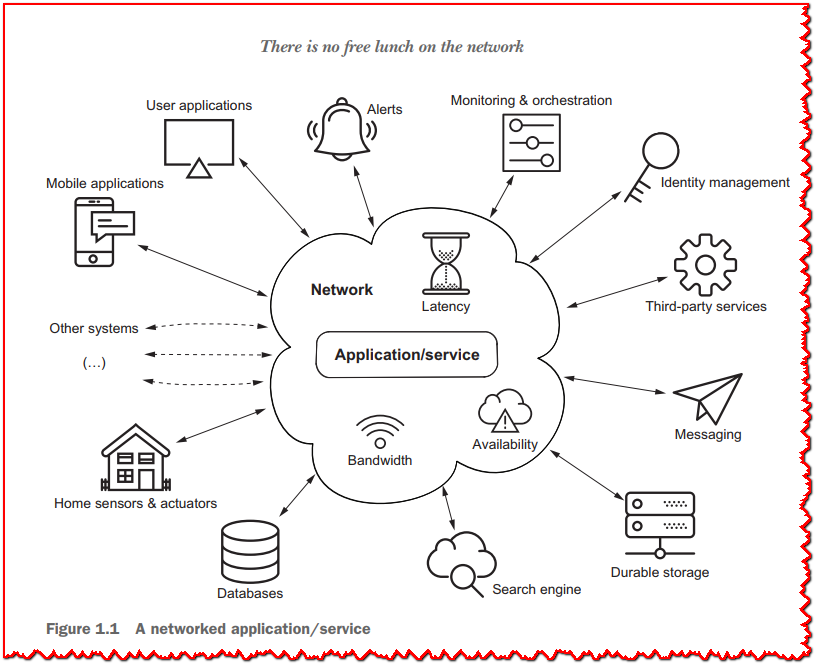
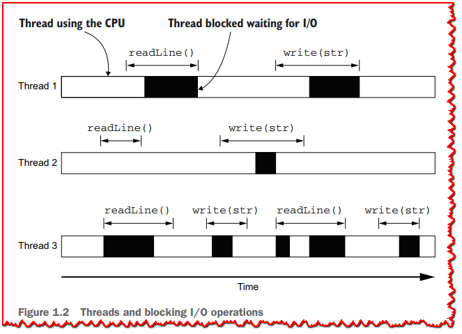
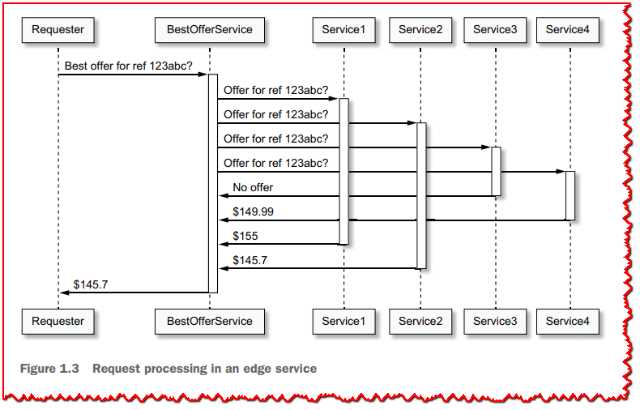
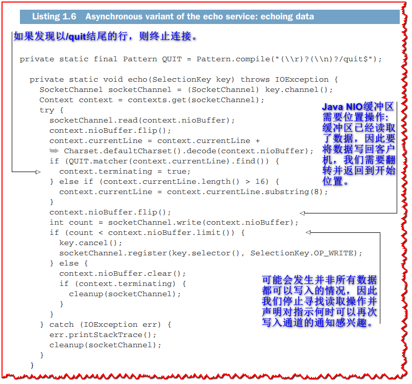
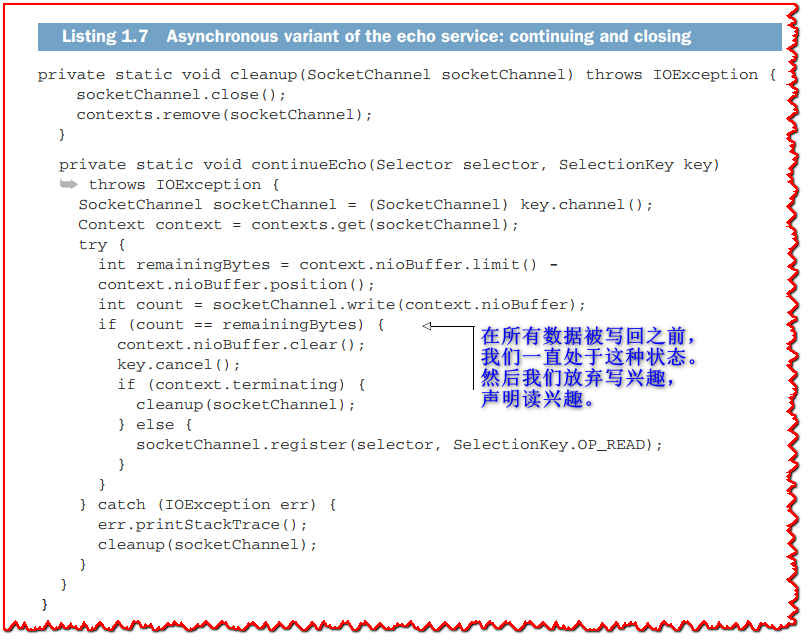
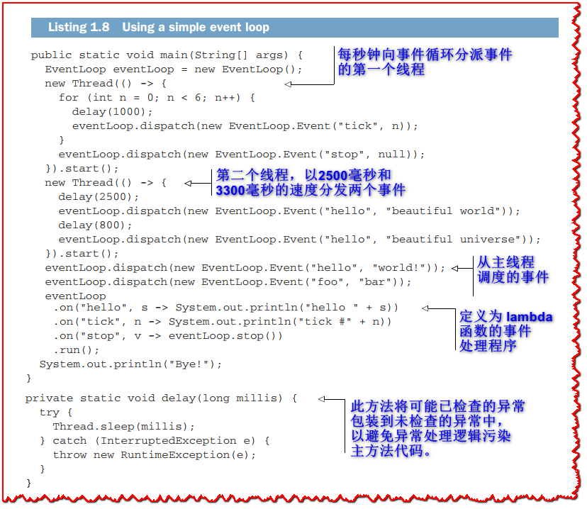
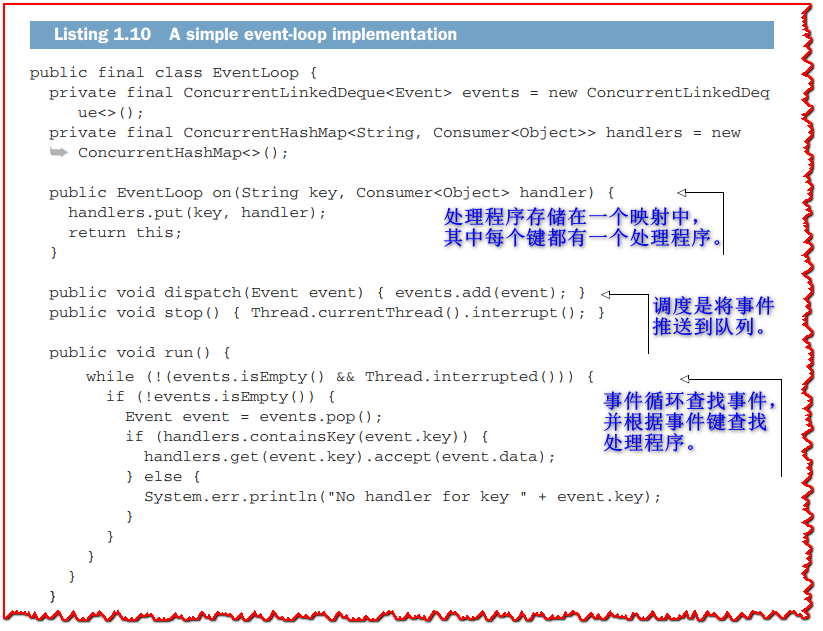
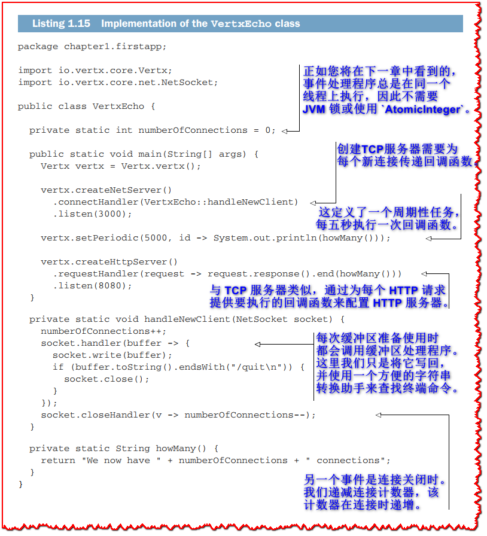
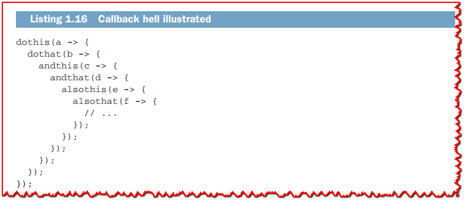

# 第二章: Vert.x 异步编程的基础知识

构建反应式系统的第一步是采用异步编程。基于阻塞I/O的传统编程模型的可伸缩性不如使用非阻塞I/O的模型。用更少的资源服务更多的请求是非常有吸引力的，那么问题在哪里呢?这里确实存在一个小问题:如果您从未接触过异步编程，那么它是一种重要的范式转换!

本书这部分的章节将通过使用Vert.x工具包教你异步编程的基本概念。使用Vert.x思考异步操作绝对是可行的(而且很有趣!)，我们将探讨Vert.x应用程序的主要构建块。

**本章涵盖了**

- Vert.x 是什么
- 为什么不能避免分布式系统
- 编程资源高效的网络应用程序的挑战
- 什么是异步和非阻塞编程
- 什么是响应式应用程序，以及为什么异步编程还不够
- Vert.x 的替代品

我们开发人员生活在一个充满流行语、技术和实践炒作周期的行业。 我长期教大学生设计、编程、集成和部署应用程序的要素，我亲眼目睹了新手在当前技术的狂野海洋中航行是多么复杂。

`Asynchronous` 和 `reactive` 是现代应用程序中的重要主题，我编写本书的目标是帮助开发人员理解这些术语背后的核心概念，获得实践经验，并认识到这些方法何时有好处。 我们将使用 Eclipse Vert.x，这是一个用于编写异步应用程序的工具包，它具有为“reactive(反应式)”含义的不同定义提供解决方案的额外好处。

在本书中，确保你理解这些概念是我的首要任务。 虽然我想让您深入了解如何编写 Vert.x 应用程序，但我还想确保您可以将在这里学到的技能转化为现在或五年后的其他类似和可能竞争的技术。

## 1.1 分布式和网络化是常态

20 年前，部署可以在单台机器上独立运行的同时执行所有操作的业务应用程序很常见。 此类应用程序通常展示图形用户界面，并且它们具有用于存储数据的本地数据库或自定义文件管理。 当然，这有点夸张，因为网络已经在使用中，并且业务应用程序可以利用网络上的数据库服务器、网络文件存储和各种远程代码操作。

如今，应用程序更自然地通过 Web 和移动界面向最终用户公开。 这自然会使网络发挥作用，从而使分布式系统发挥作用。 此外，*面向服务的架构*允许通过向其他服务发出请求来重用某些功能，这些服务可能由第三方提供商控制。 例如，将消费者应用程序中的身份验证委托给流行的帐户提供商，如 Google、Facebook 或 Twitter，或者将支付处理委托给 Stripe 或 PayPal。

## 1.2 不是住在孤岛上

图 1.1 是对现代应用程序的虚构描述：一组相互交互的网络服务。 以下是其中一些网络服务：

  - 像 PostgreSQL 或 MongoDB 这样的数据库存储数据。
  - 像 Elasticsearch 这样的搜索引擎允许查找以前编入索引的信息，例如目录中的产品。
  - 像 Amazon S3 这样的持久存储服务提供文档的持久和复制数据存储。
  - 消息服务可以是
    + 以编程方式发送电子邮件的 SMTP 服务器。
    + 用于通过消息平台（例如 Slack、Telegram 或 Facebook Messenger）与用户交互的机器人。
    + 用于应用程序到应用程序集成的集成消息传递协议，如 AMQP。
 - 像 Keycloak 这样的身份管理服务为用户和服务交互提供身份验证和角色管理。

使用 Micrometer 等库进行监控会公开健康状态、指标和日志，以便外部编排工具可以保持适当的服务质量，可能通过启动新服务实例或在失败时终止现有服务实例。



在本书的后面部分，您将看到典型服务的示例，例如 API 端点、流处理器和边缘服务。 当然，前面的列表并不详尽，但关键是服务很少独立存在，因为它们需要通过网络与其他服务通信才能运行。

## 1.3 网络上没有免费的午餐

网络正是计算中可能出现许多问题的地方：

  - 带宽波动很大，因此服务之间的数据密集型交互可能会受到影响。 并非所有服务都可以在同一数据中心内享受快速带宽，即便如此，它仍然比同一台机器上的进程之间的通信慢。

  - 延迟波动很大，并且由于服务需要与其他服务对话以处理给定请求的服务，所有网络引起的延迟都会增加整体请求处理时间。

  - 可用性不应被视为理所当然：网络失败。 路由器出现故障。 代理失败。 有时有人碰到网线并断开它。 当网络发生故障时，向另一个服务发送请求的服务可能无法确定是其他服务还是网络故障。

从本质上讲，现代应用程序是由分布式和网络化服务组成的。 它们是通过本身引入问题的网络访问的，并且每个服务都需要维护多个传入和传出连接。

## 1.4 阻塞 API 的简单性

服务需要管理与其他服务和请求者的连接。 管理并发网络连接的传统且广泛使用的模型是为每个连接分配一个线程。 这是许多技术中的模型，例如 Jakarta EE 中的 Servlet（在版本 3 中添加之前）、Spring Framework（在版本 5 中添加之前）、Ruby on Rails、Python Flask 等等。 该模型具有简单的优点，因为它是*同步的*。

让我们看一个例子，TCP 服务器将输入文本回显给客户端，直到它看到 `/quit` 终端输入（如清单 1.3 所示）。

服务器可以使用本书完整示例项目中的 Gradle 运行任务（终端中的`./gradlew run -PmainClass=chapter1.snippets.SynchronousEcho`）运行。 通过使用 `netcat` 命令行工具，我们可以发送和接收文本。


> **💡提示:** 您可能需要在操作系统上安装 netcat（或 nc）。

在服务器端，我们可以看到以下跟踪。


以下清单中的代码提供了 TCP 服务器实现。 它是提供同步 I/O API 的`java.io`包的经典用法。


```java
package chapter1.snippets;

import java.io.*;
import java.net.InetSocketAddress;
import java.net.ServerSocket;
import java.net.Socket;

public class SynchronousEcho {

  public static void main(String[] args) throws Throwable {
    ServerSocket server = new ServerSocket();
    server.bind(new InetSocketAddress(3000));
    while (true) {   // <1>
      Socket socket = server.accept();
      new Thread(clientHandler(socket)).start();
    }
  }

  private static Runnable clientHandler(Socket socket) {
    return () -> {
      try (
        BufferedReader reader = new BufferedReader(
          new InputStreamReader(socket.getInputStream()));
        PrintWriter writer = new PrintWriter(
          new OutputStreamWriter(socket.getOutputStream()))) {
        String line = "";
        while (!"/quit".equals(line)) {
          line = reader.readLine();      // <2>
          System.out.println("~ " + line);
          writer.write(line + "\n");  // <3>
          writer.flush();
        }
      } catch (IOException e) {
        e.printStackTrace();
      }
    };
  }
}
```

><1>: 主应用程序线程扮演接受线程的角色，因为它接收所有新连接的套接字对象。 当没有连接挂起时，操作会阻塞。 为每个连接分配一个新线程。
>
><2>: 从套接字读取可能会阻塞分配给连接的线程，例如在读取的数据不足时。
>
><3>: 写入套接字也可能会阻塞，例如直到底层 TCP 缓冲区数据已通过网络发送。

服务器使用主线程接受连接，并为每个连接分配一个新线程来处理 I/O。 I/O 操作是同步的，因此线程可能会阻塞 I/O 操作。

## 1.5 阻塞API浪费资源，增加成本

**清单 1.3** 中代码的主要问题是它为每个传入连接分配一个新线程，而线程绝不是廉价资源。 线程需要内存，线程越多，对操作系统内核调度程序施加的压力就越大，因为它需要给线程分配 CPU 时间。 我们可以改进**清单 1.3** 中的代码，通过使用线程池在连接关闭后重用线程，但在任何给定时间点我们仍然需要 *n* 个线程来处理 *n* 个连接。

如图 1.2 所示，您可以在其中看到三个并发网络连接的三个线程的 CPU 使用率随时间变化。 诸如`readLine`和`write`之类的输入/输出操作可能会**阻塞**线程，这意味着它正被操作系统悬停。 发生这种情况有两个原因：
  - 读取操作可能正在等待数据从网络到达。
  - 如果缓冲区因先前的写入操作已满，则写入操作可能必须等待缓冲区被耗尽。

现代操作系统可以正确处理几千个并发线程。 并非每个联网服务都会面临如此多并发请求的负载，



但是当我们谈论数以万计的并发连接时，这个模型很快就显示出它的局限性。

同样重要的是要记住，我们通常需要比传入网络连接更多的线程。 举一个具体的例子，假设我们有一个 HTTP 服务，它为给定的产品提供最优惠的价格，它通过向其他四个 HTTP 服务请求价格来做到这一点，如**图 1.3** 所示。 这种服务通常



称为*边缘服务*或*API网关*。 按顺序请求每个服务然后选择最低价格会使我们的服务变得非常慢，因为每个请求都会增加我们自己服务的延迟。 有效的方法是从我们的服务启动四个并发请求，然后等待并收集它们的响应。 这意味着再启动四个线程； 如果我们有 1,000 个并发网络请求，我们可能会使用多达 5,000 个线程，在最糟糕的情况下，所有请求都需要同时处理，并且我们不使用线程池或维护来自边缘服务的持久连接 请求的服务。

最后但同样重要的是，应用程序通常部署到容器化或虚拟化环境中。 这意味着应用程序可能无法看到所有可用的 CPU 内核，并且它们分配的 CPU 时间可能会受到限制。 进程的可用内存也可能受到限制，因此线程过多也会占用内存预算。 此类应用程序必须与其他应用程序共享 CPU 资源，因此如果所有应用程序都使用阻塞 I/O API，很快就会有太多线程需要管理和调度，这需要随着流量的增加启动更多服务器/容器实例。 这直接转化为增加的运营成本。

## 1.6 使用非阻塞 I/O 进行异步编程

不用等待I/O操作完成，我们可以切换到非阻塞的I/O。你可能已经在C语言中使用了' select '函数。

非阻塞I/O背后的思想是请求一个(阻塞)操作，然后继续执行其他任务，直到操作结果准备好。例如，一个非阻塞的读取可能会通过网络套接字请求最多256个字节，执行线程会做其他事情(比如处理另一个连接)，直到数据被放入缓冲区，准备在内存中使用。在此模型中，许多并发连接可以在单个线程上复用，因为网络延迟通常超过读取传入字节所需的CPU时间。

Java 长期以来一直有 `java.nio` (Java NIO) 包，它通过文件和网络提供非阻塞 I/O API。 回到我们之前回显传入数据的 TCP 服务示例，清单 1.4 到 1.7 显示了使用 Java 非阻塞 I/O 的参考实现。


**清单 1.4** 显示了服务器套接字通道准备代码。 它打开服务器套接字通道并使其成为非阻塞的，然后注册一个 NIO 键选择器来处理事件。 主循环遍历已准备好处理事件的选择器键，并根据事件类型（新连接、数据已到达或可以再次发送数据）将它们分派给专门的方法。


**清单 1.5** 展示了如何处理新的 TCP 连接。 对应于新连接的套接字通道被配置为非阻塞，然后在哈希映射中被跟踪以供进一步参考，其中它与某个*上下文对象*相关联。 上下文取决于应用程序和协议。 在我们的例子中，我们跟踪当前行以及连接是否正在关闭，并且我们维护一个连接特定的 NIO 缓冲区用于读取和写入数据。



**清单 1.6** 包含 `echo` 方法的代码。 处理非常简单：我们从客户端套接字读取数据，然后尝试将其写回。 如果写操作只是部分，我们停止进一步的读取，声明有兴趣知道套接字通道何时再次可写，然后确保写入所有数据。



最后，**清单 1.7** 显示了关闭 TCP 连接和完成写入缓冲区的方法。 当所有数据都写入 `continueEcho` 时，我们再次注册读取数据的兴趣。

如本例所示，使用非阻塞 I/O 是可行的，但与使用阻塞 API 的初始版本相比，它显着增加了代码复杂性。 回显协议需要两种状态来读取和写回数据：读取或完成写入。 对于更复杂的 TCP 协议，您可以轻松预测对更复杂状态机的需求。

同样重要的是要注意，与大多数 JDK API 一样，`java.nio` 只关注它的作用（这里是 I/O API）。 它不提供更高级别的特定于协议的帮助程序，例如用于编写 HTTP 客户端和服务器。 此外，`java.nio` 没有规定线程模型，这对于正确利用 CPU 内核仍然很重要，也没有处理异步 I/O 事件或阐明应用程序处理逻辑。

>  **🏷注意:** 这就是为什么在实践中，开发人员很少处理 Java NIO。 Netty 和 Apache MINA 等网络库解决了 Java NIO 的缺点，许多工具包和框架都建立在它们之上。 您很快就会发现，Eclipse Vert.x 就是其中之一。

## 1.7 多路复用事件驱动处理：事件循环的案例

用于处理异步事件的流行线程模型是事件循环。 不像我们在前面的 Java NIO 示例中所做的那样轮询可能已经到达的事件，而是将事件推送到一个*事件循环*中。


正如您在**图 1.4** 中看到的，事件在到达时会排队。 它们可以是 I/O 事件，例如准备好使用的数据或已完全写入套接字的缓冲区。 它们也可以是任何 *其它* 事件，例如计时器触发。 将单个线程分配给事件循环，处理事件不应执行任何阻塞或长时间运行的操作。 否则，线程阻塞，违背了使用事件循环的目的。

事件循环非常流行：在 Web 浏览器中运行的 JavaScript 代码运行在事件循环之上。 许多图形界面工具包，例如 Java Swing，也有一个事件循环。

实现事件循环很容易。



**清单 1.8** 中的代码显示了事件循环 API 的使用，其执行提供了以下控制台输出。


更复杂的事件循环实现是可能的，但下面清单中的实现依赖于事件队列和处理程序映射。



事件循环在调用 run 方法的线程上运行，并且可以使用 `dispatch` 方法从其他线程安全地发送事件。

最后但同样重要的是，事件只是一对键和数据，如下所示，它是`EventLoop`的静态内部类。


## 1.8 什么是反应式系统？

到目前为止，我们已经讨论了如何执行以下操作：
  - 利用异步编程和非阻塞 I/O 来处理更多的并发连接并使用更少的线程
  - 使用一种线程模型进行异步事件处理（事件循环）

通过结合这两种技术，我们可以构建可扩展且资源高效的应用程序。 现在让我们讨论一下什么是*反应式系统*，以及它如何超越“单纯的”异步编程。

响应式系统的四个属性在 *The Reactive Manifesto* 中公开：*responsive*、*resilient*、*elastic* 和 *message-driven* ([www.reactivemanifesto.org/](http://www .reactivemanifesto.org/))。 我们不打算在这本书中解释这一宣言，所以这里简要介绍一下这些属性的含义：
  - *弹性*—弹性是应用程序处理可变数量实例的能力。 这很有用，因为弹性允许应用程序通过启动新实例和跨实例负载平衡流量来响应流量峰值。 这对代码设计产生了有趣的影响，因为需要很好地识别和限制跨实例的共享状态（例如，服务器端 Web 会话）。 实例报告 *metrics* 很有用，这样编排器可以根据网络流量和报告的指标来决定何时启动或停止实例。
  - *回弹力* -回弹力部分是弹性的另一面。当一组弹性实例中的一个实例崩溃时，可以通过将流量重定向到其他实例来实现弹性，并且可以在必要时启动一个新实例。话虽如此，弹性还有更多。当一个实例由于某些条件不能满足请求时，它仍然尝试以*降级模式*响应。根据应用程序域的不同，可以使用较旧的缓存值进行响应，甚至可以使用空数据或默认数据进行响应。也可以将请求转发到其他非错误实例。在最坏的情况下，实例可以及时响应错误。
  - *响应性*—响应性是弹性和回弹力相结合的结果。 一致的响应时间提供了强大的服务水平协议保证。 这要归功于能够在需要时启动新实例（以保持可接受的响应时间），并且还因为实例在出现错误时仍能快速响应。 重要的是要注意，如果一个组件依赖于不可扩展的资源，比如单个中央数据库，那么响应性是不可能的。 事实上，如果它们都向一个很快就会过载的资源发出请求，那么启动更多实例并不能解决问题。
  - *消息驱动*——使用异步消息传递而不是像远程过程调用这样的阻塞范式是弹性和回弹力的关键推动因素，从而导致响应能力。 这也使消息能够被分派到更多实例（使系统具有弹性）并控制消息生产者和消息消费者之间的流动（这是*背压*，我们将在本书后面进行探讨）。

反应式系统表现出这四个属性，它们构成了可靠且资源高效的系统。

**异步是否意味着响应式？**

这是一个重要的问题，因为异步通常被认为是解决软件问题的灵丹妙药。 显然，反应式意味着异步，但反过来不一定正确。

作为一个（并非如此）虚构的例子，考虑一个购物 Web 应用程序，用户可以在其中将商品放入购物车。 这通常是通过将项目存储在服务器端 Web 会话中来完成的。 当会话存储在内存或本地文件中时，系统不是反应式的，即使它在内部使用非阻塞 I/O 和异步编程。 实际上，应用程序的一个实例不能接管另一个应用程序，因为会话是应用程序状态，在这种情况下，该状态不会在节点之间复制和共享。

此示例的反应式变体将使用内存网格服务（例如，Hazelcast、Redis 或 Infinispan）来存储 Web 会话，以便可以将传入请求路由到任何实例。

## 1.9 反应式还有什么意思？

由于 *reactive* 是一个流行的术语，它也被用于非常不同的目的。 您刚刚看到了什么是*反应式系统*，但还有另外两个流行的反应式定义，总结在表 1.1 中。

**表 1.1 所有的反应性事物**

| **反应式?** | **描述**                                              |
| ------------- | ------------------------------------------------------------ |
| 系统  | 消息驱动、回弹、弹性和响应式的可靠应用程序。 |
| 程序设计 | 对变化和事件做出反应的一种方式。 电子表格程序是反应式编程的一个很好的例子：当单元格数据发生变化时，具有取决于受影响单元格的公式的单元格会自动重新计算。 在本书的后面部分，您将看到 RxJava，一个流行的 Java 反应式扩展 API，它极大地帮助协调异步事件和数据处理。 还有*函数响应式编程*，这是我们不会在本书中介绍的一种编程风格，但 Stephen Blackheath 和 Anthony Jones 的*函数响应式编程*（Manning，2016 年）是一个极好的资源。 |
| 流       | 当系统交换连续的数据流时，就会出现经典的生产者/消费者问题。 提供*背压*机制尤其重要，这样消费者可以在发射速度过快时通知生产者。 对于反应式流 (www.reactive-streams.org)，主要目标是在系统之间达到最佳吞吐量。 |

## 1.10 Vert.x 是什么？

根据 Vert.x 网站 (https://vertx.io/)的介绍，“Eclipse Vert.x 是一个用于在 JVM 上构建反应式应用程序的工具包。”

Vert.x 由 Tim Fox 于 2012 年发起，现在是供应商中立的 Eclipse 基金会培育的一个项目。 虽然第一个项目迭代的目标是成为“JVM 里的 Node.js”，但Vert.x已经明显地偏离了为JVM的细节提供异步编程基础的方向。

**Vert.x 的精髓**

正如您可能从本章前面的部分中猜到的那样，Vert.x 的重点是处理异步事件，主要来自非阻塞 I/O，线程模型在事件循环中处理事件。

了解 Vert.x 是一个 *工具包* 而不是 *框架* 非常重要：它不为您的应用程序提供预定义的基础，因此您可以自由地将 Vert.x 用作更大代码库中的库 . Vert.x 在很大程度上对您应该使用的构建工具、您希望如何构建代码、您打算如何打包和部署它等等没有意见。 Vert.x 应用程序是一个模块组合，提供您真正需要的东西，仅此而已。 如果您不需要访问数据库，那么您的项目就不需要依赖与数据库相关的 API。

Vertx项目组织在可组合的模块中，**图 1.5** 显示了随机 Vert.x 应用程序的结构：
  - 一个名为 *vertx-core* 的 *core* 项目提供了用于异步编程、非阻塞 I/O、流式传输以及方便地访问 TCP、UDP、DNS、HTTP 或 WebSockets 等网络协议的 API。
  - 一组模块，它们是社区支持的 Vert.x 堆栈的一部分，例如更好的 Web API (*vertx-web*) 或数据客户端 (*vertx-kafka-client*、*vertx-redis*、*vertx -mongo* 等）提供构建各种应用程序的功能。
  - 更广泛的项目生态系统提供了更多功能，例如与 Apache Cassandra 连接、非阻塞 I/O 以在系统进程之间进行通信等等。


Vert.x 是 *多种语言的*，因为它支持大多数流行的 JVM 语言：JavaScript、Ruby、Kotlin、Scala、Groovy 等。 有趣的是，这些语言不仅仅通过它们与 Java 的互操作性得到支持。 正在生成惯用绑定，因此您可以编写在这些语言中仍然感觉自然的 Vert.x 代码。 例如，Scala 绑定使用 Scala future 的 API，而 Kotlin 绑定利用自定义 DSL 和具有命名参数的函数来简化一些代码结构。 当然，您可以在同一个 Vert.x 应用程序中混合和匹配不同的支持语言。

## 1.11 你的第一个 Vert.x 应用程序

终于到了我们编写 Vert.x 应用程序的时候了！

让我们继续我们在本章中以各种形式使用的 echo TCP 协议。 它仍然会在端口 3000 上公开 TCP 服务器，任何数据都将在此处发送回客户端。 我们将添加另外两个功能：
  - 打开的连接数将每五秒显示一次。
  - 端口 8080 上的 HTTP 服务器将响应一个字符串，给出当前打开的连接数。

### 1.11.1 准备项目

虽然对于此示例不是绝对必要的，但使用构建工具更容易。 在本书中，我将展示使用 Gradle 的示例，但您可以在本书的源代码 Git 存储库中找到等效的 Maven 构建描述符。

对于这个项目，我们唯一需要的第三方依赖是 *vertx-core* 工件加上它的依赖。 该工件位于 Maven Central 上的 *io.vertx* 组标识符下。

像 IntelliJ IDEA Community Edition 这样的集成开发环境 (IDE) 非常棒，它知道如何创建 Maven 和 Gradle 项目。 您同样可以使用 Eclipse、NetBeans 甚至 Visual Studio Code。

>  **💡提示:** 您还可以在 [https://start.vertx.io ](https://start.vertx.io/) 使用 `Vert.x starter web application`并生成项目框架以供下载。

对于本章，让我们使用 Gradle。 一个合适的 `build.gradle.kts` 文件如下所示。


> **💡提示:** 对于Gradle 您可能更熟悉 Apache Maven。 本书使用 Gradle 是因为它是一种现代、高效且灵活的构建工具。 它还使用一种简洁的领域特定语言来编写构建文件，在书的上下文中它比 Maven XML 文件效果更好。 您将在源代码 Git 存储库中找到与 Gradle 等效的 Maven 构建描述符。

### 1.11.2 VertxEcho 类

*Vertex Echo* 类的实现如**清单 1.15** 所示。 您可以使用运行任务（*gradle run* 或 *./gradlew run*）通过 Gradle 运行应用程序，如下所示。

> **💡提示:** 如果您更喜欢 Maven，请从本书源代码 Git 存储库的 chapter1 文件夹中运行 *mvn compile exec:java* 而不是 *./gradlew run*。

当然，您可以使用 `netcat` 命令与服务交互以回显文本，并且可以发出 HTTP 请求以查看打开的连接数，如下面的清单所示。

>  **💡提示:** http 命令来自位于 [httpie.org](https://httpie.org/) 的 `HTTPie` 项目。 此工具是 `curl` 的开发人员友好替代品，您可以轻松地将其安装在您的操作系统上。

现在让我们看看 `VertxEcho` 的代码。



```java
package chapter1.firstapp;

import io.vertx.core.Vertx;
import io.vertx.core.net.NetSocket;

public class VertxEcho {

  private static int numberOfConnections = 0;  // <1>

  public static void main(String[] args) {
    Vertx vertx = Vertx.vertx();

    vertx.createNetServer()
      .connectHandler(VertxEcho::handleNewClient)  // <2>
      .listen(3000);

    vertx.setPeriodic(5000, id -> System.out.println(howMany()));  // <3>

    vertx.createHttpServer()
      .requestHandler(request -> request.response().end(howMany()))  // <4>
      .listen(8080);
  }

  private static void handleNewClient(NetSocket socket) {
    numberOfConnections++;
    socket.handler(buffer -> {  // <5>
      socket.write(buffer);
      if (buffer.toString().endsWith("/quit\n")) {
        socket.close();
      }
    });
    socket.closeHandler(v -> numberOfConnections--);  // <6>
  }

  private static String howMany() {
    return "We now have " + numberOfConnections + " connections";
  }
}
```

> <1>: 正如您将在下一章中看到的，事件处理程序总是在同一个线程上执行，因此不需要 JVM 锁或使用 `AtomicInteger`。
>
> <2>: 创建TCP服务器需要为每个新连接传递回调函数。
>
> <3>: 这定义了一个周期性任务，每五秒执行一次回调函数。
>
> <4>: 与 TCP 服务器类似，通过为每个 HTTP 请求提供要执行的回调函数来配置 HTTP 服务器。
>
> <5>: 每次缓冲区准备使用时都会调用缓冲区处理程序。这里我们只是将它写回，并使用一个方便的字符串转换助手来查找终端命令。
>
> <6>: 另一个事件是连接关闭时。我们递减连接计数器，该计数器在连接时递增。

这个例子很有趣，因为它只有几行代码。 它以普通的Java `main` 方法为中心，因为没有可引导的框架。 我们需要创建的只是一个 *Vertx* 上下文，它反过来提供了创建任务、服务器、客户端等的方法，正如您将在下一章中发现的那样。

虽然在这里并不明显，但事件循环正在管理事件的处理，无论是新的 TCP 连接、缓冲区的到达、新的 HTTP 请求还是正在触发的周期性任务。 此外，每个事件处理程序都在同一个（事件循环）线程上执行。

### 1.11.3 回调函数的作用

正如您在清单 1.15 中看到的，*callbacks(回调)* 是 Vert.x 用于通知应用程序代码异步事件并将它们传递给某些处理程序的主要方法。 结合 Java 中的 lambda 表达式，回调为定义事件处理提供了一种简洁的方式。

您可能听说过或经历过臭名昭著的**回调地狱**，回调嵌套在回调中，导致代码难以阅读和推理。



请放心：虽然 Vert.x 核心 API 确实使用回调，但 Vert.x 提供了对更多编程模型的支持。 回调是事件驱动 API 中通知的规范方法，但正如您将在接下来的章节中看到的那样，可以在回调之上构建其他抽象，例如futures 和 promises、反应式扩展和协程。

虽然回调有它们的问题，但在许多情况下，当嵌套层次很少时少，它们仍然是一个非常好的编程模型，调度开销最小。

### 1.11.4 那么这是一个反应式应用程序吗？

这是一个很好的问题。 重要的是要记住，虽然 Vert.x 是用于构建反应式应用程序的工具包，但使用 Vert.x API 和模块不会“自动”使应用程序成为反应式应用程序。 然而，Vert.x 提供的 事件驱动、非阻塞 API 满足了第一个条件。

简单地说，答案是否定的，这个应用程序不是响应式的。弹性不是问题，因为惟一可能出现的错误是与I/O相关的—它们只会导致丢弃连接。应用程序也是响应性的，因为它不执行任何复杂的处理。如果我们对TCP和HTTP服务器进行基准测试，我们会得到非常好的延迟，并且偏差很低，异常值很少。下面的清单显示了一个不完美但很有说服力的快速基准测试，它从终端运行wrk ([https://github.com/wg/wrk](https://github.com/wg/wrk))。


The culprit for not being reactive clearly is elasticity. Indeed, if we create new instances, each instance maintains its own connection counter. The counter scope is the application, so it should be a shared global counter between all instances.

As this example shows, designing reactive applications is more subtle than just implementing responsive and resource-efficient systems. Ensuring that an application can run as many replaceable instances is surprisingly more engaging, especially as we need to think about *instance state* versus *application state* to make sure that instances are interchangeable.

**What if I am a Windows user?**

wrk is a command-line tool that works on Unix systems like Linux and macOS.

In this book we prefer Unix-style tooling and command-line interfaces over graphical user interfaces. We will use Unix tools that are powerful, intuitive, and maintained by active open source communities.

Fortunately, you don’t have to leave Windows to benefit from these tools! While some of these tools work natively on Windows, starting from Windows 10 you can install the Windows Subsystem for Linux (WSL) and benefit from a genuine Linux environ- ment alongside your more traditional Windows desktop environment. Microsoft mar- kets WSL as a major feature for developers on Windows, and I can only recommend that you invest some time and get familiar with it. You can see Microsoft’s WSL FAQ for more details: https://docs.microsoft.com/en-us/windows/wsl/faq.

## 1.12 What are the alternatives to Vert.x?

As you will see in this book, Vert.x is a compelling technology for building end-to-end reactive applications. Reactive application development is a trendy topic, and it is more important to understand the principles than to blindly become an expert in one specific technology. What you will learn in this book easily transfers to other technolo- gies, and I highly encourage you to check them out.

Here are the most popular alternatives to Vert.x for asynchronous and reactive programming:
  - *Node.js*—Node.js is an event-driven runtime for writing asynchronous JavaScript applications. It is based on the V8 JavaScript engine that is used by Google Chrome. At first sight, Vert.x and Node.js have lots of similarities. Still, they dif- fer greatly. Vert.x runs multiple event loops by default, unlike Node.js. Also, the JVM has a better JIT compiler and garbage collector, so the JVM is better suited for long-running processes. Last, but not least, Vert.x supports JavaScript.
  - *Akka*—Akka is a faithful implementation of the *actor* model. It runs on the JVM and primarily offers Scala APIs, although Java bindings are also being pro- moted. Akka is particularly interesting, as actors are message driven and loca- tion transparent, and actors offer supervision features that are interesting for error recovery. Akka clearly targets the design of reactive applications. As you will see in this book, Vert.x is no less capable for the task. Vert.x has a concept of *verticles*, a loose form of actors, that are used for processing asynchronous events. Interestingly, Vert.x is significantly faster than Akka and most alter- natives in established benchmarks, such as TechEmpower benchmarks ([www.techempower.com/benchmarks/](www.techempower.com/benchmarks/))
  - *Spring Framework*—The older and widespread Spring Framework now integrates a reactive stack. It is based on Project Reactor, an API for reactive programming that is very similar to RxJava. The focus of the Spring reactive stack is essentially on reactive programming APIs, but it does not necessarily lead to end-to-end reac- tive applications. Many parts of the Spring Framework employ blocking APIs, so extra care must be taken to limit the exposure to blocking operations. Project Reactor is a compelling alternative to RxJava, but the Spring reactive stack is tied to this API, and it may not always be the best way to express certain asynchronous constructions. Vert.x provides more flexibility as it supports callbacks, futures, Java CompletionStage, Kotlin coroutines, RxJava, and fibers. This means that with Vert.x it is easier to select the right asynchronous programming model for a certain task. Also like with Akka, Vert.x remains significantly faster in TechEmpower benchmarks, and applications boot faster than Spring-based ones.
  - *Quarkus* —Quarkus is a new framework for developing Java applications that run exceptionally well in container environments like Kubernetes ([https://](https://quarkus.io/) [quarkus.io](https://quarkus.io/)). Indeed, in such environments, boot time and memory consumption are critical cost-saving factors. Quarkus employs techniques at compilation time to make sensible gains when running using traditional Java virtual machines and as native executables. It is based on popular libraries like Hibernate, Eclipse MicroProfile, RESTEasy, and Vert.x. Quarkus unifies imperative and reactive programming models, and Vert.x is a cornerstone of the framework. Vert.x is not just used to power some pieces of the networking stack; some client modules are directly based on those from Vert.x, such as the Quarkus mail service and reactive routes. You can also use Vert.x APIs in a Quarkus application, with the unification between reactive and imperative helping you to bridge both worlds. Vert.x and Quarkus have different programming paradigms: Vert.x will appeal to develop- ers who prefer a toolkit approach, or developers who have affinities with Node.js. In contrast, Quarkus will appeal to developers who prefer an opinionated stack approach with dependency injection and convention over configuration. In the end, both projects work together, and anything you develop with Vert.x can be reused in Quarkus.
  - *Netty* —The Netty framework provides non-blocking I/O APIs for the JVM. It provides abstractions and platform-specific bug fixes compared to using raw NIO APIs. It also provides threading models. The target of Netty is low-latency and high-performance network applications. While you can certainly build reactive applications with Netty, the APIs remain somewhat low-level. Vert.x is one of the many technologies built on top of Netty (Spring Reactive and Akka have Netty integration), and you can get all the performance benefits of Netty with the simpler APIs of Vert.x.
  - *Scripting languages* —Scripting languages such as Python and Ruby also provide non-blocking I/O libraries, such as Async (Ruby) and Twisted (Python). You can certainly build reactive systems with them. Again, the JVM performance is an advantage for Vert.x, along with the ability to use alternative JVM languages (Ruby is officially supported by Vert.x).
  - *Native languages*—Native languages are becoming trendy again. Instead of using the venerable C/C++ languages, Go, Rust, and Swift are gaining mindshare. They all tick the boxes for building highly scalable applications, and they certainly can be used for creating reactive applications. That being said, most efficient libraries in these languages are fairly low-level, and ultimately the JVM-based Vert.x/Netty combination still ranks favorably in benchmarks.

The following books are good resources for many of the preceding topics:
  - *Node.js in Action* by Mike Cantelon, Marc Harter, T.J. Holowaychuk, and Nathan Rajlich (Manning, 2013)
  - *Akka in Action* by Raymond Roestenburg, Rob Bakker, and Rob Williams (Man- ning, 2016)
  - *Reactive Application Development* by Duncan K. DeVore, Sean Walsh, and Brian Hanafee (Manning, 2018)
  - *Spring in Action*, fifth edition, by Craig Walls (Manning, 2018)
  - *Netty in Action* by Norman Maurer and Marvin Allen Wolfthal (Manning, 2015)
  - *Go in Action* by William Kennedy with Brian Ketelsen and Erik St. Martin (Man- ning, 2015)
  - *Rust in Action* by Tim McNamara (Manning, 2019)
  - *Swift in Depth* by Tjeerd in 't Veen (Manning, 2018)

In the next chapter, we will dissect the fundamentals of asynchronous programming with Vert.x.

## Summary

  - Asynchronous programming allows you to multiplex multiple networked con- nections on a single thread.
  - Managing non-blocking I/O is more complex than the equivalent imperative code based on blocking I/O, even for simple protocols.
  - The event loop and the reactor pattern simplify asynchronous event processing.
  - A reactive system is both scalable and resilient, producing responses with consis- tent latencies despite demanding workloads and failures.
  - Vert.x is an approachable, efficient toolkit for writing asynchronous and reac- tive applications on the JVM.

