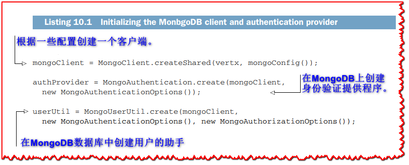
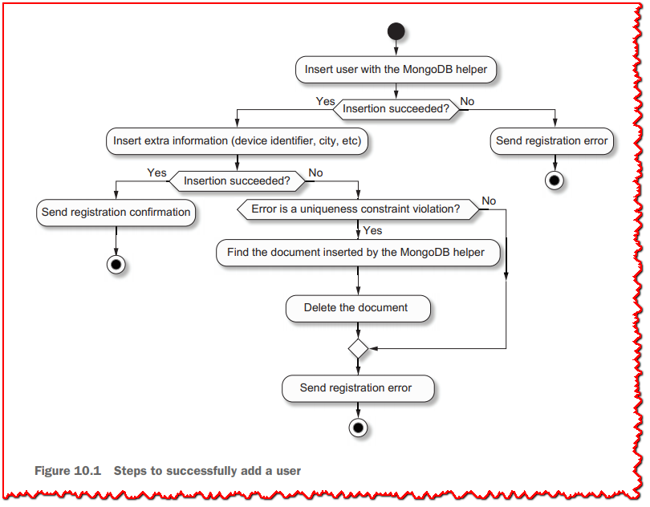
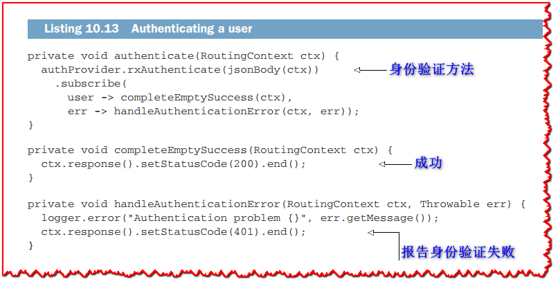
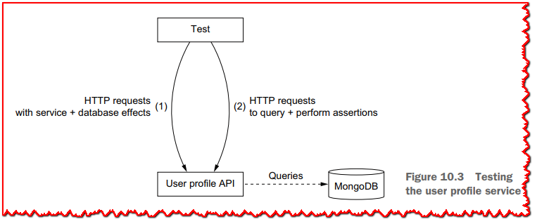
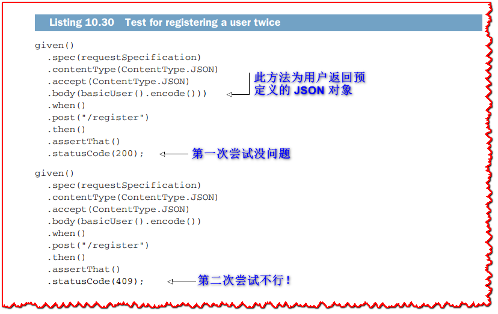
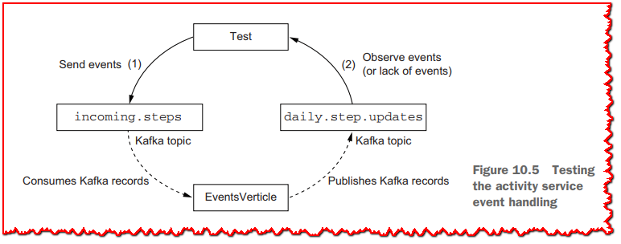
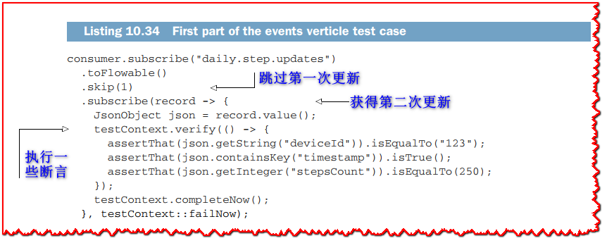
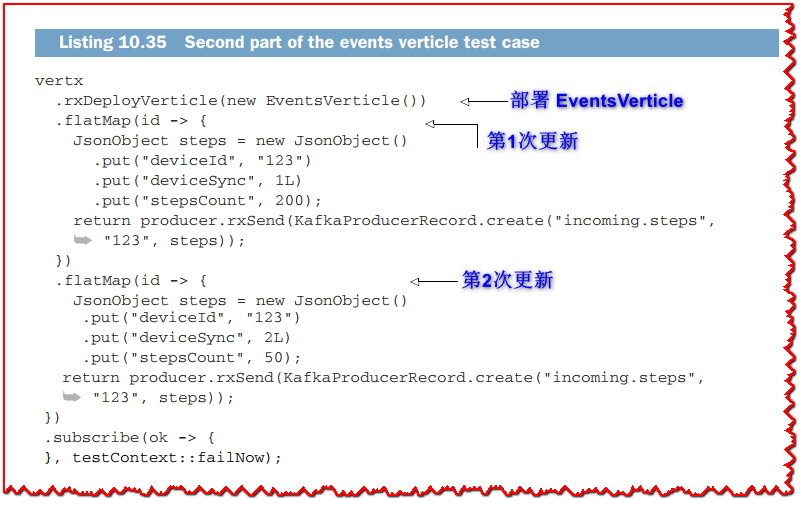

# 第十章: 使用数据库进行持久状态管理

> 翻译: 白石(https://github.com/wjw465150/Vert.x-in-Action-ChineseVersion)

**本章涵盖**
  - 使用 MongoDB 存储数据和验证用户
  - 从 Vert.x 使用 PostgreSQL
  - 与数据库交互的事件驱动服务的集成测试策略

响应式应用程序倾向于无状态设计，但是状态必须在某个地方进行管理。

数据库在大多数应用程序中都是必不可少的，因为需要存储、检索和查询数据。 数据库可以存储各种数据，例如应用程序状态、事实或用户凭据。 市场上有不同类型的数据库：一些是通用的，而另一些则专门用于某些类型的用例、访问模式和数据。

在本章中，我们将通过深入研究用户和活动服务的实现来探索 Vert.x 的数据库和状态管理。 这些服务将允许我们使用面向文档的数据库 (MongoDB) 和关系数据库 (PostgreSQL)。 您还将了解如何使用 MongoDB 对用户进行身份验证，以及如何为数据驱动的服务编写集成测试。

## 10.1 数据库 和 Vert.x

Vert.x 提供了广泛的客户端来连接数据源。 这些客户端包含与服务器通信的驱动程序，可以提供有效的连接管理，如连接池。 这对于构建各种服务很有用，从数据源支持的 API 到混合数据源、消息传递和 API 的集成服务。

### 10.1.1 Eclipse Vert.x 栈提供了什么

Eclipse Vert.x 项目提供了表 10.1 中列出的数据客户端模块。

**表 10.1 Eclipse Vert.x 支持的数据客户端模块**

| **标识符**                              | **描述**                                                     |
| --------------------------------------- | ------------------------------------------------------------ |
| vertx-mongo-client                      | MongoDB 是一个面向文档的数据库。                             |
| vertx-jdbc-client                       | 支持任何提供 JDBC 驱动程序的关系数据库。                     |
| vertx-pg-client and  vertx-mysql-client | 通过专用的 Vert.x 反应式驱动程序访问 PostgreSQL 和 MySQL 关系数据库。 |
| vertx-redis-client                      | Redis 是一种通用的数据结构存储。                             |
| vertx-cassandra-client                  | Apache Cassandra 是为大量数据量身定制的数据库。              |

您可以在更大的 Vert.x 社区中找到其他类型数据源的驱动程序。 这些超出了 Eclipse 基金会项目的范围。

MongoDB 是一种流行的面向文档的数据库； 它与 Vert.x 非常匹配，因为它操作 JSON 文档。 Redis 是一种内存数据结构存储，具有可配置的磁盘数据快照，可用作缓存、数据库和消息代理。 Apache Cassandra 是一个多节点的复制数据库，设计用于存储大量数据。 Cassandra 非常适合大小以数百 TB 甚至 PB 为单位的数据库。 当然，您可以只使用几 TB，但在这些情况下，更传统的数据库可能就足够了。

说到“传统”关系数据库，Vert.x 可以连接到有 JDBC 驱动程序的*任何东西*。 话虽如此，JDBC 是一种基于多线程设计和阻塞 I/O 的旧协议。 Vert.x 中的 JDBC 支持将数据库调用卸载到工作线程池，并将结果推送回事件循环上下文。 这是为了避免阻塞事件循环，因为 JDBC 调用会阻塞。 这种设计限制了可扩展性，因为需要工作线程，但对于中等工作负载应该没问题。

如果您使用 PostgreSQL 或 MySQL，Vert.x 提供了自己的响应式驱动程序。 这些驱动程序实现了每个数据库服务器的网络协议，它们是使用 Vert.x 的网络基础 Netty 以纯异步方式构建的。 这些驱动程序在延迟和并发连接方面都提供了出色的性能。 它们也非常稳定并实现了数据库的当前协议和功能。 您应该更喜欢 PostgreSQL 和 MySQL 的 Vert.x 反应式驱动程序客户端，并在需要连接到其他数据库时使用其 JDBC 客户端。

如果您正在寻找可靠的数据库，PostgreSQL 可能是一个不错的选择。 PostgreSQL 用途广泛，多年来一直用于各种小型和大型项目。 当然，您可以将其用作传统的关系数据库，但它还支持 JSON 文档作为一级对象，以及通过 PostGIS 扩展支持地理对象。

### 10.1.2 关于数据/对象映射的说明，以及为什么您可能并不总是需要它

在我们深入探讨 MongoDB 的用户配置服务设计和实现之前，我想快速讨论一些企业 Java 开发的既定习惯用法，并解释为什么为了**简单**和**高效**，本章中的代码会故意偏离假定的最佳实践 .

1万步挑战的代码可能会让您感到惊讶，因为它不执行对象数据映射，其中任何数据都必须映射到代表应用程序域的一些 Java 对象模型，例如数据传输对象 (DTO)。 例如，一些表示计步器更新的 JSON 数据将在完成任何进一步处理之前映射到 *DeviceUpdate* Java 类。 在这里，我们将直接操作 *JsonObject* 实例中的数据，因为它们在 HTTP、Kafka 和数据库接口之间流动。 例如，我们不会将设备更新JSON数据映射到 *DeviceUpdate*； 我们将改为使用该数据的 *JsonObject* 表示。

Vert.x允许在Java类之间进行数据映射，但是除非对象模型包含一些重要的业务逻辑，或者可以被第三方库中的一些处理利用，否则我认为进行任何形式的数据绑定都没有什么价值。我提倡这样的设计有以下几个原因:
  - 它使我们免于编写除了暴露琐碎的 getter 和 setter 之外没有其他功能的类。
  - 它避免了对生命周期通常较短的对象进行不必要的分配（例如，处理 HTTP 请求的生命周期）。
  - 数据并不总是很容易映射到对象模型，您可能并不对所有数据感兴趣，而是对一些选定的条目感兴趣。
  - 在关系数据库的情况下，对象和模型存在一些众所周知的不匹配，这些不匹配会导致复杂的映射和由于查询过多而导致的性能下降。
  - 它最终会导致更多的功能的代码。

如果您有疑问，请始终问自己是否真的需要对象模型，或者数据表示是否足以满足您正在进行的处理工作。 如果您的对象模型只包含 getter 和 setter，那么（至少在最初）您不需要它可能是一个好兆头。

现在让我们深入研究在用户配置文件服务中使用 MongoDB。

## 10.2 使用 MongoDB 的用户配置文件服务

用户配置文件服务管理用户数据，例如姓名、电子邮件和城市，它还用于根据登录/密码凭据对用户进行身份验证。 其他需要检索数据并将数据与用户信息相关联的服务使用此服务。

用户服务使用 MongoDB 有两个目的：
  - 存储用户数据：用户名、密码、电子邮件、城市、设备标识符，以及数据是否应出现在公开排名中
  - 根据用户名加密码组合对用户进行身份验证

MongoDB 非常适合这里，因为它是一个文档数据库； 每个用户都可以表示为一个文档。 我们将使用 *vertx-mongo-client* 模块连接到 MongoDB 实例，我们将使用 *vertx-auth-mongo* 模块进行身份验证。

### 10.2.1 数据模型

*vertx-auth-mongo* 模块是在 MongoDB 数据库之上进行用户身份验证的交钥匙解决方案，因为它管理正确存储和检索凭据的所有复杂性。 它实现了模块*vertx-auth-common*的通用认证接口。 它特别处理使用 *salt* 值存储密码的加密哈希，因为存储实际密码从来都不是一个好主意。 根据 *vertx-auth-mongo* 模块中定义的约定，目标数据库中的每个用户都有一个文档，其中包含以下条目：
  - **username** - 用户名的字符串
  - **salt** - 用于保护密码的随机数据字符串
  - **password** - 通过从实际密码加上盐值计算 SHA-512 哈希得到的字符串
  - **roles** - 定义 *roles* 的字符串数组（例如“administrator”）
  - **permissions** - 定义 *permissions* 的字符串数组（例如“can_access_beta”）。

在我们的例子中，我们不会使用角色和权限，因为所有用户都是平等的，所以这些条目将是空数组。 我们不必处理处理盐和密码哈希的微妙之处，因为这是由身份验证模块处理的。

虽然此数据模型由 *vertx-auth-mongo* 规定，但没有什么能阻止我们向代表用户的文档添加更多字段。 因此，我们可以添加以下条目：
  - **city** - 用户所在城市的字符串
  - **deviceId** - 计步器设备标识符的字符串
  - **email** - 用户电子邮件地址的字符串
  - **makePublic** - 一个布尔值，指示用户是否希望出现在公共排名中

我们还将对 MongoDB 索引强制执行两个完整性约束：*username* 和 *deviceId* 在所有文档中都必须是唯一的。 这避免了重复的用户名以及两个用户拥有相同的设备。 这将在注册新用户时带来正确性挑战，因为我们将无法使用任何交易机制。 当 *deviceId* 唯一性约束防止重复插入时，我们将需要回滚部分数据插入。

现在让我们看看如何使用 Vert.x MongoDB 客户端和 Vert.x 身份验证支持。

### 10.2.2 用户配置文件 API Verticle 和初始化

*UserProfileApiVerticle* 类公开了用户配置文件服务的 HTTP API。 它包含三个重要字段：

  - **mongoClient**，类型为 *MongoClient*，用于连接到 MongoDB 服务器。
  - **authProvider**，类型为 *MongoAuthentication*，用于使用 MongoDB 执行身份验证检查。
  - **userUtil**，类型为 *MongoUserUtil*，用于帮助创建新用户。

我们从 *rxStart* verticle 初始化方法初始化这些字段（因为我们使用 RxJava），如下面的清单所示。

身份验证提供程序依附于MongoDB客户端实例，该实例的配置如下面的清单所示。按照Vert.x MongoDB身份验证模块的约定，我们为身份验证提供者传递了空的配置选项。在添加用户时帮助我们的实用程序也是如此。

由于我们公开了一个 HTTP API，我们将使用 Vert.x Web 路由器来配置要由服务处理的各种路由，如下面的清单所示。

请注意，我们使用两个链式处理程序进行注册。 第1个处理程序用于数据验证，第2个处理程序用于实际处理逻辑。 但是验证逻辑是什么？

### 10.2.3 验证用户输入

注册是一个关键步骤，所以我们必须确保数据是有效的。 我们必须检查传入的数据（一个 JSON 文档）是否包含所有必填字段，并且它们都是有效的。 例如，我们需要检查电子邮件是否真的是电子邮件，并且用户名不为空且不包含不需要的字符。

以下清单中的 *validateRegistration* 方法将验证委托给辅助方法 *anyRegistrationFieldIsMissing* 和 *anyRegistrationFieldIsWrong*。

当任何验证步骤失败时，我们会返回 400 HTTP 状态码； 否则，我们调用下一个处理程序，在我们的例子中将是 *register* 方法。

*anyRegistrationFieldIsMissing* 方法的实现非常简单。 我们检查提供的 JSON 文档是否包含必填字段，如下所示。

*anyRegistrationFieldIsWrong* 方法将检查委托给正则表达式，如下面的清单所示。

*validDeviceId* 正则表达式与 *validUsername* 相同。 验证电子邮件地址 (*validEmail*) 是一种更复杂的正则表达式。 为此，我选择使用开放 Web 应用程序安全项目 (OWASP) 中的一种安全正则表达式 (www.owasp.org/index.php/OWASP_Validation_Regex)。

现在我们已经验证了数据，是时候注册用户了。

### 10.2.4 在 MongoDB 中添加用户

在数据库中插入新用户需要两个步骤：

  1. 我们需要让助手插入一个新用户，因为它还会处理其他方面，例如哈希密码和具有盐值。
  2. 我们需要更新用户文档以添加身份验证提供程序模式不需要的额外字段。

由于这是一个两步数据插入，我们不能使用任何事务管理工具，我们需要自己处理数据完整性，如**图 10.1** 所示。

幸运的是，RxJava 使错误管理声明性，因此我们不必处理异步操作的嵌套条件，这对于回调或 Promise/Future 来说会很复杂。

*register* 方法首先从 HTTP 请求中提取 JSON 有效负载，然后是要创建的用户的用户名和密码，如下所示。

请记住，*register* 在验证后调用，因此我们希望 JSON 数据是好的。 我们向身份验证提供者传递用户名和密码。 还有一种形式，*rxCreateUser* 接受2个额外的列表来定义角色和权限。 然后助手用一个新文档填充数据库。

接下来，我们必须运行查询来更新新创建的文档并附加新条目。 MongoDB 查询显示在以下清单中，并表示为JSON对象。

因此，我们必须将 *rxInsertUser* 操作与 MongoDB 更新查询链接，知道 *rxInsertUser* 返回一个 `Single<String>` ，其中值是新文档的标识符。 下面的清单显示了使用 RxJava 的完整用户添加处理。

*flatMapMaybe* 运算符允许我们链接两个查询。

*insertExtraInfo* 方法显示在下一个清单中并返回 *MaybeSource*，因为如果没有找到匹配的文档，查找和更新文档可能不会保存结果。

请注意，更新查询可能会失败； 例如，如果另一个用户已经注册了具有相同标识符的设备。 在这种情况下，我们需要手动回滚并删除由身份验证提供程序创建的文档，否则数据库中的文档将不完整。 以下清单包含 *deleteIncompleteUser* 方法的实现。

我们需要依靠异常消息中的技术代码来区分索引违规错误和其他类型的错误。 在第一种情况下，必须删除以前的数据，因为我们要对其进行处理和恢复； 在第二种情况下，这是另一个错误，我们无能为力，所以我们传播它。

最后，下一个清单中显示的 *handleRegistrationError* 方法需要检查错误以使用适当的 HTTP 状态代码进行响应。

如果请求失败是因为用户名或设备标识符已被占用，或者由于某些技术错误而失败，请务必通知请求者。 在一种情况下，错误是请求者的错误，而在另一种情况下，服务端是罪魁祸首，请求者可以稍后再试。

### 10.2.5 验证用户

根据用户名和密码对用户进行身份验证非常简单。 我们需要做的就是查询身份验证提供程序，它在成功时返回一个 *io.vertx.ext.auth.User* 实例。 在我们的例子中，我们对查询权限或角色不感兴趣—我们要做的就是检查身份验证是否成功。

假设发送到 `/authenticate` 的 HTTP *POST* 请求具有带有 *username* 和 *password* 字段的 JSON 正文，我们可以按如下方式执行身份验证请求。

身份验证请求的结果是 *User*，如果失败则返回异常。 根据结果，我们以 200 或 401 状态码结束 HTTP 请求。

### 10.2.6 获取用户数据

对 `/username` 的 HTTP *GET* 请求必须返回与该用户关联的数据（例如，`/foo`、`/bar` 等）。 为此，我们需要准备一个 MongoDB 查询并将数据作为 JSON 响应返回。

我们需要一个 MongoDB 的 `find` 查询来定位用户文档。 为此，我们需要两个 JSON 文档：
  - 根据数据库文档的 *username* 字段的值查找的查询文档
  - 用于指定应返回的字段的文档。

以下代码执行这样的查询。

指定哪些字段应该是响应的一部分并明确说明这一点很重要。 在我们的例子中，我们不想透露文档标识符，所以我们在 *fields* 文档中将其设置为 `0`。 我们还明确列出了我们希望以 `1` 值返回的字段。 这也确保不会意外泄露其他字段，例如来自身份验证的密码和盐值。

下一个清单显示了完成获取请求和 HTTP 响应的两种方法。

正确处理错误情况并区分不存在的用户和技术错误非常重要。

现在让我们看看更新用户的情况。

### 10.2.7 更新用户数据

更新用户数据类似于获取数据，因为我们需要两个 JSON 文档：一个用于匹配文档，另一个用于指定需要更新的字段。 下面的清单显示了相应的代码。

由于更新请求是来自 HTTP 请求的 JSON 文档，因此如果我们不小心，总是有可能受到外部攻击。 恶意用户可以在请求中制作包含更新密码或用户名的 JSON 文档，因此我们测试更新中是否存在每个允许的字段：*city*、*email* 和 *makePublic*。 然后，我们创建一个仅针对这些字段进行更新的 JSON 文档，而不是重用通过 HTTP 接收的 JSON 文档，并向 Vert.x MongoDB 客户端发出更新请求。

我们现在已经介绍了 Vert.x 中 MongoDB 的典型用法，以及如何将其用于身份验证。 让我们继续讨论 PostgreSQL 和活动服务。

## 10.3 使用 PostgreSQL 的活动服务

活动服务存储从计步器接收到的所有步数更新。 它是一种对新的步数更新事件（以存储数据）做出反应的服务，它可以被其他服务查询以获取给定设备在给定日期、月份或年份的步数。

在摄取服务接受设备更新后，活动服务使用 PostgreSQL 存储活动数据。 PostgreSQL 非常适合此目的，因为 SQL 查询语言可以轻松计算聚合，例如给定月份设备的步数。

此服务分为两个独立的verticles：
  - **EventsVerticle** 通过 Kafka 监听传入的活动更新，然后将数据存储在数据库中。
  - **ActivityApiVerticle** 公开了一个用于查询活动数据的 HTTP API。

我们本可以将所有代码放在一个 verticle 上，但是这种解耦使代码更易于管理，因为每个 verticle 都有明确的用途。 *EventsVerticle* 执行对数据库的写入，而 *ActivityApiVerticle* 执行读取操作。

### 10.3.1 数据模型

数据模型并不是非常复杂，并且适合单个关系 *stepevent*。 创建 *stepevent* 表的 SQL 指令显示在以下清单中。

主键根据设备标识符 (*device_id*) 和来自设备的同步计数器 (*device_sync*) 唯一标识活动更新。 记录事件的时间戳（*sync_timestamp*），最后存储步数（*steps_count*）。

>  **💡提示:** 如果您来自大量使用 *object-relational mappers* (ORM) 的背景，您可能会对前面的数据库模式感到惊讶，尤其是它使用复合主键而不是一些自动递增的数字这一事实。 您可能需要首先考虑关于正常形式的关系模型的正确设计，然后才能查看如何处理代码中的数据，无论是使用反映数据的集合 和/或 对象。 如果您对该主题感兴趣，维基百科对数据库规范化提供了很好的介绍：https://en.wikipedia.org/wiki/Database_normalization。

### 10.3.2 打开连接池

*vertx-pg-client* 模块包含 *PgPool* 接口，该接口模拟到 PostgreSQL 服务器的连接池，其中每个连接都可以重复用于后续查询。 *PgPool* 是您在客户端中执行 SQL 查询的主要访问点。

以下清单显示了如何创建 PostgreSQL 连接池。

池创建需要 Vert.x 上下文、一组连接选项（例如主机、数据库和密码）以及池选项。 可以调整池选项以设置最大连接数以及等待队列的大小，但这里可以使用默认值。

然后使用 *pool* 对象对数据库执行查询，如下所示。

### 10.3.3 设备更新事件的生命周期

*EventsVerticle* 负责监听 `incoming.steps` 主题的 Kafka 记录，其中每条记录都是通过摄取服务从设备接收到的更新。 对于每条记录，*EventsVerticle* 必须执行以下操作：

  - 将记录插入 PostgreSQL 数据库。
  - 使用记录设备的每日步数生成更新的记录。
  - 将其作为新的 Kafka 记录发布到Kafka的 *daily.step.updates*  主题。 如**图 10.2** 所示。

这些步骤由以下清单中定义的 RxJava 管道建模。

这个 RxJava 管道让人想起我们之前在消息传递和事件堆栈中看到的那些，因为我们组合了三个异步操作。 此管道从 Kafka 读取数据，插入数据库记录 (*insertRecord*)，生成要写入 Kafka 的查询 (*generateActivityUpdate*)，并提交它 (*commitKafkaConsumerOffset*)。

### 10.3.4 插入新记录

接下来显示用于插入记录的 SQL 查询。

>  **💡提示:** Vert.x 没有规定任何对象关系映射工具。 使用纯 SQL 是一个不错的选择，但如果您想从数据库的特殊性中抽象出代码并使用 API 来构建查询而不是使用字符串，我建议您查看 jOOQ (www.jooq.org)。 您甚至可以在社区中找到 *Vert.x/jOOQ(https://github.com/jklingsporn/vertx-jooq)* 集成模块。

我们使用带有静态方法的类来定义 SQL 查询，因为它比我们代码中的纯字符串常量更方便。 该查询将用作准备好的语句，其中以 `$` 符号为前缀的值将从值元组中获取。 由于我们使用预准备语句，因此这些值不会受到 SQL 注入攻击。

为每个新的 Kafka 记录调用 *insertRecord* 方法，方法主体显示在以下清单中。

我们首先从记录中提取 JSON 正文，然后准备一个值元组作为参数传递给**清单 10.20** 中的 SQL 查询。 查询的结果是一个行集，但由于这不是一个 *SELECT* 查询，所以我们不关心结果。 相反，我们只是简单地用原始 Kafka 记录值重新映射结果，因此 *generateActivityUpdate* 方法可以重用它。

*onErrorReturn* 运算符允许我们优雅地处理重复插入。 有可能在服务重启后，我们最终会重播一些我们已经处理过的 Kafka 事件，因此 INSERT 查询将失败，而不是创建具有重复主键的条目。

以下清单中的 *duplicateKeyInsert* 方法显示了我们如何区分重复键错误和另一个技术错误。

我们再次必须在异常消息中搜索技术错误代码，如果它对应于 PostgreSQL 重复键错误，则 *onErrorReturn* 将原始 Kafka 记录放入管道中，而不是让错误传播。

### 10.3.5 生成设备的每日活动更新

插入记录后，RxJava 处理管道的下一步是查询数据库以了解当天执行了多少步。 然后用于准备新的 Kafka 记录并将其推送到 `daily.step.updates` Kafka主题。

与该操作对应的 SQL 查询由以下清单中的 *stepsCountForToday* 方法指定。

此请求计算给定设备标识符在当天采取的步骤的总和（或 0）。

下一个清单显示了 *generateActivityUpdate* 方法的实现，获取由 *insertRecord* 方法转发的原始 Kafka 记录。

此代码显示了我们如何在 *SELECT* 查询之后操作行。 查询的结果是*RowSet*，在此由第一个*map* 运算符中的 *rs* 参数具体化，并且可以逐行迭代。 由于查询返回单行，我们可以通过在 *RowSet* 迭代器上调用 *next* 直接访问第一行也是唯一一行。 然后，我们按类型和索引访问行元素以构建一个 *JsonObject*，它创建发送到 `daily.step.updates` 主题的 Kafka 记录。

### 10.3.6 活动 API 查询

*ActivityApiVerticle* 类公开了活动服务的 HTTP API - 所有路由都指向 SQL 查询。 我不会展示所有这些。 我们将重点关注设备的每月步骤，通过对 `/:deviceId/:year/:month` 的 HTTP *GET* 请求进行处理。 SQL 查询如下所示。

*stepsOnMonth* 方法显示在下一个清单中。 它根据年月路径参数执行 SQL 查询。

查询结果又是一个*RowSet*，我们从SQL 查询中知道只能返回一行，所以我们使用 *map* 操作符来提取它。 *sendCount* 方法将数据作为 JSON 文档发送，而 *handleError* 方法会产生 HTTP 500 错误。 当年或月 URL 参数不是数字或没有生成有效日期时，*sendBadRequest* 会生成 HTTP 400 响应，让请求知道错误。

现在是时候转向集成测试策略了。 当我们必须预填充 PostgreSQL 数据库时，我还将向您展示一些其他数据客户端方法，例如 SQL 批处理查询。

## 10.4 集成测试

测试用户配置文件服务涉及向相应 API 发出 HTTP 请求。 活动服务有两个方面：一个涉及 HTTP API，另一个涉及制作 Kafka 事件并观察持久状态和生成事件方面的影响。

### 10.4.1 测试用户配置文件服务

用户配置文件测试依赖于发出影响服务状态和数据库的 HTTP 请求（例如，创建用户），然后发出进一步的 HTTP 请求以执行一些断言，如**图 10.3** 所示。

集成测试再次依赖于 Testcontainers，因为我们需要运行 MongoDB 实例。 一旦我们让容器运行，我们需要在运行任何测试之前准备 MongoDB 数据库处于干净状态。 这对于确保测试不受先前测试执行留下的数据的影响非常重要。

*IntegrationTest* 类的 *setup* 方法执行测试准备。

我们首先连接到 MongoDB 数据库，然后确保我们有两个索引用于 *username* 和 *deviceId* 字段。 然后，我们从 *profiles* 数据库中删除所有现有文档（参见清单 10.28），并在成功完成初始化阶段之前部署 *UserProfileApiVerticle* verticle 的实例。

*IntegrationTest* 类提供了预期会成功的操作以及预期会失败的操作的不同测试用例。 *RestAssured* 用于编写 HTTP 请求的测试规范，如下面的清单所示。

*authenticateMissingUser* 方法检查是否针对无效凭据进行身份验证会导致 HTTP 401 状态代码。

另一个例子是下面的测试，我们检查当我们尝试注册用户两次时会发生什么。

我们还可以查看数据库并检查每个操作后存储的数据。 由于我们需要涵盖 HTTP API 的所有功能案例，因此在集成测试中只关注 HTTP API 会更直接。 但是，在某些情况下，数据库之上的 API 可能不会让您接触到对存储数据的一些重要影响，在这些情况下，您需要连接到数据库以进行一些进一步的断言。

### 10.4.2 测试活动服务 API

测试活动服务 API 与测试用户配置文件服务非常相似，只是我们使用 PostgreSQL 而不是 MongoDB。

我们首先需要确保数据模式的定义如**清单 10.17** 所示。 为此，`init/postgres/setup.sql` 中的 SQL 脚本会在 PostgreSQL 容器启动时自动运行。 这是因为容器镜像指定在 `/docker-entrypoint-initdb.d/` 中找到的任何 SQL 脚本将在启动时运行，并且我们使用的 Docker Compose 文件将 `init/postgres` 挂载到 `/docker- entrypoint-initdb.d/`，因此容器中的 SQL 文件可用。

一旦数据库已经准备好一些预定义的数据，我们就会发出 HTTP 请求来执行断言，如**图 10.4** 所示。

我们再次依靠 Testcontainers 启动一个 PostgreSQL 服务器，然后我们依靠测试设置方法来准备数据，如下所示。

在这里，我们需要一个包含我们控制的数据集的数据库，其中包含设备 *123*、*456*、*abc* 和 *def* 在不同时间点的活动。 例如，设备*123*在*2019/05/21 11:00*记录了320步，这是该设备第4次与后端成功同步。 然后，我们可以对 HTTP API 执行检查，如下面的清单所示，我们在其中检查设备 *123* 在 *2019 年 5 月* 的步数。

活动 HTTP API 是服务的只读部分，所以现在让我们看看服务的另一部分。

### 10.4.3 测试活动服务的事件处理

测试 *EventsVerticle* 的 Kafka 事件处理部分的技术与我们在上一章中所做的非常相似：我们将发送一些 Kafka 记录，然后观察服务产生的 Kafka 记录。

通过为给定设备发送多个步骤更新，我们应该观察到该服务生成的更新会累积当天的步骤。 由于该服务既消费又产生反映数据库当前状态的 Kakfa 记录，我们不需要执行 SQL 查询——观察正在产生正确的 Kafka 记录就足够了。 **图 10.5** 概述了测试是如何完成的。

集成测试类 (*EventProcessingTest*) 再次使用 TestContainers 来启动所需的服务：PostgreSQL、Apache Kafka 和 Apache ZooKeeper。 在运行任何测试之前，我们必须使用以下清单中的测试准备代码从干净状态开始。

我们需要确保 PostgreSQL 数据库是空的，并且我们用来接收和发送事件的 Kafka 主题被删除。 然后我们可以专注于测试方法，我们将为设备 *123* 发送2个步骤更新。

在此之前，我们必须先订阅 *daily.step.updates* Kafka 主题，其中 *EventsVerticle* 类将发送 Kafka 记录。 以下清单显示了测试用例的第一部分。

由于我们发送了2个更新，我们跳过发出的记录，只对第2个执行断言，因为它应该反映2个更新的步骤总和。 前面的代码正在等待事件的产生，所以我们现在需要部署 *EventsVerticle* 并发送两个更新，如下所示。

当 *EventsVerticle* 正确地向 *daily.step.updates* Kafka 主题发送正确的更新时，测试完成。 我们可以再次注意到 RxJava 如何允许我们以声明方式组合异步操作并确保清楚地识别错误处理。 我们这里基本上有两个 RxJava 管道，任何错误都会导致测试上下文失败。

>  **🏷注意:** 如果第1次更新在午夜之前发送，第2次在午夜之后发送，那么这个测试有一个很小的漏洞窗口会失败。 在这种情况下，第2个事件将不是两个事件中步骤的总和。 这不太可能发生，因为这两个事件将相隔几毫秒发出，但它仍然可能发生。

说到事件流，下一章将重点介绍 Vert.x 的高级事件处理服务。

## 总结
  - Vert.x 应用程序可以轻松部署到 Kubernetes 集群，而无需 Kubernetes 特定模块。
  - Vert.x 分布式事件总线通过配置集群管理器发现模式在 Kubernetes 中工作。
  - 使用 Minikube、Skaffold 和 Jib 等工具可以获得快速的本地 Kubernetes 开发体验。
  - 公开运行状况检查和指标是在集群中操作服务的好习惯。
