# 第十章: Persistent state management with databases

**本章涵盖**

◾     Storing data and authenticating users with MongoDB

◾     Using PostgreSQL from Vert.x

◾     Testing strategies for integration testing of eventdriven services that interact with databases

Reactive applications favor stateless designs, but state has to be managed somewhere. 

Databases are essential in most applications, because data needs to be stored, retrieved, and queried. Databases can store all kinds of data, such as application state, facts, or user credentials. There are different types of databases on the market: some are generalist and others are specialized for certain types of use cases, access patterns, and data.

In this chapter we’ll explore database and state management with Vert.x by diving into the implementation of the user and activity services. These services will allow us to use a document-oriented database (MongoDB) and a relational database (PostgreSQL). You will also see how you can use MongoDB for authenticating users, and how to write integration tests for data-driven services.

## 10.1 Databases and Vert.x

Vert.x offers a wide range of clients for connecting to data sources. These clients contain drivers that talk to servers, and that may offer efficient connection management, like connection pooling. This is useful for building all kinds of services, from APIs backed by a data source to integration services that mix data sources, messaging, and APIs.

### 10.1.1 What the Eclipse Vert.x stack provides

The Eclipse Vert.x project provides the data client modules listed in table 10.1.

**Table 10.1 Data client modules supported by Eclipse Vert.x**

| **Identifier**                          | **Description**                                              |
| --------------------------------------- | ------------------------------------------------------------ |
| vertx-mongo-client                      | MongoDB is a document-oriented database.                     |
| vertx-jdbc-client                       | Supports any relational database that offers a JDBC driver.  |
| vertx-pg-client and  vertx-mysql-client | Access PostgreSQL and MySQL  relational databases through dedicated Vert.x reactive drivers. |
| vertx-redis-client                      | Redis is versatile data structure store.                     |
| vertx-cassandra-client                  | Apache Cassandra is a database tailored for very large volumes of data. |

You can find drivers for other kinds of data sources in the larger Vert.x community. Those are beyond the scope of the project at the Eclipse Foundation.

MongoDB is a popular document-oriented database; it is a good match with Vert.x since it manipulates JSON documents. Redis is an in-memory data structure store with configurable on-disk data snapshots that can be used as a cache, as a database, and as a message broker. Apache Cassandra is a multinode, replicated database designed for storing huge amounts of data. Cassandra is well suited for databases where size is measured in hundreds of terabytes or even petabytes. You can, of course, use it for just a few terabytes, but a more traditional database may suffice in these cases.

Speaking of “traditional” relational databases, Vert.x can connect to *anything* for which there is a JDBC driver. That being said, JDBC is an older protocol based on a multithreaded design and blocking I/O. The JDBC support in Vert.x offloads database calls to worker thread pools, and it pushes results back to event-loop contexts. This is to avoid blocking event loops, since JDBC calls do block. This design limits scalability, as worker threads are needed, but for moderate workloads it should be fine.

If you use PostgreSQL or MySQL, Vert.x provides its own reactive drivers. These drivers implement the network protocols of each database server, and they are built in a purely asynchronous fashion using Netty, the networking foundation of Vert.x. The drivers offer excellent performance, both in terms of latency and concurrent connections. They are also very stable and implement the current protocols and features of the databases. You should prefer the Vert.x reactive driver clients for PostgreSQL and MySQL, and use the JDBC client when you need to connect to other databases.

If you are looking for a solid database, PostgreSQL is probably a good bet. PostgreSQL is versatile and has been used in all sorts of small and large-scale projects over the years. You can, of course, use it as a traditional relational database, but it also supports JSON documents as first-class objects, and geographic objects through the PostGIS extension.

### 10.1.2 A note on data/object mapping, and why you may not always need it

Before we dive into the user profile service design and implementation with MongoDB, I would like to quickly discuss certain established idioms of enterprise Java development, and explain why, in search of simplicity and efficiency, the code in this chapter deviates intentionally from supposed best practices.

The code of the 10k steps challenge may surprise you, because it does not perform object data mapping, where any data has to be mapped to some Java object model that represents the application domain, such as data transfer objects (DTOs). For instance, some JSON data representing a pedometer update would be mapped to a DeviceUpdate Java class before any further processing was done. Here we will directly manipulate data in JsonObject instances as they flow between HTTP, Kafka, and database interfaces. We will not map, say, device update JSON data to DeviceUpdate; we will work with the JsonObject representation of that data instead.

Vert.x does allow you to do data mapping from and to Java classes, but unless the object model contains some significant business logic or can be leveraged by some processing in a third-party library, I see little value in doing any form of data binding. I advocate such a design for several reasons:

◾     It saves us from writing classes that have no functionality except exposing trivial getters and setters.

◾     It avoids unnecessary allocation of objects with typically short lifetimes (e.g., the lifespan of processing an HTTP request).

◾     Data is not always easy to map to an object model, and you may not be interested in all the data, but rather in some selected entries.

◾     In the case of relational databases, the object and the models have some well-known mismatches that can result in complex mappings and bad performance due to excessive queries.

◾     It eventually leads to code that is more functional.

If you’re in doubt, always ask yourself whether you actually need an object model, or whether the data representation is good enough for the processing work that you are doing. If your object model consists of nothing but getters and setters, perhaps it’s a good sign that (at least initially) you don’t need it.

Let’s now dive into using MongoDB in the user profile service.

## 10.2 User profile service with MongoDB

The user profile service manages user data such as name, email, and city, and it’s also used to authenticate a user against login/password credentials. This service is used by other services that need to retrieve and correlate data against user information.

The user service makes use of MongoDB for two purposes:

◾     Storing user data: username, password, email, city, device identifier, and whether data should appear in public rankings

◾     Authenticating users against a username plus password combination

MongoDB is a good fit here because it is a document database; each user can be represented as a document. We will use the vertx-mongo-client module to connect to MongoDB instances, and we will use the vertx-auth-mongo module for authentication.

### 10.2.1 Data model

The vertx-auth-mongo module is a turnkey solution for doing user authentication on top of a MongoDB database, as it manages all the intricacies of properly storing and retrieving credentials. It implements the common authentication interface of module vertx-auth-common. It especially deals with storing cryptographic hashes of passwords with a *salt* value, because storing actual passwords is never a good idea. According to the conventions defined in the vertx-auth-mongo module, there is a document for each user in the target database with the following entries:

◾     username—A string for the username

◾     salt—A random data string used to secure the password

◾     password—A string made by computing the SHA-512 hash from the actual password plus the salt value

◾     roles—An array of strings defining *roles* (such as “administrator”)

◾     permissions—An array of strings defining *permissions* (such as “can_access

_beta”).

In our case, we won’t use roles and permissions, since all users will be equal, so these entries will be empty arrays. We will not have to deal with the subtleties of handling salts and password hashing, as this is taken care of by the authentication module.

While this data model is prescribed by vertx-auth-mongo, nothing precludes us from adding more fields to the documents that represent users. We can thus add the following entries:

◾     city—A string for the user’s city

◾     deviceId—A string for the pedometer device identifier

◾     email—A string for the user’s email address

◾     makePublic—A Boolean to indicate whether or not the user wants to appear in public rankings

We’ll also enforce two integrity constraints with MongoDB indexes: both username and deviceId must be unique across all documents. This avoids duplicate user names as well as two users having the same device. This will pose a correctness challenge when registering new users, because we will not be able to use any transaction mechanism. We will need to roll back partial data inserts when the deviceId uniqueness constraint prevents a duplicate insert.

Let’s now look at how we can use the Vert.x MongoDB client and Vert.x authentication support.

### 10.2.2 User profile API verticle and initialization

The UserProfileApiVerticle class exposes the HTTP API for the user profile service. It holds three important fields:

◾     mongoClient, of type MongoClient, is used to connect to a MongoDB server.

◾     authProvider, of type MongoAuthentication, is used to perform authentication checks using MongoDB.

◾     userUtil, of type MongoUserUtil, is used to facilitate new user creation.

We initialize these fields from the rxStart verticle initialization method (since we use RxJava), as shown in the following listing.

The authentication provider piggybacks on the MongoDB client instance, which is configured as in the next listing. We pass empty configuration options for the authentication provider as we follow the conventions of the Vert.x MongoDB authentication module. The same goes with the utility that will help us when adding users.

Since we are exposing an HTTP API, we’ll use a Vert.x web router to configure the various routes to be handled by the service, as shown in the following listing.

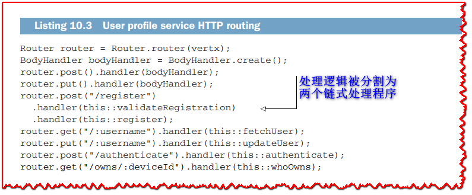

Note that we use two chained handlers for the registration. The first handler is for data validation, and the second handler is for the actual processing logic. But what is in the validation logic?

### 10.2.3 Validating user input

Registration is a critical step, so we must ensure that the data is valid. We must check that the incoming data (a JSON document) contains all required fields, and that they are all valid. For instance, we need to check that an email is actually an email, and that a username is not empty and does not contain unwanted characters.

The validateRegistration method in the following listing delegates the validation to the helper methods anyRegistrationFieldIsMissing and anyRegistrationFieldIsWrong.

When any validation steps fails, we respond with a 400 HTTP status code; otherwise, we call the next handler, which in our case will be the register method.

The implementation of the anyRegistrationFieldIsMissing method is quite

simple. We check that the provided JSON document contains the required fields, as follows.

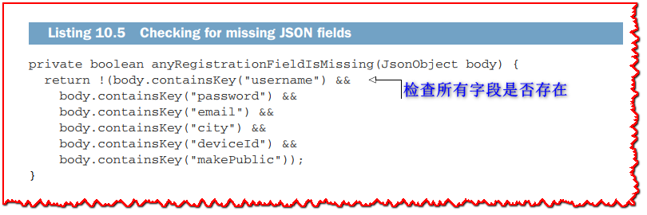

The anyRegistrationFieldIsWrong method delegates checks to regular expressions, as in the following listing.

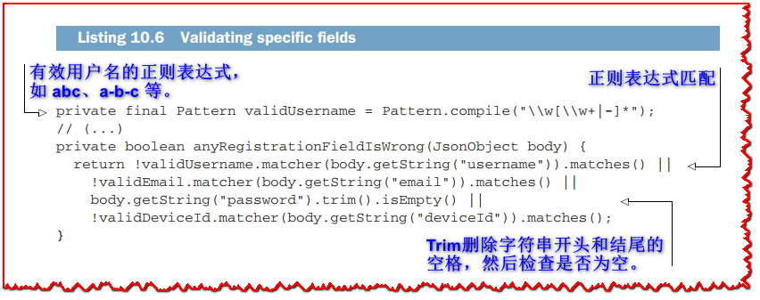

The validDeviceId regular expression is the same as validUsername. Validating an email address (validEmail) is a more sophisticated regular expression. I chose to use one of the safe regular expressions from the Open Web Application Security Project (OWASP) for that purpose (www.owasp.org/index.php/OWASP_Validation_Regex).

Now that we have validated the data, it is time to register the users.

### 10.2.4 Adding users in MongoDB

Inserting a new user in the database requires two steps:

**1** We need to ask the helper to insert a new user, as it will also deal with other aspects like hashing passwords and having a salt value.

**2** We need to update the user document to add extra fields that are not required by the authentication provider schema.

Since this is a two-step data insert, and we cannot use any transaction management facility, we need to take care of the data integrity ourselves, as shown in figure 10.1.

Fortunately RxJava makes the error management declarative, so we won’t have to deal with nested conditionals of asynchronous operations, which would be complicated to do with callbacks or promises/futures.

The register method starts by extracting the JSON payload from the HTTP request, and then the username and password of the user to create, as follows.

Remember that register is called after validation, so we expect the JSON data to be good. We pass the authentication provider the username and password. There is also a form where rxCreateUser accepts two extra lists for defining roles and permissions. Then the helper populates the database with a new document.

Next we have to run a query to update the newly created document and append new entries. The MongoDB query is shown in the following listing and is represented as a JSON object.

We must thus chain the rxInsertUser operation with a MongoDB update query, knowing that rxInsertUser returns a Single<String> where the value is the identifier of the new document. The following listing shows the complete user addition processing with RxJava.

The flatMapMaybe operator allows us to chain the two queries.

The insertExtraInfo method is shown in the next listing and returns a MaybeSource, because finding and updating a document may not hold a result if no matching document was found.

Note that the update query can fail; for example, if another user has already registered a device with the same identifier. In this case, we need to manually roll back and remove the document that was created by the authentication provider, because otherwise we would have an incomplete document in the database. The following listing holds the implementation of the deleteIncompleteUser method.

We need to rely on a technical code in an exception message to distinguish between index violation errors and other types of errors. In the first case, the previous data has to be removed because we want to deal with it and recover; in the second case, this is another error and we cannot do much, so we propagate it.

Finally, the handleRegistrationError method shown in the next listing needs to inspect the error to respond with the appropriate HTTP status code.

It is important to notify the requester if the request failed because the username or device identifier has already been taken, or if it failed due to some technical error. In one case, the error is the fault of the requester, and in the other case, the service is the culprit, and the requester can try again later.

### 10.2.5 Authenticating a user

Authenticating a user against a username and password is very simple. All we need to do is query the authentication provider, which returns an io.vertx.ext.auth.User instance on success. In our case, we are not interested in querying permissions or roles—all we want to do is check that authentication succeeded.

Assuming that an HTTP POST request sent to /authenticate has a JSON body with username and password fields, we can perform the authentication request as follows.

The result of an authentication request is a User, or an exception if it failed. Depending on the outcome, we end the HTTP request with a 200 or 401 status code.

### 10.2.6 Fetching a user’s data

HTTP GET requests to /username must return the data associated with that user (e.g.,

/foo, /bar, etc.). To do that, we need to prepare a MongoDB query and return the data as a JSON response.

We need a MongoDB “find” query to locate a user document. To do that we need two JSON documents:

◾     A query document to find based on the value of the username field of the database documents

◾     A document to specify the fields that should be returned. The following code performs such a query.

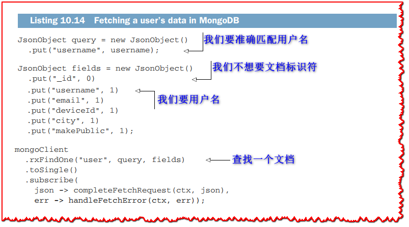

It is important to specify which fields should be part of the response, and to be explicit about it. In our case, we don’t want to reveal the document identifier, so we set it to 0 in the fields document. We also explicitly list the fields that we want to be returned with 1 values. This also ensures that other fields like the password and salt values from the authentication are not accidentally revealed.

The next listing shows the two methods that complete the fetch request and HTTP response.

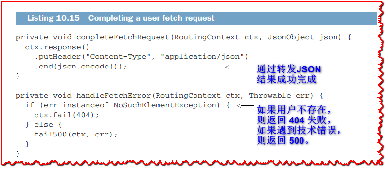

It is important to properly deal with the error cases and to distinguish between a nonexisting user and a technical error.

Let’s now see the case of updating a user.

### 10.2.7 Updating a user’s data

Updating a user’s data is similar to fetching data, as we need two JSON documents: one to match documents, and one to specify what fields need to be updated. The following listing shows the corresponding code.

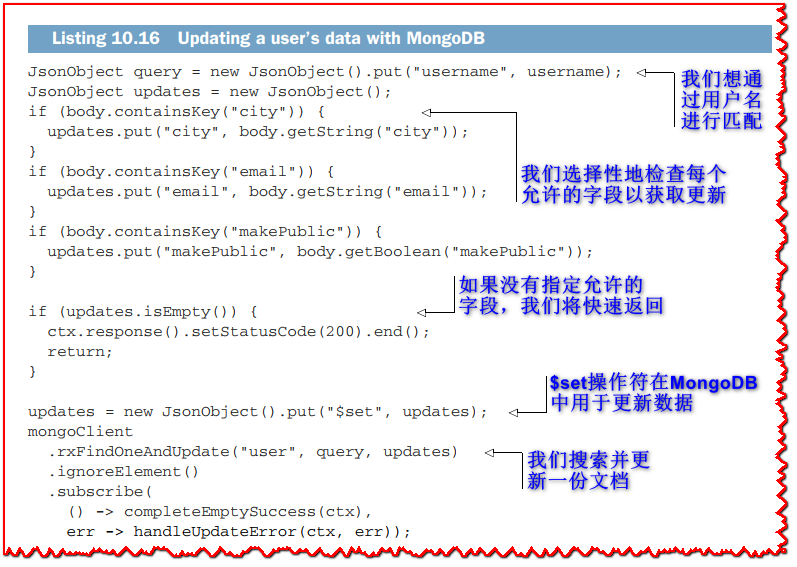

Since the update request is a JSON document coming from an HTTP request, there is always the possibility of an external attack if we are not careful. A malicious user could craft a JSON document in the request with updates to the password or username, so we test for the presence of each allowed field in updates: city, email, and makePublic. We then create a JSON document with updates just for these fields, rather than reusing the JSON document received over HTTP, and we make an update request to the Vert.x MongoDB client.

We have now covered the typical use of MongoDB in Vert.x, as well as how to use it for authentication purposes. Let’s move on to PostgreSQL and the activity service.

## 10.3 Activity service with PostgreSQL

The activity service stores all the step updates as they are received from pedometers. It is a service that reacts to new step update events (to store data), and it can be queried by other services to get step counts for a given device on a given day, month, or year.

The activity service uses PostgreSQL to store activity data after device updates have been accepted by the ingestion service. PostgreSQL is well suited for this purpose because the SQL query language makes it easy to compute aggregates, such as step counts for a device on a given month.

The service is split into two independent verticles:

◾     EventsVerticle listens for incoming activity updates over Kafka and then stores data in the database.

◾     ActivityApiVerticle exposes an HTTP API for querying activity data.

We could have put all the code on a single verticle, but this decoupling renders the code more manageable, as each verticle has a well-defined purpose. EventsVerticle performs writes to the database, whereas ActivityApiVerticle performs the read operations.

### 10.3.1 Data model

The data model is not terribly complex and fits in a single relation stepevent. The SQL instructions for creating the stepevent table are shown in the following listing.

The primary key uniquely identifies an activity update based on a device identifier (device_id) and a synchronization counter from the device (device_sync). The timestamp of the event is recorded (sync_timestamp), and finally the number of steps is stored (steps_count).

>  **TIP** If you come from a background with a heavy use of *object-relational mappers* (ORMs), you may be surprised by the preceding database schema, and especially the fact that it uses a composite primary key rather than some auto-incremented number. You may want to first consider the proper design of your relational model with respect to normal forms, and only then see how to handle data in your code, be it with collections and/or objects that reflect the data. If you’re interested in the topic, Wikipedia provides a good introduction to database normalization: https://en.wikipedia.org/wiki/Database_normalization.

### 10.3.2 Opening a connection pool

The vertx-pg-client module contains the PgPool interface that models a pool of connections to a PostgreSQL server, where each connection can be reused for subsequent queries. PgPool is your main access point in the client for performing SQL queries.

The following listing shows how to create a PostgreSQL connection pool.

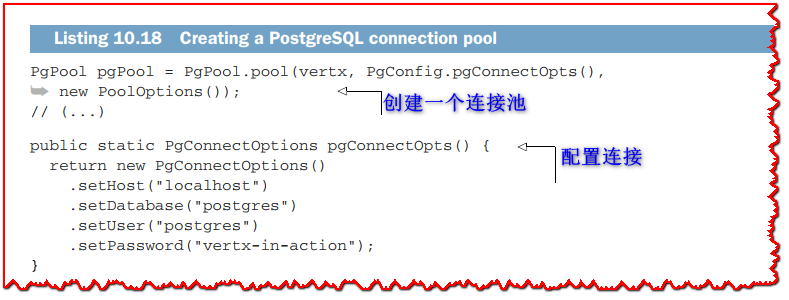

The pool creation requires a Vert.x context, a set of connection options such as the host, database, and password, and pool options. The pool options can be tuned to set the maximum number of connections as well as the size of the waiting queue, but default values are fine here.

The *pool* object is then used to perform queries to the database, as you will see next.

### 10.3.3 Life of a device update event

The EventsVerticle is in charge of listening to Kafka records on the incoming.steps topic, where each record is an update received from a device through the ingestion service. For each record, EventsVerticle must do the following:

◾     Insert the record into the PostgreSQL database.

◾     Generate an updated record with the daily step count for the device of the record.

◾     Publish it as a new Kafka record to the daily.step.updates Kafka topic. This is illustrated in figure 10.2.

These steps are modeled by the RxJava pipeline defined in the following listing.

This RxJava pipeline is reminiscent of those we saw earlier in the messaging and eventing stack, as we compose three asynchronous operations. This pipeline reads from Kafka, inserts database records (insertRecord), produces a query to write to Kafka (generateActivityUpdate), and commits it (commitKafkaConsumerOffset).

### 10.3.4 Inserting a new record

The SQL query to insert a record is shown next.

>  **TIP** Vert.x does not prescribe any object-relational mapping tool. Using plain SQL is a great option, but if you want to abstract your code from the particularities of databases and use an API to build your queries rather than using strings, I recommend looking at jOOQ (www.jooq.org/). You can even find a Vert.x/jOOQ integration module in the community.

We use a class with static methods to define SQL queries, as it is more convenient than plain string constants in our code. The query will be used as a prepared statement, where values prefixed by a $ symbol will be taken from a tuple of values. Since we use a prepared statement, these values are safe from SQL injection attacks.

The insertRecord method is called for each new Kafka record, and the method body is shown in the following listing.

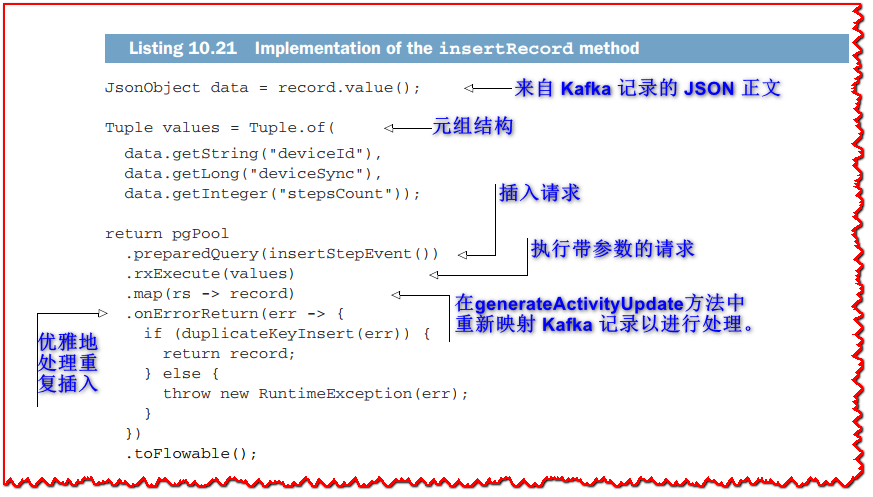

We first extract the JSON body from the record, and then prepare a tuple of values to pass as parameters to the SQL query in listing 10.20. The result of the query is a row set, but since this is not a SELECT query, we do not care about the result. Instead, we simply remap the result with the original Kafka record value, so the generateActivityUpdate method can reuse it.

The onErrorReturn operator allows us to handle duplicate inserts gracefully. It is possible that after a service restart we’ll end up replaying some Kafka events that we had already processed, so the INSERT queries will fail instead of creating entries with duplicate primary keys.

The duplicateKeyInsert method in the following listing shows how we can distinguish between a duplicate key error and another technical error.

We again have to search for a technical error code in the exception message, and if it corresponds to a PostgreSQL duplicate key error, then onErrorReturn puts the original Kafka record in the pipeline rather than letting an error be propagated.

### 10.3.5 Generating a device’s daily activity update

The next step in the RxJava processing pipeline after a record has been inserted is to query the database to find out how many steps have been taken on the current day. This is then used to prepare a new Kafka record and push it to the daily.step.updates Kafka topic.

The SQL query corresponding to that operation is specified by the stepsCountForToday method in the following listing.

This request computes the sum (or 0) of the steps taken on the current day for a given device identifier.

The next listing shows the implementation of the generateActivityUpdate method, picking up the original Kafka record forwarded by the insertRecord method.

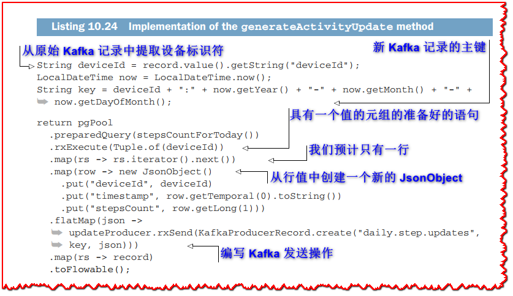

This code shows how we can manipulate rows following a SELECT query. The result of a query is RowSet, materialized here by the rs argument in the first map operator, and which can be iterated row by row. Since the query returns a single row, we can directly access the first and only row by calling next on the RowSet iterator. We then access the row elements by type and index to build a JsonObject that creates the Kafka record sent to the daily.step.updates topic.

### 10.3.6 Activity API queries

The ActivityApiVerticle class exposes the HTTP API for the activity service—all routes lead to SQL queries. I won’t show all of them. We’ll focus on the monthly steps for a device, handled through HTTP GET requests to /:deviceId/:year/:month. The SQL query is shown next.

The stepsOnMonth method is shown in the next listing. It performs the SQL query based on the year and month path parameters.

The query result is again a RowSet, and we know from the SQL query that only one row can be returned, so we use the map operator to extract it. The sendCount method sends the data as a JSON document, while the handleError method produces an HTTP 500 error. When a year or month URL parameter is not a number or does not result in a valid date, sendBadRequest produces an HTTP 400 response to let the request know of the mistake.

It is now time to move on to integration testing strategies. I’ll also show you some other data client methods, such as SQL batch queries, when we have to prepopulate a PostgreSQL database.

## 10.4 Integration tests

Testing the user profile service involves issuing HTTP requests to the corresponding API. The activity service has two facets: one that involves the HTTP API, and one that involves crafting Kafka events and observing the effects in terms of persisted state and produced events.

### 10.4.1 Testing the user profile service

The user profile tests rely on issuing HTTP requests that impact the service state and the database (e.g., creating a user) and then issuing further HTTP requests to perform some assertions, as illustrated in figure 10.3.

The integration tests rely again on Testcontainers, as we need to have a MongoDB instance running. Once we have the container running, we need to prepare the MongoDB database to be in a clean state before we run any tests. This is important to ensure that a test is not affected by data left by a previous test’s execution.

The setup method of the IntegrationTest class performs the test preparation.

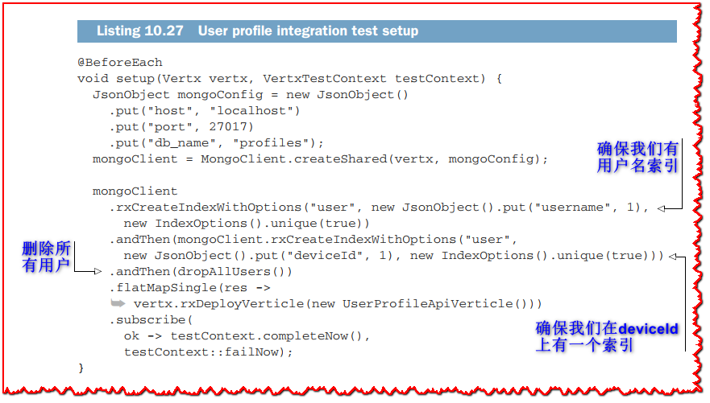

We first connect to the MongoDB database and then ensure we have two indexes for the username and deviceId fields. We then remove all existing documents from the profiles database (see listing 10.28), and deploy an instance of the UserProfileApiVerticle verticle before successfully completing the initialization phase.

The IntegrationTest class provides different test cases of operations that are expected to succeed, as well as operations that are expected to fail. RestAssured is used to write the test specifications of the HTTP requests, as in the following listing.

The authenticateMissingUser method checks that authenticating against invalid credentials results in an HTTP 401 status code.

Another example is the following test, where we check what happens when we attempt to register a user twice.

We could also peek into the database and check the data that is being stored after each action. Since we need to cover all functional cases of the HTTP API, it is more straightforward to focus on just the HTTP API in the integration tests. However, there are cases where an API on top of a database may not expose you to some important effects on the stored data, and in these cases, you will need to connect to the database to make some further assertions.

### 10.4.2 Testing the activity service API

Testing the activity service API is quite similar to testing the user profile service, except that we use PostgreSQL instead of MongoDB.

We first need to ensure that the data schema is defined as in listing 10.17. To do that, the SQL script in init/postgres/setup.sql is run automatically when the PostgreSQL container starts. This works because the container image specifies that any SQL script found in /docker-entrypoint-initdb.d/ will be run when it starts, and the Docker Compose file that we use mounts init/postgres to /docker-entrypoint-initdb.d/, so the SQL file is available in the container.

Once the database has been prepared with some predefined data, we issue HTTP requests to perform assertions, as shown in figure 10.4.

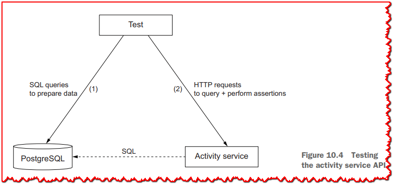

We again rely on Testcontainers to start a PostgreSQL server, and then we rely on the test setup method to prepare the data as follows.

Here we want a database with a data set that we control, with activities for devices 123, 456, abc, and def at various points in time. For instance, device 123 recorded 320 steps on 2019/05/21 at 11:00, and that was the fourth time the device made a successful synchronization with the backend. We can then perform checks against the HTTP API, as in the following listing, where we check the number of steps for device 123 in May 2019.

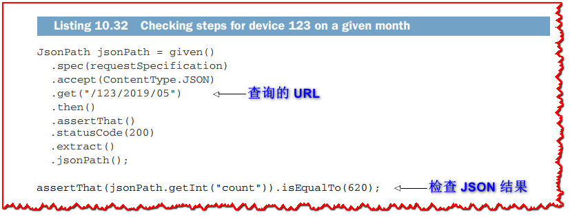

The activity HTTP API is the read-only part of the service, so let’s now look at the other part of the service.

### 10.4.3 Testing the activity service’s event handling

The technique for testing the Kafka event processing part of EventsVerticle is very similar to what we did in the previous chapter: we’ll send some Kafka records and then observe what Kafka records the service produces.

By sending multiple step updates for a given device, we should observe that the service produces updates that accumulate the steps on the current day. Since the service both consumes and produces Kakfa records that reflect the current state of the database, we won’t need to perform SQL queries—observing that correct Kafka records are being produced is sufficient. Figure 10.5 provides an overview of how the testing is done.

The integration test class (EventProcessingTest) again uses TestContainers to start the required services: PostgreSQL, Apache Kafka, and Apache ZooKeeper. Before any test is run, we must start from a clean state by using the test preparation code in the following listing.

We need to ensure that the PostgreSQL database is empty, and that the Kafka topics we use to receive and send events are deleted. We can then focus on the test method, where we will send two step updates for device 123.

Before that, we must first subscribe to the daily.step.updates Kafka topic, where the EventsVerticle class will send Kafka records. The following listing shows the first part of the test case.

Since we send two updates, we skip the emitted record and only perform assertions on the second one, as it should reflect the sum of the steps from the two updates. The preceding code is waiting for events to be produced, so we now need to deploy EventsVerticle and send the two updates as follows.

The test completes as EventsVerticle properly sends correct updates to the daily.step.updates Kafka topic. We can again note how RxJava allows us to compose asynchronous operations in a declarative fashion and ensure the error processing is clearly identified. We have essentially two RxJava pipelines here, and any error causes the test context to fail.

>  **NOTE** There is a tiny vulnerability window for this test to fail if the first update is sent before midnight and the second right after midnight. In that case, the second event will not be a sum of the steps in the two events. This is very unlikely to happen, since the two events will be emitted a few milliseconds apart, but still, it could happen.

Speaking of event streams, the next chapter will focus on advanced event processing services with Vert.x.

## Summary

◾     Vert.x applications can easily be deployed to Kubernetes clusters with no need for Kubernetes-specific modules.

◾     The Vert.x distributed event bus works in Kubernetes by configuring the cluster manager discovery mode.

◾     It is possible to have a fast, local Kubernetes development experience using tools like Minikube, Skaffold, and Jib.

◾     Exposing health checks and metrics is a good practice for operating services in a cluster.
