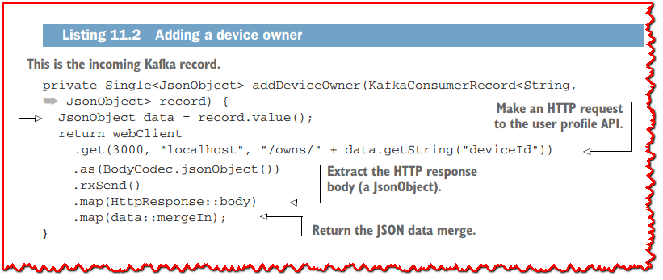
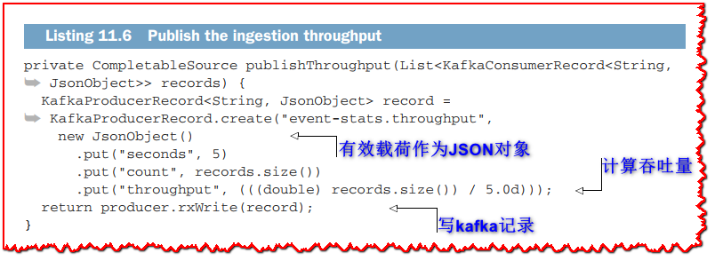
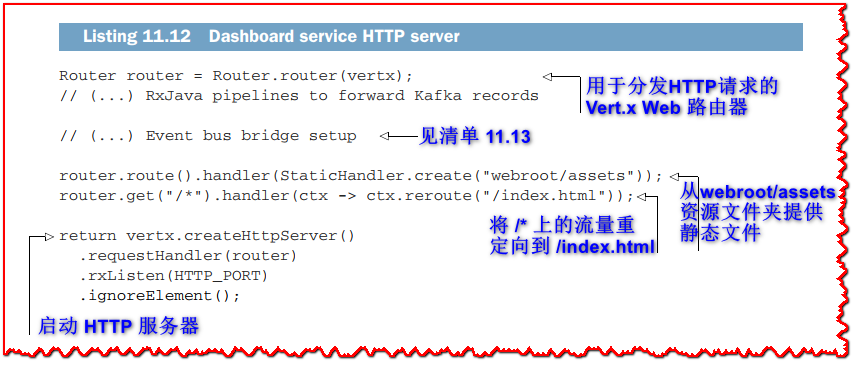
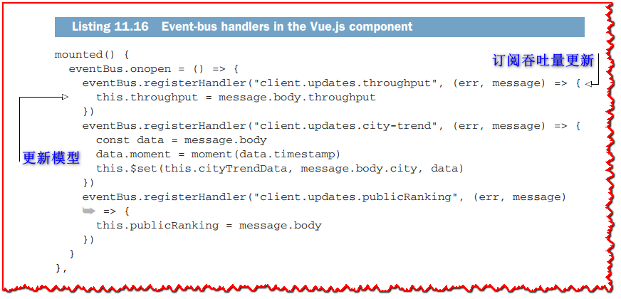
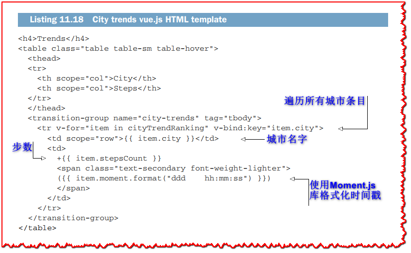
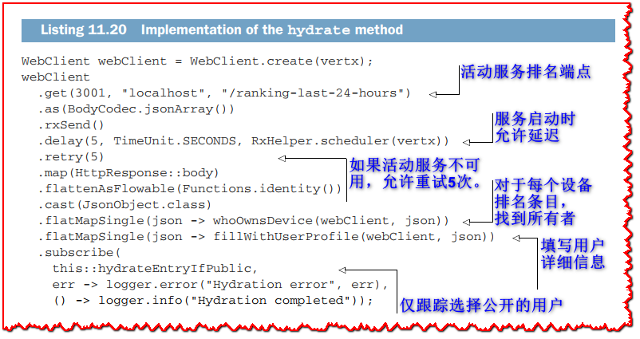
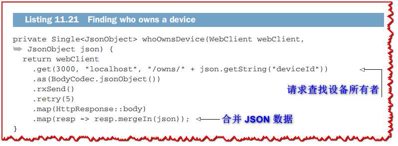
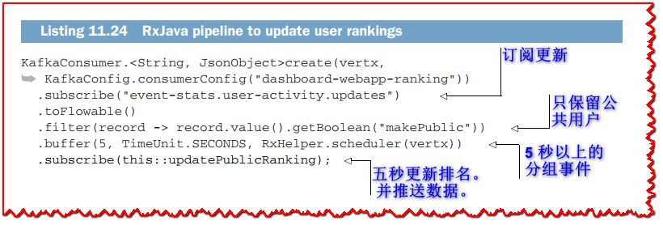
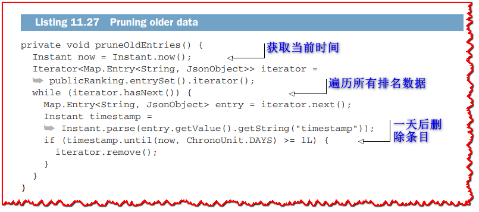
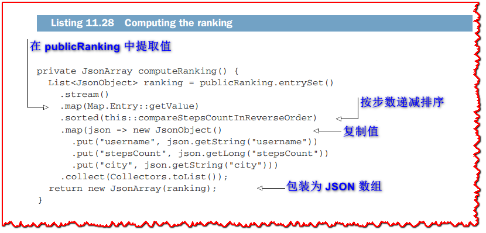

# 第十一章: End-to-end real-time reactive event processing

**This chapter covers**

◾     Combining RxJava operators and Vert.x clients to support advanced processing

◾     Using RxJava operators to perform content enrichment and aggregate data processing on top of event streams

◾     Extending the Vert.x event bus to web applications to unify backend and frontend communication models

◾     Managing state in a stream-processing setting

In this chapter we’ll explore advanced reactive stream processing, where application state is subject to live changes based on events. By performing transformations and aggregations on events, we will compute live statistics about what is happening in the larger 10k steps application. You will also see how event streams can impact real-time web applications by unifying Java and JavaScript code under the Vert.x event-bus umbrella.

This chapter starts by looking at advanced stream processing with RxJava operators and Vert.x clients. We’ll then discuss the topic of real-time web applications connected over the event bus, and we’ll finish with techniques for properly dealing with state (and especially *initial* state) in a context of continuous events.

## 11.1 Advanced stream data processing with Kafka and RxJava

In previous chapters we used RxJava operators to process events of all kinds: HTTP requests, AMQP messages, and Kafka records. RxJava is a versatile library for reactive programming, and it is especially well suited for processing event streams with the Flowable type for back-pressured streams. Kafka provides solid middleware for event streaming, while Vert.x provides a rich ecosystem of reactive clients that connect to other services, databases, or messaging systems.

The *event stats* service is an event-driven reactive service that consumes Kafka records and produces some statistics as other Kafka records. We will look at how we can use RxJava operators to efficiently address three common operations on event streams:
  - Enriching data
  - Aggregating data over time windows
  - Aggregating data by grouping elements using a key or a function

### 11.1.1 Enriching daily device updates to generate user updates

The daily.step.updates Kafka topic is populated with records sent from the activity service. The records contain three entries: the device identifier, a timestamp of when the record was produced, and a number of steps.

Whenever a device update is processed by the activity service, it stores the update to a PostgreSQL database and then produces a Kafka record with the number of steps on the current day for the corresponding device. For instance, when device abc receives an update of, say, 300 steps recorded at 11:25, it sends a Kafka record to daily.step

.updates with the number of steps for the day corresponding to device abc.

The event stats service consumes these events to enrich them with user data, so other services can be updated in real time about the number of steps recorded on the current day for any user. To do that, we take the records from the daily.step.updates Kafka topic, and add the data from the user API: user name, email, city, and whether the data shall be public. The enriched data is then sent as records to the event-stats.useractivity.updates topic. The steps for enriching data are illustrated in figure 11.1.

>  **TIP** This is an implementation technique for the *content enricher* messaging pattern in the seminal *Enterprise Integration Patterns* book by Gregor Hohpe and Bobby Woolf (Addison-Wesley Professional, 2003).

For each incoming Kafka record, we do the following:

1. Make a request to the user profile API to determine who the device belongs to.
2. Make another request to the user profile API to get all the data from the user, and merge it with the incoming record data.
3. Write the enriched record to the event-stats.user-activity.updates Kafka topic, and commit it.

The following listing shows the corresponding RxJava pipeline.

The RxJava pipeline composes asynchronous operations with flatMapSingle and flatMapCompletable. This is because doing an HTTP request produces a (single) result, whereas committing a Kafka record is an operation with no return value (hence it is completable). You can also see the common error handling logic from earlier chapters with a delayed re-subscription.

The next listing shows the implementation of the addDeviceOwner method.

This method makes an HTTP request whose result is a JSON object, and it returns the merge of the source Kafka record’s JSON data with the request result data.

Once this is done, we know who the device of the record belongs to, so we can chain with another request to get the user data from the user profile API, as shown next.

This method follows the same pattern as addDeviceOwner, as it takes the result from the previous operation as a parameter, makes an HTTP request to the user profile API, and then returns merged data.

The last operation is that of the publishActivityUpdate method, shown in the following listing.

The implementation writes the Kafka record to the target *event-stats.user-activity.updates* topic.

### 11.1.2 Computing device-update ingestion throughput using time-window aggregates

The ingestion service receives the incoming device updates from HTTP and AMQP, and then publishes them to the incoming.steps Kafka topic. The ingestion throughput is typical of a dashboard metric, where the value is frequently updated with the number of device updates ingested per second. This is a good indicator of the stress level on the larger application, as every update triggers further events that are processed by other microservices.

To compute the ingestion throughput, we need to listen for records on the incoming.steps topic, aggregate records over a fixed time window, and count how many records have been received. This is illustrated in figure 11.2.

The following listing shows the RxJava pipeline for computing the throughput and publishing the results to the event-stats.throughput Kafka topic.

The buffer operator is one of several aggregation operators that you can use in RxJava. It aggregates events for a time period and then passes the result as a List. You can see that we pass a Vert.x scheduler from the RxHelper class; this is because buffer delays event processing and by default will call the next operators on an RxJava-specific thread. The Vert.x scheduler ensures that operators are instead called from the original Vert.x context so as to preserve the Vert.x threading model.

Once buffer has aggregated all Kafka records over the last five seconds, the publishThroughput method computes and publishes the throughput as shown next.

Given the records list, we can easily compute a throughput and publish a new record. We take care to indicate the number of records and time window size in seconds, so that event consumers have all the information and not just the raw result.

### 11.1.3 Computing per-city trends using aggregation discriminants and time windows

Let’s now look at another form of data aggregation based on RxJava operators by computing per-city trends. More specifically, we’ll compute periodically how many steps have been recorded in each city on the current day. To do that, we can reuse the events published to the event-stats.user-activity.updates Kafka topic by the very same event stats service, since they contain the number of steps a user has recorded today, along with other data, including the city.

We could reuse the buffer operator, as in listing 11.5, and then iterate over the list of records. For each record, we could update a hash table entry where the key would be the city and the value would be the number of steps. We could then publish an update for each city based on the values in the hash table.

We can, however, write a more idiomatic RxJava processing pipeline thanks to the *groupBy* operator, as shown in the following listing and figure 11.3.

As events enter the pipeline, the groupBy operator dispatches them to groups based on the city values found in the records (the *discriminant*). You can think of groupBy as the equivalent of GROUP BY in an SQL statement. The filtering function city is shown in the next listing and extracts the city value from the Kafka record.

The groupBy operator in listing 11.7 returns a Flowable of GroupedFlowable of Kafka records. Each GroupedFlowable is a flowable that is dedicated to the grouped records of a city, as dispatched by groupBy using the city function. For each group, the flatMap operator is then used to group events in time windows of five seconds, meaning that per-city steps are updated every five seconds.

Finally, the publishCityTrendUpdate method prepares a new record with updated stats for each city, as shown in the following listing.

The publishCityTrendUpdate method receives a list of Kafka records for a given city and from a time window. We first have to check if there is a record, because otherwise there is nothing to do. With records, we can use Java streams to compute the sum with a reduce operator and then prepare a Kafka record with several entries: a timestamp, the time window duration in seconds, the city, how many steps have been recorded, and how many updates were observed during the time window. Once this is done, we write the record to the event-stats.city-trend.updates Kafka topic.

Now that we’ve looked at performing advanced event-streaming processing with RxJava and Vert.x, let’s see how we can propagate events to reactive web applications.

## 11.2 Real-time reactive web applications

As specified in chapter 7, the dashboard web application consumes events from the stats service and displays the following:
  - Ingestion throughput
  - Rankings of public users
  - Per-city trends

This application is updated live, as soon as new data is received, which makes for a nice case of end-to-end integration between backend services and web browsers. The application is a microservice, as illustrated in figure 11.4.

The dashboard service is made of two parts:
  - A Vue.js application
  - A Vert.x service that does the following:
      - Serves the Vue.js resources
      – Connects to Kafka and forwards updates to the Vert.x event bus
      – Bridges between the connected web browsers and the Vert.x event bus 

Let’s start with the forwarding from Kafka to the event bus.

### 11.2.1 Forwarding Kafka records to the Vert.x event bus

These two RxJava pipelines have no complicated logic, as they forward to the *client.updates.throughput* and *client.updates.city-trend* event bus destinations.

The next listing shows the implementation of the forwardKafkaRecord method.

Since the Kafka record values are of type JsonObject, there is no data conversion to perform to publish them to the Vert.x event bus.

### 11.2.2 Bridging the event bus and web applications

The dashboard web application starts an HTTP server, as shown in the following excerpt.

Listing 11.12 shows an HTTP server for serving static files. This is only an excerpt: we now need to see how the Vert.x event bus can be connected to web applications.

Vert.x offers an event-bus integration using the SockJS library ([https://github.com/](https://github.com/sockjs) [sockjs](https://github.com/sockjs)). SockJS is an emulation library for the WebSocket protocol (https://tools.ietf.org/html/rfc6455), which allows browsers and servers to communicate in both directions on top of a persistent connection. The Vert.x core APIs offer support for WebSockets, but SockJS is interesting because not every browser in the market properly supports WebSockets, and some HTTP proxies and load balancers may reject WebSocket connections. SockJS uses WebSockets whenever it can, and it falls back to other mechanisms such as long polling over HTTP, AJAX, JSONP, or iframe.

The Vert.x web module offers a handler for SockJS connections that bridge the event bus, so the same programming model can be used from the server side (in Vert.x) and the client side (in JavaScript). The following listing shows how to configure it.

The bridge relies on a handler for SockJS client connections, with a set of permissions to allow only certain event-bus destinations to be bridged. It is indeed important to limit the events that flow between the connected web applications and backend, both for security and performance reasons. In this case, I decided that only the destinations starting with client.updates will be available.

On the web application side, the Vert.x project offers the *vertx3-eventbus-client* library, which can be downloaded manually or by using a tool like npm (the Node package manager). With this library we can connect to the event bus, as outlined in the following listing.

The full code for using the Vert.x event bus in a Vue.js component is in the part2steps-challenge/dashboard-webapp/src/App.vue file from the source code repository. As you can see, we have the same programming model in the JavaScript code; we can register event-bus handlers and publish messages, just like we would in Vert.x code.

### 11.2.3 From Kafka to live web application updates

The dashboard uses Vue.js, just like the public web application service that you saw earlier. The whole application essentially fits in the App.vue component, which can be found in the project source code. The component data model is made of three entries, as follows.

These entries are updated when events are received from the Vert.x event bus. To do that, we use the Vue.js mounted life-cycle callback to connect to the event bus, and then register handlers as follows.

The handlers update the model based on what is received from the event bus. Since Vue.js is a reactive web application framework, the interface is updated when the data model changes. For instance, when the value of throughput changes, so does the value displayed by the HTML template in the following listing.

The city-trends view rendering is a more elaborated template.

The template iterates over all city data and renders a table row for each city. When a city has an update, the city row is updated thanks to the item.city binding, which ensures uniqueness in the rows generated by the v-for loop. The transition-group tag is specific to Vue.js and is used for animation purposes: when the data order changes, the row order changes with an animation. The loop iterates over cityTrendRanking, which is a computed property shown in the following listing.

The *cityTrendRanking* computed property ranks entries by their number of steps, so the dashboard shows cities with the most steps on top.

The throughput and city trends are updated every five seconds, with updates coming from Kafka records and JSON payloads being forwarded to the dashboard web application. This works well because updates are frequent and cover aggregated data, but as you’ll see next, things are more complicated for the users’ ranking.

## 11.3 Streams and state

The dashboard web application shows a live ranking of users based on the number of steps they have taken over the last 24 hours. Users can be ranked based on the updates produced by the event stats service and sent to the *event-stats.user-activity.updates* Kafka topic.

### 11.3.1 A stream of updates

Each record sent to event-stats.user-activity.updates contains the latest number of steps for a given user. The dashboard service can observe these events, update its state to keep track of how many steps a given user has taken, and update the global ranking accordingly. The problem here is that we need some state to start with, because when it starts (or restarts!), the dashboard service doesn’t know about the earlier updates.

We could configure the Kafka subscriber to restart from the beginning of the stream, but it could potentially span several days’ or even weeks’ worth of data. Replaying all records when the dashboard service starts would in theory allow us to compute an accurate ranking, but this would be a costly operation. Also, we would need to wait until all the records have been processed before sending updates to the connected web applications, because this would create a lot of traffic on the event bus.

Another solution is to start by asking the activity service what the current day rankings are, which is a straightforward SQL query built into the service. We’ll call this the *hydration* phase. We can then update the rankings as we receive updates from the *event-stats.user-activity.updates* Kafka topic.

### 11.3.2 Hydrating the ranking state

The dashboard service maintains a publicRanking field, which is a map where keys are user names and values are the latest user update entries as JSON data. When the service starts, this collection is empty, so the first step is to fill it with data.

To do that, the hydrate method is called from the DashboardWebAppVerticle initialization method (rxStart), right after the Kafka consumers have been set, as in listing 11.10. This method assembles ranking data by calling the activity and user profile services, as shown in the following listing.

The implementation of the hydrate method relies on getting a ranking of the devices over the last 24 hours. The service returns a JSON array ordered by the number of steps. We allow an arbitrary five-second delay before making the request, and allow five retries in case the activity service is not available. Once we have ranking data, the whoOwnsDevice method (listing 11.21) and fillWithUserProfile method (listing 11.22) correlate the pedometer-centric data with a user. Finally, the hydrateEntryIfPublic method in listing 11.23 fills the publicRanking collection with data from users who opted to be in public rankings.

The whoOwnsDevice method performs an HTTP request to determine who owns a device, and then merges the resulting JSON data. At this point, we need to fill the remaining user data, which is done via the fillWithUserProfile method, shown next.

This code is very similar to that of the whoOwnsDevice method.

Last but not least, the hydrateEntryIfPublic method in the following listing adds data to the publicRanking collection.

Hydration is a process that’s started asynchronously when the verticle starts, and eventually the publicRanking collection holds accurate data. Note that at this stage we have not pushed any ranking data to the dashboard web application clients. Let’s now see what happens next.

### 11.3.3 Periodically updating rankings from the updates stream

The user ranking is updated every five seconds. To do so, we collect updates from users for five seconds, update the public ranking data, and push the result to the dashboard web application. We batch data over spans of five seconds to pace the dashboard refresh, but you can reduce the time window or even get rid of it if you want a more lively dashboard. The following listing shows the RxJava pipeline to manage this process.

The filter operator is used to keep only Kafka records where the user data is public, and the buffer operator makes five-second windows of events.

The following listing shows the implementation of the *updatePublicRanking* method that processes these event batches.

The method describes the process in three steps:
  1. Use the collected data to update ranking data.
  2. Discard older entries.
  3. Compute a new ranking and send it to the connected web applications over the event bus.

The next listing shows the implementation of the *copyBetterScores* method.

The preceding method updates the *publicRanking* collection when a collected entry has a higher step count than the previous one, because there could potentially be a conflict between a hydration process and a user update.

The next listing shows the *pruneOldEntries* method.

This method simply iterates over all ranking data entries in the publicRanking collection and removes entries older than one day.

The ranking is produced by the computeRanking method, shown next.

The method sorts public ranking data and produces a JSON array, where entries are ranked in reverse order (the first value is the user with most steps over the last 24 hours, and so on).

The compareStepsCountInReverseOrder method used to compare and sort entries is shown in the following listing.

The comparison returns -1 when b has fewer steps than a, 0 when they are equal, and 1 when b has more steps than a.

The Vue.js template for rendering the user ranking table is shown in the next listing.

The Vue.js code for the web application receives the ranking array over the event bus and updates the publicRanking data entry. Whenever this happens, the display is updated to reflect the changes. Just like the city trends table, entries move using an animation as their order changes.

This concludes the end-to-end stream processing, from Kafka records to reactive web applications. The next chapter focuses on resilience and fault-tolerance in reactive systems.

## Summary
  - RxJava offers advanced operators like buffer and groupBy that can be composed to perform aggregate data processing.
  - A microservice does not have to expose an HTTP API. The event stats service only consumes and produces Kafka records.
  - There are stream-processing works that can start at any point of a stream, like computing a throughput, while other works require some initial state, like maintaining a live ranking of users over the last 24 hours.
  - The Vert.x event bus can be extended to web applications using the SockJS protocol, offering the same communication model across service and web code bases.
  - Vert.x allows you to build end-to-end reactive systems, where events trigger computations in services and impact user-facing web applications.
