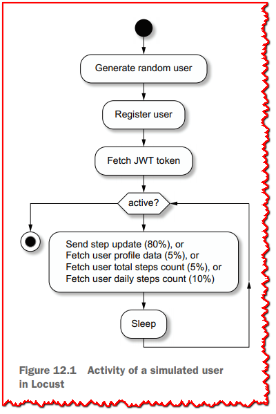
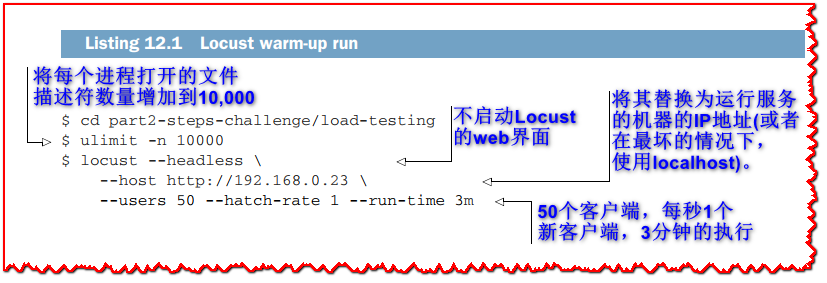
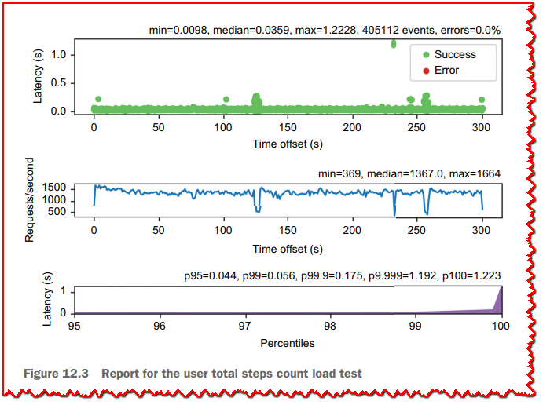
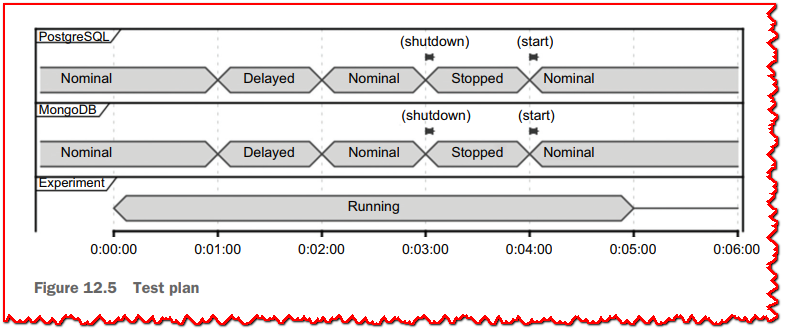
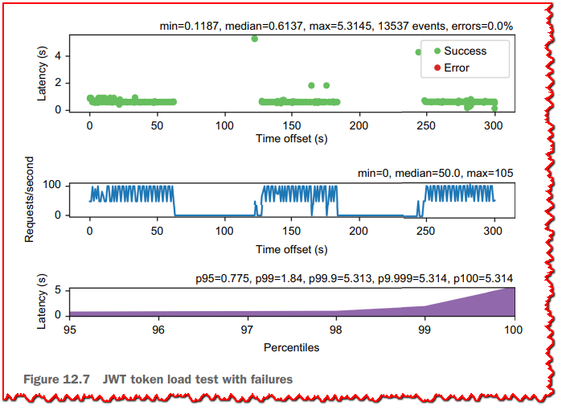
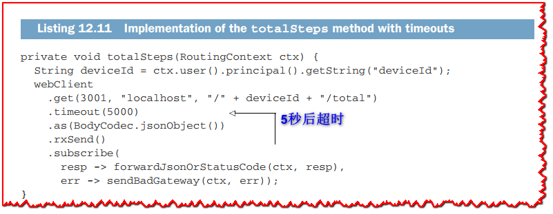
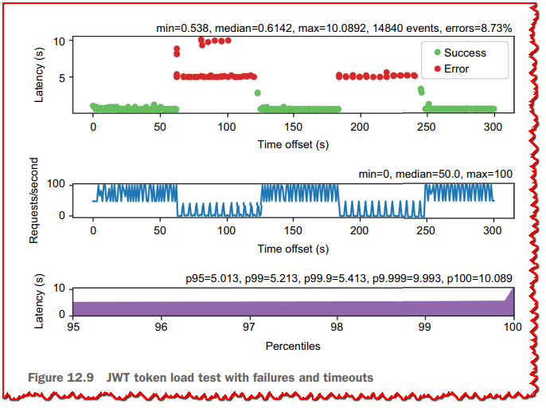
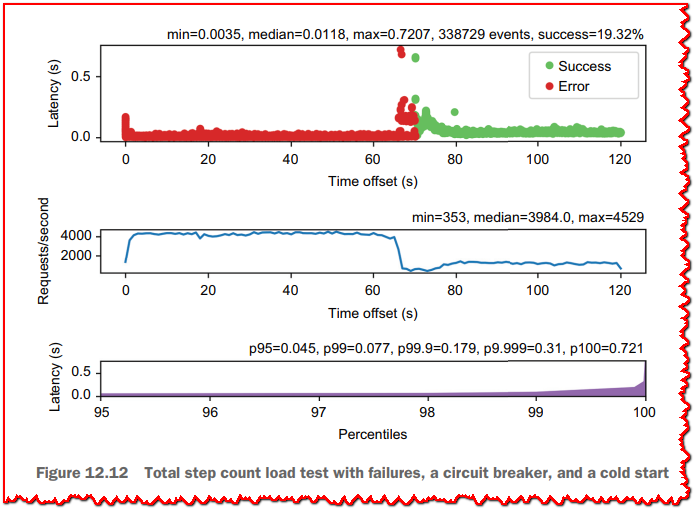

# 第十二章: Toward responsiveness with load and chaos testing  

> 翻译: 白石(https://github.com/wjw465150/Vert.x-in-Action-ChineseVersion)

**This chapter covers**

  - Simulating users with Locust
  - Load testing HTTP endpoints with Hey
  - Chaos testing with Pumba
  - Mitigating failures with explicit timeouts, circuit breakers, and caches

We have now covered all the important technical parts of the 10k steps challenge application: how to build web APIs, web applications, and edge services, and how to use databases and perform event-stream processing. By using Vert.x’s asynchronous and reactive programming, we can expect the set of services that form the application to be *reactive*: scalable as workloads grow and resilient as failures happen.

Are the services that we built actually reactive? Let’s discover that now through testing and experimentation, and see where we can make improvements toward being reactive.

To do that, we will use load testing tools to stress services and measure latencies. We will then add failures using chaos testing tools to see how this impacts the service behaviors, and we will discuss several options for fixing the problems that we identify. You will be able to apply this methodology in your own projects too.

> **Software** **versions**
>
> The chapter was written and tested with the following tool versions:
>
> - Locust 1.0.3
> - Python 3.8.2
> - Hey 0.1.3
> - Pumba 0.7.2

## 12.1 Initial experiments: Is the performance any good?

This chapter is extensively based on experiments, so we need to generate some workloads to assess how the application copes with demanding workloads and failures. There are many load testing tools, and it is not always easy to pick one. Some tools are very good at stressing a service with a specific request (e.g., “What is the latency when issuing 500 requests per second to /api/hello”). Some tools provide more flexibility by offering scripting capabilities (e.g., “Simulate a user that logs in, then adds items to a cart, then perform a purchase”). And finally, some tools do all of that, but the reported metrics may be inaccurate due to how such tools are implemented.

I have chosen two popular and easy-to-use tools to use in this chapter:
  - *Locust*—A versatile load testing tool that simulates users through scripts written in Python (https://locust.io/)
  - *Hey* —A reliable HTTP load generator (https://github.com/rakyll/hey)

These two tools can be used together, or not. Locust allows us to simulate a representative workload of users interacting with the application, while Hey give us precise metrics of how specific HTTP endpoints behave under stress.

>  **TIP** Both Locust and Hey work on Linux, macOS, and Windows. As usual, if you are a Windows user, I recommend that you use the Windows Subsystem for Linux (WSL).

### 12.1.1 Some considerations before load testing

Before we run a load testing tool, I’d like to discuss a few points that have to be considered to get representative results. Most importantly, we need to interpret them with care.

First, when you run the 10k steps application as outlined in chapter 7, all services are running locally, while the third-party middleware and services are running in Docker containers. This means that everything is actually running on the same machine, avoiding real network communications. For instance, when the user profile service talks to MongoDB, it goes through virtual network interfaces, but it never reaches an actual network interface, so there is no fluctuating latency or data loss. We will use other tools later in this chapter to simulate network problems and get a more precise understanding of how our services behave.

Next, there is a good chance that you will be performing these experiments on your laptop or desktop. Keep in mind that a real server is different from your workstation, both in terms of hardware and software configurations, so you will likely perform tests with lower workloads than the services could actually cope with in a production setting. For instance, when we use PostgreSQL directly from a container, we won’t have done any tuning, which we would do in a production setting. More generally, running the middleware services from containers is convenient for development purposes, but we would run them differently in production, with or without containers. Also note that we will be running the Vert.x-based services without any JVM tuning. In a production setting, you’d need to at least adjust memory settings and tune the garbage collector.

Also, each service will run as a single instance, and verticles will also be single instances. They have all been designed to work with multiple instances, but deploying, say, two instances of the ingestion service would also require deploying an HTTP reverse proxy to distribute traffic between the two instances.

Last but not least, it is preferable that you run load tests with two machines: one to run the application, and one to run a load testing tool. You can perform the tests on a single machine if that is more convenient for you, but keep these points in mind:
  - You will not go through the network, which affects results.
  - Both the services under test and the load testing tool will compete for operating system resources (CPU time, networking, open file descriptors, etc.), which also affects the results.

The results that I present in this chapter are based on experiments conducted with two Apple MacBook laptops, which hardly qualify as production-grade servers. I am also using a domestic WiFi network, which is not as good as an Ethernet wired connection, especially when it comes to having a stable latency. Finally, macOS has very low limits on the number of file descriptors that a process can open (256), so I had to raise them with the ulimit command to run the services and the load testing tools— otherwise errors unrelated to the services’ code can arise because too many connections have been opened. I will show you how to do that, and depending on your system, you will likely have to use this technique to run the experiments.

### 12.1.2 Simulating users with Locust

Locust is a tool for generating workloads by simulating users interacting with a service. You can use it for demonstrations, tests, and measuring performance.

You will need a recent version of Python on your machine. If you are new to Python, you can read Naomi Ceder’s *Exploring Python Basics* (Manning, 2019) or look through one of the many tutorials online. At the time of writing, I am using Python 3.8.2.

You can install Locust by running pip install locust on the command line, where pip is the standard Python package manager.

The Locust file that we will use is locustfile.py, and it can be found in the part2steps-challenge/load-testing folder of the book’s Git repository. We will be simulating the user behaviors illustrated in figure 12.1:
  **1.** Each new user is generated from random data and a set of predefined cities.
  **2.** A newly created user registers itself through the public API.
  **3.** A user fetches a JWT token on the first request after having been registered, and then periodically makes requests: 
    - The user sends step updates (80% of its requests).
        - The user fetches its profile data (5% of its requests).
        - The user fetches its total steps count (5% of its requests).
        - The user fetches its steps count for the current day (10% of its requests).



This activity covers most of the services: ingesting triggers event exchanges between most services, and API queries trigger calls to the activity and user profile services.

The locustfile.py file defines two classes. UserBehavior defines the tasks performed by a user, and UserWithDevice runs these tasks with a random delay between 0.5 and 2 seconds. This is a relatively short delay between requests to increase the overall number of requests per second.

There are two parameters for running a test with Locust:
  - The number of users to simulate
  - The hatch rate, which is the number of new users to create per second during the initial ramp-up phase

As described in chapter 7, you need to run the container services with Docker Compose from the part2-steps-challenge folder using docker-compose up in a terminal.

Then you can run all Vert.x-based services in another terminal. You can use foreman start if you have foreman installed, or you can run all services using the commands in the Procfile.

The following listing shows the command to perform an initial warm-up run.



It is important to do such a warm-up run because the JVM running the various services needs to have some workload before it can start to run code efficiently. After that, you can run a bigger workload to get a first estimation of how your services are going.

The following listing shows the command to run a test for 5 minutes with 150 clients and a hatch rate of 2 new users per second.


Let’s run the experiment and collect results. We’ll get various metrics on each type of request, such as the average response time, the minimum/maximum times, the median time, and so on. An interesting metric is the latency given a percentile.

Let’s take the example of the latency at the 80th percentile. This is the maximum latency observed for 80% of the requests. If that latency is 100 ms, it means that 80% of the requests took less than 100 ms. Similarly, if the 95th percentile latency is 150 ms, it means that 95% of the requests took at most 150 ms. The 100th percentile reveals the worst case observed.

When measuring performance, we are often interested in the latencies between the 95th and 100th percentiles. Suppose that latency at the 90th percentile is 50 ms, but it’s 3 s at the 95th percentile and 20 s at the 99th percentile. In such a case, we clearly have a performance problem, because we observe a large share of bad latencies. By contrast, observing a latency of 50 ms at the 90th percentile and 70 ms at the 99th percentile shows a service with very consistent behavior.

The latency distribution of a service’s behavior under load tells more than the average latency. What we are actually interested in is not the best cases but those cases where we observed the worst results. Figure 12.2 shows the latency report for a run that I did with 150 users over 5 minutes.


The plot contains values at the 95th, 98th, 99th, and 100th percentiles. The reported latencies are under 200 ms at the 99th percentile for all requests, which sounds reasonable for a run with imperfect conditions and no tuning. The 100th percentile values show us the worst response times observed, and they are all under 500 ms.

We could increase the number of users to stress the application even more, but we are not going to do precise load testing with Locust. If you raise the number of users, you will quickly start seeing increasing latencies and errors being raised. This is not due to the application under test but due to a limitation of Locust at the time of writing:
  - Locust’s network stack is not very efficient, so we quickly reach limits in the number of concurrent users.
  - Like many load testing tools, Locust suffers from *coordinated omission*, a problem where time measures are incorrect due to ignoring the wait time before the requests are actually made.

For accurate load testing, we thus have to use another tool, and Hey is a good one.

>  **TIP** Locust is still a great tool for producing a small workload and even automating a demo of the project. Once it is started and is simulating users, you can connect to the dashboard web application and see it updated live.

### 12.1.3 Load testing the API with Hey

Hey is a much simpler tool than Locust, as it cannot run scripts and it focuses on stressing an HTTP endpoint. It is, however, an excellent tool for getting accurate measures on an endpoint under stress.

We are still going to use Locust on the side to simulate a small number of users. This will generate some activity in the system across all services and middleware, so our measurements won’t be made on a system that is idle.

We are going to stress the public API endpoint with two different requests:
  - Get the total number of steps for a user.
  - Authenticate and fetch a JWT token.

This is interesting, because to get the number of steps for a user, the public API service needs to make an HTTP request to the activity service, which in turn queries a PostgreSQL database. Fetching a JWT token involves more work, as the user profile service needs to be queried twice before doing some cryptography work and finally returning a JWT token. The overall latency for these requests is thus impacted by the work done in the HTTP API, in the user and activity services, and finally in the databases.

>  **NOTE** The goal here is not to identify the limits of the services in terms of maximum throughput and best latency. We want to have a baseline to see how the service behaves under a sustained workload, and that will later help us to characterize the impact of various types of failures and mitigation strategies.

Since Hey cannot run scripts, we have to focus on one user and wrap calls to Hey in shell scripts. You will find helper scripts in the part2-steps-challenge/load-testing folder. The first script is create-user.sh, shown in the following listing.


This script ensures that user loadtesting-user is created and that a few updates have been recorded.

The *run-hey-user-steps.sh* script shown in the following listing uses Hey and fetches the total number of steps for user *loadtesting-user*.


The run-hey-token.sh script in the following listing is similar and performs an authentication request to get a JWT token.


We are now ready to perform a run on the user total steps count endpoint. In my case, I’m doing the experiment with a second laptop, while my main laptop runs the services and had IP address 192.168.0.23 when I ran the tests. First off, we’ll get some light background workload with Locust, again to make sure the system is not exactly idle:

```
$ locust --headless --host [http://192.168.0.23 ](http://192.168.0.23/)--users 20 --hatch-rate 2
```

 In another terminal, we’ll launch the test with Hey for five minutes:

```
./run-hey-user-steps.sh 192.168.0.23 5m
```

 Once we have collected the results, the best way to analyze them is to process the data and plot it. You will find Python scripts to do that in the part2-steps-challenge/loadtesting folder. Figure 12.3 shows the plot for this experiment.

The figure contains three subplots:
  - A scattered plot of the request latencies over time
  - A throughput plot that shares the same scale as the requests latencies plot
  - A latency distribution over the 95th to 100th percentiles

The 99.99th percentile latency is very good while the throughput is high. We get better results with Hey compared to a 100-user workload with Locust. We can see a few short throughput drops correlated with higher latency responses, but there is nothing to worry about in these conditions. These drops could have been caused by various factors, including PostgreSQL, the WiFi network, or a JVM garbage collector run. It is easy to get better results with better hardware running Linux, a wired network, some JVM tuning, and a properly configured PostgreSQL database server.



We can run another load testing experiment, fetching JWT tokens:

```
./run-hey-token.sh 192.168.0.23 5m
```

 The results are shown in figure 12.4.


These results again show consistent behavior, albeit with a higher latency and lower throughput than the step count endpoint could achieve. This is easy to explain, as there are two HTTP requests to the user profile service, and then the token has to be generated and signed. The HTTP requests are mostly I/O-bound, while token signing requires CPU-bound work to be done on the event loop. The results are consistent over the five-minute run.

It is safe to conclude that the tested service implementations deliver solid performance under load. You could try to increase the number of workers for Hey and see what happens with bigger workloads (see the -c flag of the hey tool). You could also perform latency measures with increasing request rates (see the -q flag), but note that by default Hey does not do rate limiting, so in the previous runs Hey did the best it could with 50 workers (the default).

Scalability is only half of being reactive, so let’s now see how our services behave with the same workloads in the presence of failures.

## 12.2 Let’s do some chaos engineering

Strictly speaking, *chaos engineering* is the practice of voluntarily introducing failures in production systems to see how they react to unexpected application, network, and infrastructure failures. For instance, you can try to shut down a database, take down a service, introduce network delays, or even interrupt traffic between networks. Instead of waiting for failures to happen in production and waking up on-duty site reliability engineers at 4 a.m. on a Sunday, you decide to be proactive by periodically introducing failures yourself.

You can also do chaos engineering before software hits production, as the core principle remains the same: run the software with some workload, introduce some form of failure, and see how the software behaves.

### 12.2.1 Test plan

We need a reproducible scenario to evaluate the services, as they will alternate between nominal and failure phases. We will introduce failures according to the plan in figure 12.5.



We will run the same load testing experiments as we did in previous sections over periods of five minutes. What will change is that we’re going to split it into five phases of one minute each:

  **1** The databases work nominally for the first minute.

  **2** We will introduce network delays of three seconds (+/– 500 ms) for all database traffic for the second minute.

  **3** We will get back to nominal performance for the third minute.

  **4** We will stop the two databases for the forth minute.

  **5** We will get back to nominal performance for the fifth and final minute.

Network delays increase latency, but they also simulate an overloaded database or service that starts to become unresponsive. With extreme delay values, they can also simulate an unreachable host, where establishing TCP connections takes a long time to fail. On the other hand, stopping the databases simulates services being down while their hosts remain up, which should lead to quick TCP connection errors.

How are we going to introduce these failures?

### 12.2.2 Chaos testing with Pumba

Pumba is a chaos testing tool for introducing failures in Docker containers (https://github.com/alexei-led/pumba). It can be used to do the following:
  - Kill, remove, and stop containers
  - Pause processes in containers
  - Stress container resources (e.g., CPU, memory, or filesystem)
  - Emulate network problems (packet delays, loss, duplication, corruption, etc.)

Pumba is a very convenient tool that you can download and run on your machine. The only dependency is having Docker running.

We are focusing on two types of failures in our test plan because they are the most relevant to us. You can play with other types of failures just as easily.

With the 10k steps application running locally, let’s play with Pumba and add some delay to the MongoDB database traffic. Let’s fetch a JWT token with the load-testing/ fetch-token.sh script, as follows.


In another terminal, let’s introduce the delays with the following command.


Pumba should now be running for one minute. Try fetching a JWT token again; the command should clearly take more time than before, as shown in the following listing.


The process took 6.157 seconds to fetch a token, due to waiting for I/O. Similarly, you can stop a container with the following command.


If you run the script to fetch a token again, you will be waiting, while in the logs you will see some errors due to the MongoDB container being down, as follows.


The service is now unresponsive. My request took 57.315 seconds to complete because it had to wait for the database to be back.

Let’s get a clearer understanding by running the test plan, and we’ll see what happens when these failures happen and the system is under load testing.

### 12.2.3 We are not resilient (yet)

To run these experiments you will use the same shell scripts to launch Hey as we did earlier in this chapter. You will preferably use two machines. The part2-steps-challenge/ load-testing folder contains a run-chaos.sh shell script to automate the test plan by calling Pumba at the right time. The key is to start both the run-chaos.sh and Hey scripts (e.g., run-hey-token.sh) at the same time.

Figure 12.6 shows the behavior of the service on getting a user’s total steps count.

The results show a clear lack of responsiveness when Pumba runs.


In the phase of network delays, we see a rapid latency increase spike to nearly 20 seconds, after which the throughput implodes. What happens here is that requests are enqueued, waiting for a response in both the public API and user profile services, up to the point where the system is at a halt. The database delays are between 2.5 s and

3.5 s, which can temporarily happen in practice. Of course, the issue is vastly amplified here due to load testing, but any service with some sustained traffic can show this kind of behavior even with smaller delays.

In the phase where databases are down we see errors for the whole simulated outage duration. While it is hard to be surprised about errors, we can see that the system has not come to a halt either. This is far from perfect, though, since the reduced throughput is a sign that requests need *some* time to be given an error, while other requests are waiting until they time out, or they eventually complete when the databases restart.



Let’s now look at figure 12.7 and see how fetching JWT tokens goes.

Network delays also cause the system to come to a halt, but we do not observe the same shape in the scatter plot. This is due to the inherently lower throughput of the service for this type of request, and also the fact that two HTTP requests are needed. Requests pile up, waiting for responses to arrive, and once the delays stop, the system gets going again. More interestingly, we do not observe errors in the phase where databases have been stopped. There are just no requests being served anymore as the system is waiting for databases.

From these two experiments, we can see that the services become unresponsive in the presence of failures, so they are not reactive. The good news is that there are ways to fix this, so let’s see how we can become reactive, again using the public API as a reference. You will then be able to extrapolate the techniques to the other services.

## 12.3 From “scalable” to “scalable and resilient”

To make our application resilient, we have to make changes to the public API and make sure that it responds *quickly* when a failure has been detected. We will explore two approaches: enforcing timeouts, and then using a circuit breaker.

### 12.3.1 Enforcing timeouts

Observations in the preceding experiments showed that requests piled up while waiting for either the databases to get back to nominal conditions, or for TCP errors to arise. A first approach could be to enforce short timeouts in the HTTP client requests, so that they fail fast when the user profile or activity services take too long to respond.

The changes are very simple: we just need to add timeouts to the HTTP requests made by the Vert.x web client, as shown in listing 12.11.

>  **TIP** You can find the corresponding code changes in the chapter12/publicapi-with-timeouts branch of the Git repository.



The changes are the same in the fetchUserDetails and token methods. A timeout of five seconds is relatively short and ensures a quick notification of an error.

Intuitively, this should improve the responsiveness of the public API services and avoid throughput coming to a halt. Let’s see what happens by running the chaos testing experiments again, as shown in figure 12.8.

Compared to the experiment in figure 12.6, we still have drastically reduced throughputs during failures, but at least we see errors being reported, thanks to the


timeout enforcements. We also see that the maximum latency is below six seconds, which is in line with the five-second timeouts.

Let’s now see how the JWT token load test behaves, as shown in figure 12.9. This run confirms what we have observed: timeouts get enforced, ensuring that some requests are still served during the failures. However, the worst-case latencies are worse than without the timeouts: network delays stretch the time for doing two HTTP requests to the user profile service, so the higher values correspond to those requests where the second request timed out.



Timeouts are better than no timeouts when it comes to improving responsiveness, but we cannot qualify our public API service as being resilient. What we need is a way for the service to *know* that there is a failure happening, so it fails fast rather than waiting for a timeout to happen. This is exactly what a circuit breaker is for!

### 12.3.2 Using a circuit breaker

The goal of a circuit breaker is to prevent the problems observed in the previous section, where requests to unresponsive systems pile up, causing cascading errors between distributed services. A circuit breaker acts as a form of proxy between the code that makes a (networked) request, such as an RPC call, HTTP request, or database call, and the service to be invoked.

Figure 12.10 shows how a circuit breaker works as a finite state machine. The idea is quite simple. The circuit breaker starts in the closed state, and for each request, it observes whether the request succeeded or not. Failing can be because an error has been reported (for example, a TCP timeout or TCP connection error), or because an operation took too long to complete.


Once a certain number of errors have been reported, the circuit breaker goes to the open state. From here, all operations are notified of a failure due to the circuit being open. This avoids further requests being issued to an unresponsive service, which allows for fast error responses, trying alternative recovery strategies, and reducing the pressure on both the service and requester ends.

The circuit breaker leaves the open state and goes to the half-open state after some reset timeout. The first request in the half-open state determines whether the service has recovered. Unlike the open state, the half-open state is where we start doing a real operation again. If it succeeds, the circuit breaker goes back to the closed state and resumes normal servicing. If not, another reset period starts before it goes back to the half-open state and checks if the service is back.

>  **TIP** You can find the code changes discussed here in the chapter12/publicapi-with-circuit-breaker branch of the Git repository.

Vert.x provides the *vertx-circuit-breaker* module that needs to be added to the public API project. We will use two circuit breakers: one for token generation requests, and one for calls to the activity service (such as getting the total steps count for a user). The following listing shows the code to create a circuit breaker in the *PublicApiVerticlerxStart* method.


The *tokenCircuitBreakerName* reference is a field of type *CircuitBreaker*. There is another field called *activityCircuitBreaker* for the activity service circuit breaker, and the code is identical. The callbacks on state change can be optionally set. It is a good idea to log these state changes for diagnosis purposes.

The following listing shows a circuit breaker configuration.


We are going to open the circuit breaker after five failures, including operations timing out after five seconds (to be consistent with the previous experiments). The reset timeout is set to 10 seconds, which will let us frequently check how the service goes. How long this value should be depends on your context, but you can anticipate that long timeouts will increase the time a service operates in degraded mode or reports errors, whereas short values may diminish the effectiveness of using a circuit breaker.

The following listing shows the modified token method with the code wrapped into a circuit breaker call.


The circuit breaker executes an operation, which here is making two HTTP requests to the user profile service and then making a JWT token. The operation’s result is a Single<String> of the JWT token value. The execution method passes a promise to the wrapped code, so it can notify if the operation succeeded or not.

The handleAuthError method had to be modified as in the following listing to check the source of any error.


The circuit breaker reports open circuit conditions and operation timeouts with dedicated exceptions. In these cases, we report an HTTP 500 status code or a classic 401 so the requester knows if a failure is due to bad credentials or not.

This is great, but what is the actual effect of the circuit breaker on our system? Let’s see by running the experiment on the JWT token generation. The results are shown in figure 12.11.

The impact of the circuit breaker is striking: the service is now highly responsive during failure periods! We get a high throughput during failures, as the service now fails fast when the circuit breaker is open. Interestingly, we can spot when the circuit breaker tries to make requests when in the half-open state: these are the high-latency error points at regular intervals. We can also see that the 99.99th percentile is back to a lower latency compared to the previous runs.

This is all good, but what about fetching the total steps count for a user?


### 12.3.3 Resiliency and fallback strategies

The circuit breaker made JWT token generation responsive even with failures, so the endpoint is now fully reactive. That being said, it did not offer much in the way of fallback strategies: if we can’t talk to the user profile service, there is no way we can authenticate a user and then generate a JWT token. This is why the circuit breaker always reports errors.

We could adopt the same strategy when issuing requests to the activity service, and simply report errors. That being said, we could provide further resiliency by caching data and provide an older value to a requester. Fallback strategies depend on the functional requirements: we cannot generate a JWT token without authentication working, but we can certainly serve some older step count data if we have it in a cache.

We will use the efficient in-memory Caffeine caching library ([https://github.com/](https://github.com/ben-manes/caffeine) [ben-manes/caffeine](https://github.com/ben-manes/caffeine)). This library provides configurable strategies for managing cached data, including count, access, and time-based eviction policies. We could cache data in a Java HashMap, but that would quickly expose us to memory exhaustion problems if we didn’t put a proper eviction policy in place.

The following listing shows how to create a cache of at most 10,000 entries, where keys are strings and values are long integers.


We add entries to the cache with the cacheTotalSteps method in the following listing, and Caffeine evicts older entries when the 10,000 entries limit has been reached.


The preceding method is used in the totalSteps method, shown next, where the code has been wrapped using a circuit breaker call.


We now use a circuit breaker that does not return any value, hence the Void parametric type. The executeWithFallback method allows us to provide a fallback when the circuit is open, so we can try to recover a value from the cache. This is done in the tryToRecoverFromCache method in the following listing.


By recovering from a cache in the tryToRecoverFromCache method, we don’t always send errors. If we have data in the cache, we can still provide a response, albeit with a possibly outdated value.

>  **NOTE** Caching step counts and recovering from older values with a circuit breaker fallback could also be done directly in the activity service.

It is now time to check the behavior of the service when fetching step counts. First, let’s have a cold-start run where the database is initially down and the service has just started. Figure 12.12 shows a two-minute run where the database starts after a minute. The service immediately starts with a few errors, and then the circuit breaker opens, at which point the service consistently provides errors with a very low latency.

Remember that the service hasn’t cached any data yet.

When the database starts, we can see a latency spike as errors turn into successes, and then the service is able to respond nominally. Note that in the first success seconds, the JVM will start optimizing the code that talks to the database, so there is an improved throughput.



Figure 12.13 shows the service behavior over the full five-minute test plan. Since the test plan starts with databases running nominally, the service manages to cache data for the test user. This is why we get no errors across the whole run. We see a few successes with higher latency when the network delays appear, which actually impact the last few percentiles above 99.99th. These are due to the circuit breaker reporting timeouts on making HTTP requests, but note that the circuit breaker cannot cancel the HTTP requests. Hence, we have a few HTTP requests waiting for an unresponsive activity service, while the circuit breaker meanwhile completes the corresponding HTTP responses with some cached data.


Figure 12.14 shows the effect of combining the circuit breaker with a five-second timeout on the web client HTTP requests (see the chapter12/public-api-with-circuitbreaker-and-timeouts branch of the Git repository).

This clearly improves the result, as we don’t have any worst-case latency around 20 seconds anymore. Other than that, the latency and throughputs are consistent over the rest of the run, and they’re barely impacted by the databases being stopped around minute 4.

> **NOTE** A circuit breaker is a very useful tool for avoiding cascading failures, but you don’t have to wrap every operation over the network in a circuit breaker. Every abstraction has a cost, and circuit breakers do add a level of indirection. Instead, it is best to use chaos testing and identify where they are most likely to have a positive effect on the overall system behavior.


We now have a reactive service: it is not just resource-efficient and scalable, but is also resilient to failures. The service keeps responding in all situations, and the latency is kept under control.

The next and final chapter discusses running Vert.x applications in container environments.

## Summary

  - A reactive service is not just scalable; it has to be resilient and responsive.
  - Load testing and chaos testing tools are key to analyzing service behavior both when operating in nominal conditions, and when surrounded by failures from the network and services it relies on.
  - Circuit breakers are the most efficient tool for shielding a service from unresponsive services and network failures.
  - A resilient service is not just responsive when it can quickly notify of an error; it may still be able to respond successfully, such as by using cached data if the application domain allows it.
