# 第十三章: 最后说明：容器原生的Vert.x

> 翻译: 白石(https://github.com/wjw465150/Vert.x-in-Action-ChineseVersion)

**本章涵盖**

  - 使用Jib高效地构建容器图像
  - 配置Vert.x集群以在Kubernetes集群中工作
  - 在Kubernetes集群中部署Vert.x服务
  - 使用Skaffold和Minikube进行本地开发
  - 公开运行状况检查和度量

到目前为止，您应该对什么是响应式应用程序有了深刻的理解，以及Vert.x如何帮助您构建可伸缩的、资源高效的和有弹性的服务。在本章中，我们将讨论一些与在Kubernetes集群容器环境中部署和操作Vert.x应用程序相关的主要问题。您将学习如何准备Vert.x服务以便在Kubernetes中良好地工作，以及如何使用有效的工具打包容器映像并在本地运行它们。您还将了解如何公开运行状况检查和指标，以便在容器环境中更好地集成服务。

这一章是可选的，因为这本书的核心目标是教会你自己反应式的概念和实践。尽管如此，Kubernetes仍然是一个流行的部署目标，并且值得学习如何使Vert.x应用程序在这种环境中成为一等公民。

在本章中，我将假设你对容器、Docker和Kubernetes有一个基本的了解，这在其他书籍中有深入的介绍，如Marko Lukša的《*Kubernetes In Action*，第二版》(Manning, 2020)和Jeff Nickoloff和Stephen Kuenzli (Manning, 2019)的《*Docker In Action*》第二版。如果你不太了解这些主题，你应该仍然能够理解并运行本章中的示例，并且在此过程中你将学习一些Kubernetes的基础知识，但是我不会花时间解释Kubernetes的核心概念，比如*pods*和*services*，或者描述*kubectl*命令行工具的微妙之处。

> **翻译者注释:** k8s中的思想是：每个容器只安装一个进程，然后多个或一个容器属于一个pod。然后这个pod下的容器可以通过volume的方式共享磁盘。也就是说，应该把整个pod看作虚拟机，然后每个容器相当于运行在虚拟机的进程。
>
> pod是应用程序的载体，我们可以通过pod的ip来访问应用程序，但是pod的ip地址不是固定的，这也就意味着不方便直接采用pod的ip对服务进行访问.为了解决这个问题，k8s提供了service资源，service会对提供同一个服务的多个pod进行聚合，并且提供一个统一的入口地址。通过访问service的入口地址就能访问到后面的pod服务


> **工具版本**
>
> 本章使用以下工具版本编写和测试:
>
> - Minikube 1.11.0
>
> - Skaffold 1.11.0
>
> - k9s 0.20.5 (optional)
>
> - Dive 0.9.2 (optional)


## 13.1 云中的热传感器

在这最后一章中，我们将回到一个基于热传感器的用例，因为它将比使用1万步挑战应用程序更简单。

在这种情况下，热传感器会定期发布温度更新，并且可以使用API从所有传感器中检索最新温度，并确定温度异常的传感器。 该应用程序基于三个微服务，您可以在源代码git存储库中找到，并在 **图13.1** 中说明。

这是每种服务所做的：
  - *heat-sensor-service* - 代表一个热传感器，该传感器在Vert.x事件总线上发布温度更新。 它暴露了HTTP API以获取当前温度。
  - *sensor-gateway* - 从Vert.x事件总线上的所有热传感器服务收集温度更新。 它揭示了用于检索最新温度值的HTTP API。
  - *heat-api* - 用于检索最新温度值的HTTP API，并用于检测温度不在预期范围内的传感器。

需要对热传感器服务进行缩放以模拟多个传感器，而传感器网关和API服务仅使用一个实例就可以正常工作。 话虽这么说，后两者没有共享状态，因此，如果工作负载需要它，也可以将它们缩放到多个实例。

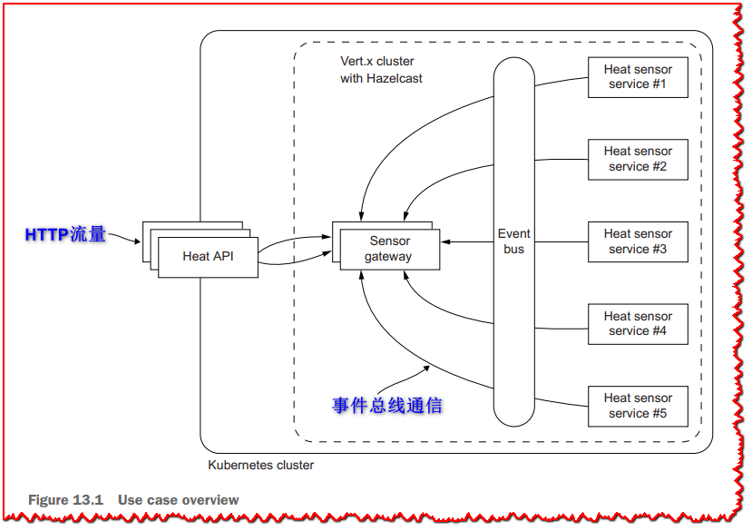

热API是唯一要暴露在集群之外的服务。传感器网关是一个集群内部服务。热传感器服务应该作为集群中的实例部署，但它们不需要负载均衡器。Vert.x集群管理器使用Hazelcast。

让我们快速看看这些服务实现中值得注意的代码部分。

### 13.1.1 热传感器服务

热传感器服务基于本书前几章的代码，特别是第3章的代码。从*scheduleNextUpdate* *方法中的计时器集合调用的 *update*方法已经更新如下。

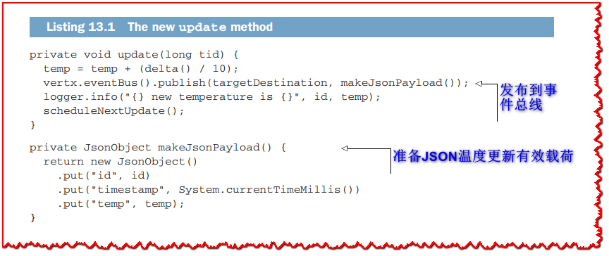

我们仍然使用相同的逻辑，并向事件总线发布一个JSON温度更新文档。我们还引入了*makeJsonPayload*方法，因为它也用于HTTP端点，如下所示。


最后，我们从*HeatSensor* 的verarticle的*start*方法中的环境变量中获得服务配置，如下所示。


环境变量非常好，因为在运行服务时很容易重写它们。因为它们是作为Java *Map*公开的，所以我们可以利用*getOrDefault*方法来拥有默认值。

Vert.x还提供 *Vertx-Config* 模块（本书中未涵盖），如果您需要更高级的配置，例如组合文件，环境变量和分布式注册表。 您可以在Vert.x网站文档（https://vertx.io/docs/）中了解有关它的更多信息。 但是，在大多数情况下，使用Java的*System*类解析一些环境变量要简单得多。

### 13.1.2 传感器网关

传感器网关通过Vert.x事件总线通信从热传感器服务中收集温度更新。 首先，它从环境变量中获取配置，如**列表13.3**所示，因为它需要HTTP端口号和事件总线目标目的地。 开始方法设置了事件z总线消费者，如以下列表。


每个传入的JSON更新都放在数据字段中，即 *HashMap<String, JsonObject>*，以存储每个传感器的最后更新。

HTTP API通过 */data* 端点公开收集的传感器数据，该数据由以下代码处理。


该方法通过将收集到的所有数据组装到一个数组中，然后包装在JSON文档中，从而准备一个JSON响应。

### 13.1.3 Heat API

该服务提供所有传感器数据，或者仅提供温度超出预期正确范围的服务数据。为此，它向传感器网关发出HTTP请求。

配置再次通过环境变量提供，如下所示。


该服务使用环境变量解析传感器网关地址以及正确的温度范围。稍后您将看到，在将服务部署到集群时，我们可以重写这些值。

*start*方法配置web客户端向传感器网关发出HTTP请求，它还使用Vert.x web路由器公开API端点。


使用HTTP GET请求从传感器网关获取数据，如以下清单所示。


*fetchData*方法是通用的，第二个参数是一个自定义动作，因此我们公开的两个HTTP端点可以重用请求逻辑。

下面展示了*fetchAllData* 方法的实现。


这个方法除了用JSON数据完成HTTP请求外，没有做任何特殊的事情。

接下来显示的*sensorsOverLimits*方法更有趣，因为它过滤数据。


*sensorsOverLimits* 方法只保存温度不在预期范围内的条目。为此，我们采用使用Java集合流的函数处理方法，然后返回响应。注意，如果所有传感器值都正确，响应JSON文档中的*data*数组可能为空。

现在您已经看到了这三个服务实现中最有趣的地方，我们可以继续讨论在Kubernetes集群中实际部署它们的主题。

### 13.1.4 部署到本地集群

有很多方法可以运行本地 Kubernetes 集群。 Docker Desktop 嵌入了 Kubernetes，所以如果你的机器上运行了 Kubernetes，它可能就是你运行 Kubernetes 所需要的一切。

Minikube 是 Kubernetes 项目 (https://minikube.sigs.k8s.io/docs/) 提供的另一个可靠选项。 它在 Windows、macOS 或 Linux 上部署了一个小型虚拟机，非常适合创建一次性集群进行开发。 如果出现任何问题，您可以轻松销毁集群并重新开始。

Minikube 的另一个好处是它为 Docker 守护程序提供环境变量，因此您可以在集群内直接使用本地构建的容器映像。 在其他 Kubernetes 配置中，您必须将映像推送到私有或公共注册表，这会减慢开发反馈循环，尤其是在通过缓慢的 Internet 连接将数百兆字节推送到公共注册表时。

我假设您将在这里使用 Minikube，但您可以随意使用任何其他选项。

>  **💡提示:** 如果您以前从未使用过 Kubernetes，欢迎！ 尽管通过阅读本节您不会成为 Kubernetes 专家，但运行这些命令仍然应该让您了解它的全部内容。 一旦超越了庞大的生态系统和术语，Kubernetes 背后的主要概念就非常简单。

以下清单显示了如何创建具有四个 CPU 和 8 GB 内存的集群。

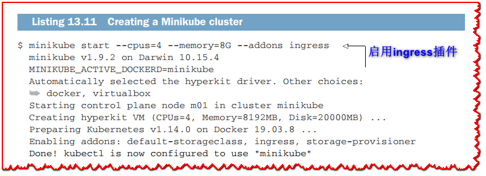

标志和输出将根据您的操作系统和软件版本而有所不同。 您可能需要通过查看当前的 Minikube 文档（在您阅读本章时可能已经更新）来调整这些。 我分配了四个 CPU 和 8 GB 内存，因为这在我的笔记本电脑上很舒服，但你可以使用一个 CPU 和更少的 RAM。

您可以通过运行 *minikube dashboard* 命令访问 Web 仪表板。 使用 Minikube 仪表板，您可以查看各种 Kubernetes 资源，甚至可以执行一些（有限的）操作，例如向上和向下扩展服务或查看日志。

我发现还有另一个仪表板特别高效，建议您尝试一下:K9s ([https://k9scli.io](https://k9scli.io/))。它是一个命令行工具，可以在Kubernetes资源、访问pod日志、更新副本计数等之间快速移动。

Kubernetes有一个名为*kubectl*的命令行工具，您可以使用它执行任何操作:部署服务、收集日志、配置DNS等等。*kubectl*是Kubernetes的瑞士军刀。我们可以使用*kubectl*来应用在每个服务的*k8s/*文件夹中找到的Kubernetes资源定义。稍后我将描述*k8s/*文件夹中的资源。如果你是Kubernetes的新手，你现在需要知道的就是这些文件告诉Kubernetes如何在本章中部署这三个服务。

有一种更好的工具可以改善本地Kubernetes开发经验，称为Skaffold (https://skaffold.dev)。不需要使用Gradle(或Maven)来构建服务并打包，然后使用*kubectl*来部署到Kubernetes, Skaffold能够为我们完成这一切，使用缓存避免不必要的构建，执行部署，聚合所有日志，并在退出时清除所有内容。

您首先需要在您的机器上下载并安装 Skaffold。 Skaffold 与 Minikube 一起开箱即用，因此无需额外配置。 它只需要一个 *skaffold.yaml* 资源描述符，如下面的清单所示（并且包含在 Git 存储库中 chapter13 文件夹的根目录中）。

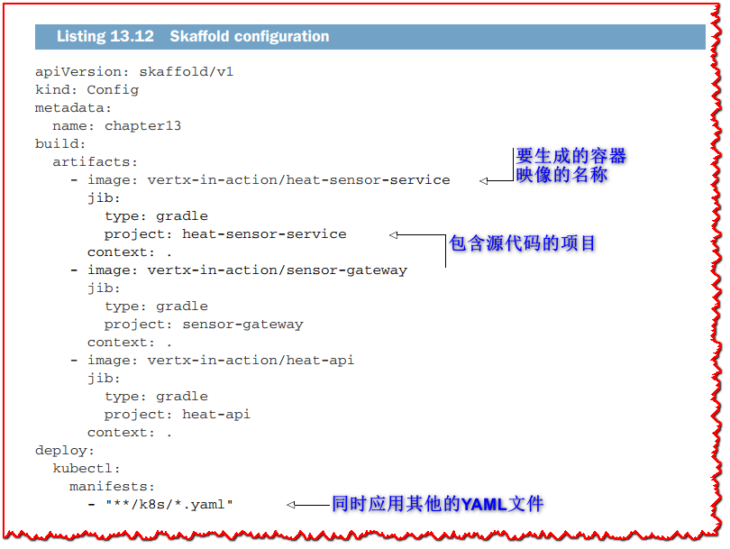

在第 13 章文件夹中，您可以运行 *skaffold dev*，它将构建项目、部署容器映像、公开日志并监视文件更改。 **图 13.2** 显示了 Skaffold 运行的屏幕截图。

恭喜，您现在拥有在（本地）集群中运行的服务！

您不必使用 Skaffold，但为了获得良好的本地开发体验，这是您可以信赖的工具。 它隐藏了 *kubectl* 命令行界面的一些复杂性，并在项目构建工具（例如 Gradle 或 Maven）和 Kubernetes 环境之间架起了一座桥梁。


下面的清单显示了几个检查集群中部署的服务的命令。


*minikube tunnel* 命令对于访问 *LoadBalancer* 服务很重要，它应该在单独的终端中运行。 请注意，它可能需要您输入密码，因为该命令需要调整您当前的网络设置。

您也可以使用以下 Minikube 命令来获取 *LoadBalancer* 服务的 URL，而无需 *minikube 隧道*：

```bash
$ minikube service heat-api --url
http://192.168.64.12:31673
```

>  **💡提示:** 服务的 IP 地址在您的机器上会有所不同。 它们也会随着您删除和创建新服务而改变，因此不要对 Kubernetes 中的 IP 地址做出任何假设。

这是因为 Minikube 还将 *LoadBalancer* 服务公开为 Minikube 实例 IP 地址上的 *NodePort*。 这两种方法在使用 Minikube 时是等效的，但使用 *minikube 隧道* 的方法更接近生产集群所获得的方法，因为该服务是通过集群外部 IP 地址访问的。

现在您有了访问 heat API 服务的方法，您可以发出一些请求。

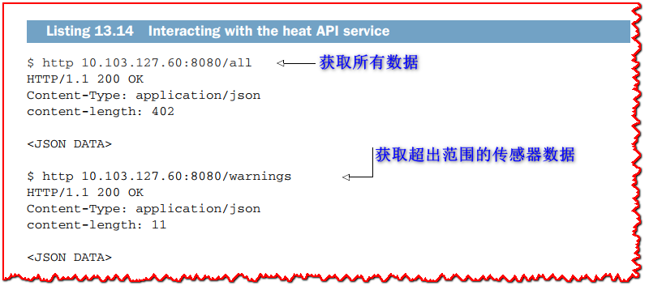

您还可以使用端口转发访问传感器网关，如下所示。


*kubectl port-forward*命令必须在另一个终端运行，只要运行，本地8080端口就转发到集群内部的sensor gateway服务。 这对于访问集群中运行的任何东西而不会暴露为 *LoadBalancer* 服务非常方便。

最后，我们可以进行 DNS 查询，看看热传感器headless服务是如何解决的。 以下清单使用包含 dig 工具的第三方映像，可用于发出 DNS 请求。


现在，如果我们增加副本的数量，如以下清单所示，我们可以看到DNS反映了变化。


此外，如果我们像 **清单 13.14** 那样发出 HTTP 请求，我们可以看到我们有来自5个传感器的数据。

现在我们已经部署了服务并与它们进行了交互，让我们看看 Kubernetes 中的部署如何为 Vert.x 服务工作。

## 13.2 让这些服务在Kubernetes中工作

在Kubernetes中，让一个服务工作在大多数情况下是相当透明的，特别是当它被设计成不受目标运行时环境影响的时候。无论它运行在容器中、虚拟机中还是裸机中，都不应该成为问题。尽管如此，由于Kubernetes的工作方式，仍然需要在一些方面进行调整和配置。

在我们的示例中，唯一需要进行的主要调整是配置集群管理器，以便实例可以发现自己，消息可以通过分布式事件总线发送。剩下的工作就是构建服务的容器映像和编写Kubernetes资源描述符来部署服务。

让我们从构建容器镜像开始。

### 13.2.1 构建容器镜像

构建容器镜像的方法有很多，技术上基于 *OCI Image Format* (OCIIF; https://github.com/opencontainers/image-spec)。 构建此类镜像的最基本方法是编写一个 *Dockerfile* 并使用 *docker build* 命令构建一个镜像。 请注意，*Dockerfile* 描述符可以被 Podman (https://podman.io/) 或 Buildah (https://github.com/containers/buildah) 等其他工具使用，因此您实际上并不需要 Docker 构建容器镜像。

因此，您可以选择带有 Java 的基本映像，然后复制一个自包含的可执行 Jar 文件以运行。 虽然这种方法很简单并且工作得很好，但这意味着对于源代码的每一次更改，您都需要构建一个 Jar 文件大小的新镜像层，其中包含所有依赖项，例如 Vert.x、Netty 等。 服务的编译类通常几千字节，而独立的 Jar 文件多达几兆字节。

或者，您可以制作具有多个阶段和层的 *Dockerfile*，或者您可以使用 Jib 之类的工具自动为您执行等效操作 (https://github.com/GoogleContainerTools/jib)。 如图 13.3 所示，Jib 将不同的层组装成一个容器镜像。


项目依赖项位于基础镜像之上； 它们通常比应用程序代码和资源大，而且它们也不会经常更改，除非升级版本和添加新的依赖项。 当项目具有快照依赖项时，它们会显示为固定版本依赖项之上的一层，因为较新的快照经常出现。 资源和类文件更频繁地更改，并且它们通常对磁盘使用较少，因此它们最终位于顶部。 这种巧妙的分层方法不仅可以节省磁盘空间； 它还可以缩短构建时间，因为层通常可以重复使用。

Jib 提供 Maven 和 Gradle 插件，它通过从项目中获取信息来构建容器镜像。 Jib很棒，因为它纯粹是用 Java 编写的，并且不需要 Docker 来构建镜像，因此您可以在没有任何第三方工具的情况下生成容器镜像。 它还可以将容器映像发布到注册表和 Docker 守护程序，这在开发中很有用。

一旦应用了 Jib 插件，您所需要的只是一些配置元素，如下面的 Gradle 构建清单所示（Maven 版本是等效的，尽管是在 XML 中完成的）。


基础镜像来自 AdoptOpenJDK 项目，该项目发布了许多 OpenJDK 构建 ([https://adoptopenjdk.net](https://adoptopenjdk.net/))。 在这里，我们使用 OpenJDK 11 作为 *Java Runtime Environment* (JRE)，而不是完整的 *Java Development Kit* (JDK)。 这节省了磁盘空间，因为我们只需要一个运行时，而且 JDK 映像比 JRE 映像大。 *ubi-minimal* 部分是因为我们使用基于 Red Hat 通用基础映像的 AdoptOpenJDK 构建变体，其中“最小”变体最大限度地减少了嵌入式依赖项。

Jib 需要知道要执行的主类以及要在容器外公开的端口。 对于热传感器和传感器网关服务，我们需要为 HTTP 服务公开端口 8080，为使用 Hazelcast 的 Vert.x 集群公开端口 5701。 JVM 调优仅限于禁用 JVM 字节码验证器，使其启动速度稍快，并且还使用 */dev/urandom* 生成随机数（默认的 */dev/random* 伪文件可能会在容器启动时阻塞并出现 熵不够）。 最后，我们以 *nobody* 组中的用户 *nobody* 运行，以确保进程在容器内以非特权用户身份运行。

您可以构建镜像并检查它，如下所示。


所有三个服务的容器镜像都以相同的方式构建。 唯一的配置不同是 heat API 服务只暴露了 8080 端口，因为它不需要集群管理器。

>  **💡提示:** 如果您对为准备三个服务的容器镜像而产生的不同层的内容感到好奇，可以使用 Dive（https://github.com/wagoodman/dive）之类的工具。

说到集群，还有配置工作要做！

### 13.2.2 集群和Kubernetes

您在第 3 章中使用的 Hazelcast 和 Infinispan 默认使用多播通信来发现节点。 这对于本地测试和许多裸机服务器部署非常有用，但在 Kubernetes 集群中无法进行多播通信。 如果您在 Kubernetes 上按原样运行容器，则热传感器服务和传感器网关实例将无法通过事件总线进行通信。

当然，这些集群管理器可以配置为在 Kubernetes 中执行服务发现。 我们将简要介绍 Hazelcast 的情况，其中有两种可能的发现模式：
  - Hazelcast可以连接到Kubernetes API来侦听和发现匹配请求的pods，例如所需的标签和值。
  - Hazelcast 可以定期进行 DNS 查询以发现给定 Kubernetes（headless）服务的所有 pods。

DNS 方法受到更多限制。

相反，让我们使用 Kubernetes API 并配置 Hazelcast 以使用它。 默认情况下，Hazelcast Vert.x 集群管理器从 *cluster.xml* 资源中读取配置。 以下清单显示了 *heat-sensor-service/src/main/resource/cluster.xml* 文件的相关配置摘录。

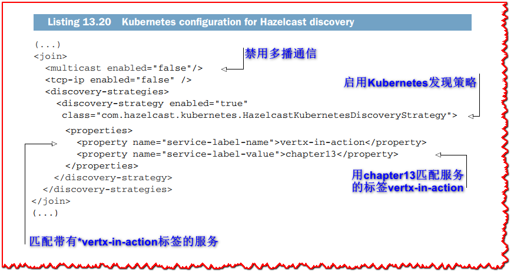

我们禁用默认发现机制并启用 Kubernetes 发现机制。 在这里，Hazelcast 形成属于服务的 pods 集群，其中 *vertx-in-action* 标签使用值 *chapter13* 定义。 由于我们打开了 5701 端口，因此 pods 将能够连接。 请注意，传感器网关的配置相同。

由于 Hazelcast 需要从 Kubernetes API 中读取数据，因此我们需要使用 Kubernetes 基于角色的访问控制 (RBAC) 来确保我们拥有权限。 为此，我们需要应用以下清单的 *ClusterRoleBinding* 资源和 *k8s/rbac.yaml* 文件。

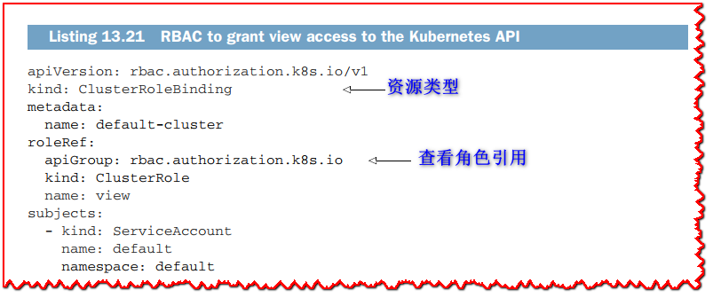

我们需要做的最后一件事是确保热传感器和网关服务在启用集群的情况下运行。 在这两种情况下，代码都是相似的。 以下清单显示了热传感器服务的 *main* 方法。

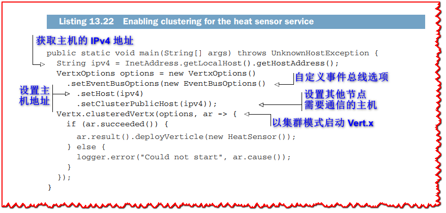

我们启动一个集群的 Vert.x 上下文并传递选项来自定义事件总线配置。 在大多数情况下，您不需要在此处进行任何额外的调整，但在 Kubernetes 的上下文中，集群可能会解析为 *localhost* 而不是实际的主机 IPv4 地址。 这就是为什么我们首先解析 IPv4 地址，然后将事件总线配置主机设置为该地址，以便其他节点可以与其通信。

>  **💡提示:** 清单 13.22 中执行的事件总线网络配置将在以后的 Vert.x 版本中自动完成。 我在这里展示它是因为它可以帮助您解决除 Kubernetes 之外的上下文中的分布式事件总线配置问题。

### 13.2.3 Kubernetes部署和服务资源

现在您知道如何将服务放入容器以及如何确保 Vert.x 集群在 Kubernetes 中工作，我们需要讨论资源描述符。 事实上，Kubernetes 需要一些描述符来将容器镜像部署到 pods 上并公开服务。

让我们从热传感器服务的部署描述符开始，如以下清单所示。


默认情况下，此部署描述符会部署 *vertx-in-action/heat-sensor-service* 容器映像的四个 pods。 部署 pods 是很好的第一步，但我们还需要一个映射到这些 pods 的服务定义。 这对于 Hazelcast 尤其重要：请记住，这些实例是通过带有标签 *vertx-in-action* 和值 *chapter13* 的 Kubernetes 服务发现自己的。

当部署更新时，Kubernetes 通过将旧配置的 *pods* 逐步替换为较新配置的 *pods* 来执行滚动更新。 最好将 *maxSurge* 和 *maxUnavailable* 的值设置为 1。这样做时，Kubernetes 会一个接一个地替换 *pods*，从而使集群状态顺利转移到新的 *pods*。 可以避免这种配置，让 Kubernetes 在滚动更新时更加激进，但集群状态可能会在一段时间内不一致。

以下清单显示了服务资源定义。

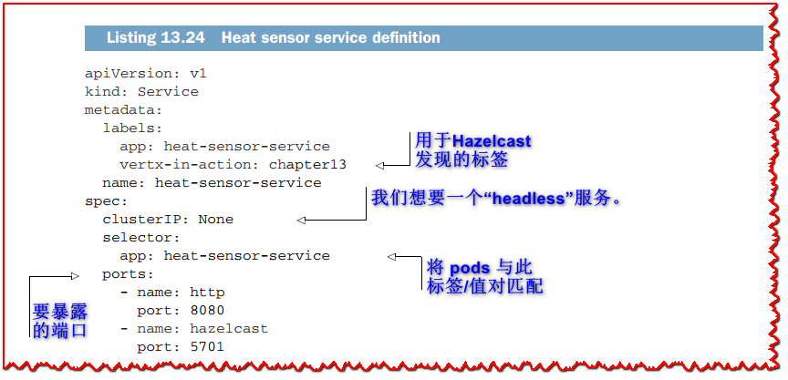

服务描述符暴露了一个 *headless* 服务，也就是说 *pods* 之间没有负载均衡。 因为每项服务都是一个传感器，所以不能将它们用于另一个。 可以使用返回所有 *pods* 列表的 DNS 查询来发现headless服务。 您在清单 13.16 中看到了如何使用 DNS 查询发现headless服务。

传感器网关的部署描述符与热传感器服务的部署描述符几乎相同，您可以在下一个清单中看到。

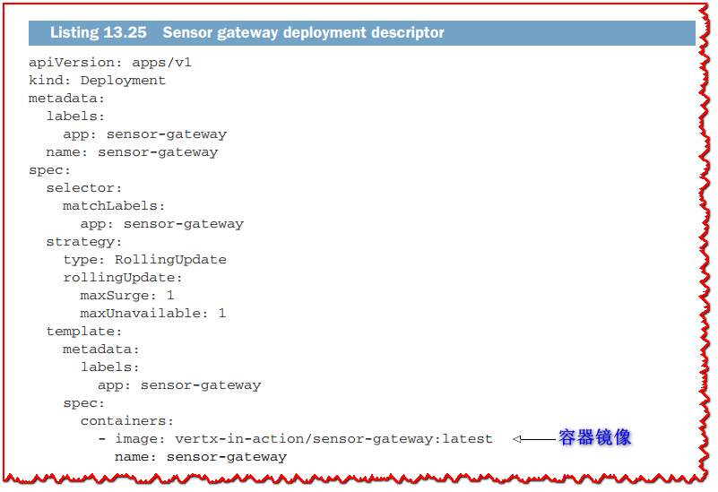

除了名称之外，您可以注意到我们没有指定副本数，默认情况下为 1。服务定义如下面的清单所示。

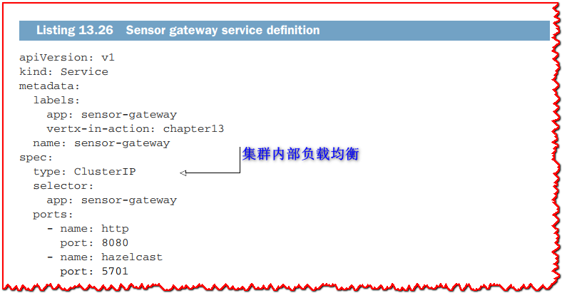

现在我们公开一个做负载均衡的服务。 如果我们进一步启动 *pods*，流量将在它们之间进行负载平衡。 *ClusterIP* 服务是负载均衡的，但它不会暴露在集群之外。

heat API 部署与我们已经完成的部署非常相似，只是有配置可以通过环境变量。 以下清单显示了 *spec.template.spec.containers* 部分中描述符的有趣部分。

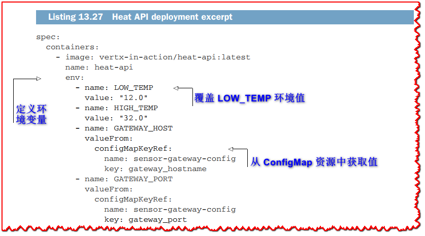

环境变量可以直接按值传递，如 *LOW_TEMP*，也可以通过 *ConfigMap* 资源的间接传递，如以下清单所示。


通过 *ConfigMap* 传递环境变量，我们可以更改配置而无需更新 heat API 部署描述符。 注意 *gateway_hostname* 的值：这是用于在 Kubernetes 集群内使用 DNS 解析服务的名称。 这里 *default* 是 Kubernetes 命名空间，*svc* 指定服务资源，*cluster.local* 解析为 *cluster.local* 域名（请记住，我们使用的是本地开发集群）。

最后，以下清单显示了如何将热传感器 API 公开为外部负载均衡服务。

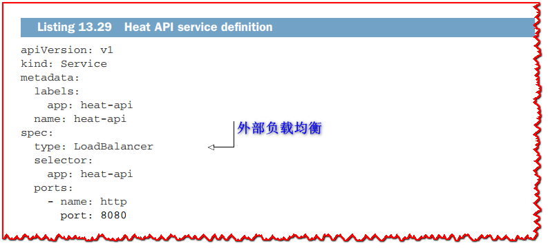

*LoadBalancer* 服务暴露在集群之外。 它也可以使用 Ingress 映射到主机名，但这不是我们将介绍的内容。

我们现在已经介绍了将服务部署到 Kubernetes，所以您可能认为我们已经完成了。 当然，这些服务在 Kubernetes 中运行良好，但我们可以使集成更好！

## 13.3 一流的Kubernetes公民

如您所见，我们部署的服务在 Kubernetes 中运行良好。 话虽如此，我们可以通过做两件事让他们成为一流的 Kubernetes 公民：
  - 暴露运行状况和就绪检查
  - 暴露指标

这对于确保集群知道服务的行为方式非常重要，以便它可以重新启动服务或向上和向下扩展它们。

### 13.3.1 健康检查

当 Kubernetes 启动一个 *pod* 时，它假定它可以在暴露的端口上为请求提供服务，并且只要进程正在运行，应用程序就可以正常运行。 如果进程崩溃，Kubernetes 将重新启动它的 *pod*。 此外，如果一个进程消耗了太多内存，Kubernetes 会杀死它并重新启动它的 *pod*。

我们可以做得更好，通过一个过程 *告知* Kubernetes它是如何做的。

健康检查有两个重要的概念：
  - *活动性检查*允许服务报告它是否正常工作，或者它是否失败并需要重新启动。
  - *就绪检查*允许服务报告它已准备好接受流量。

活度检查很重要，因为进程可能正在工作，但遇到致命错误，或陷入(例如)无限循环。活动探测可以基于文件、TCP端口和HTTP端点。当探测超过阈值失败时，Kubernetes会重新启动 *pod*。

热传感器服务和传感器网关可以使用 HTTP 提供简单的健康检查报告。 只要 HTTP 端点有响应，就意味着服务正在运行。 以下清单显示了如何向这些服务添加运行状况检查功能。


对于HTTP探测，Kubernetes感兴趣的是响应的HTTP状态代码:200表示检查成功，其他值表示有问题。返回一个带有*status*字段和*UP*或*DOWN*值的JSON文档是一种宽松的约定。其他数据可以放在文档中，比如正在执行的各种检查的消息。当记录这些数据用于诊断时，这些数据非常有用。

然后我们必须让Kubernetes知道关于探测器的事情，如下面的清单所示。

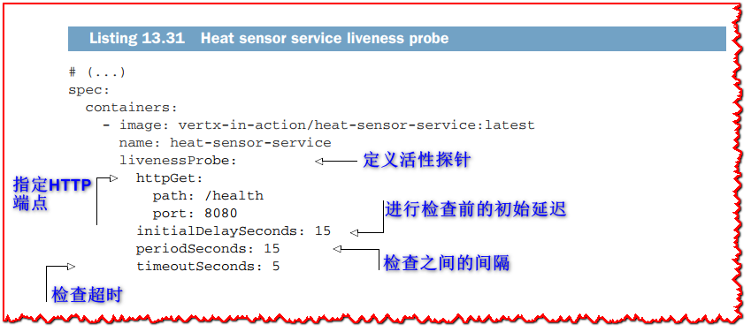

这里的活性检查在 15 秒后开始，每 15 秒发生一次，5 秒后超时。 我们可以通过查看其中一个热传感器服务pods的日志来检查这一点。


要获取 *pod* 名称并检查日志，您可以查看 *kubectl logs* 的输出。 在这里，我们看到检查确实每 15 秒发生一次。

heat API 的例子更有趣，因为我们可以定义 liveness 和 readiness 检查。 API 需要传感器网关，因此其准备情况取决于网关的准备情况。 首先，我们必须为 liveness 和 readiness 检查定义两条路由，如下面的清单所示。


*livenessCheck* 方法的实现与清单 13.30 的实现相同：如果服务响应，则它是活动的。 不存在服务会响应但仍处于需要重新启动的状态的条件。 但是，该服务可能无法接受流量，因为传感器网关不可用，这将由以下就绪检查报告。

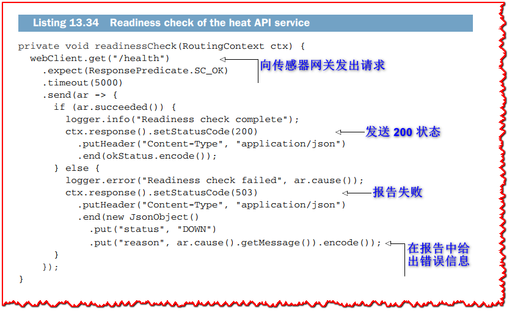

为了执行就绪检查，我们向传感器网关健康检查端点发出请求。 我们实际上可以提出任何其他请求，让我们知道该服务是否可用。 然后，我们使用 HTTP 200 或 503 响应就绪检查。

部署资源中的配置显示在以下清单中。


如您所见，就绪探针的配置非常类似于活性探针。 我们将 *initialDelaySeconds* 定义为 5 秒； 这是因为最初的 Hazelcast 发现需要几秒钟，所以传感器网关在完成之前还没有部署它的 Verticle。

我们可以通过关闭传感器网关的所有实例来检查效果，如下所示。

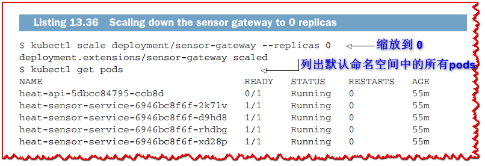

您应该在列出 *pods* 之前等待几秒钟，并观察 heat API *pod* 被标记为 *0/1* 就绪。 这是因为就绪检查失败，所以 Pod 将不再接收流量。 您可以尝试运行以下查询并立即看到错误：

```bash
$ http $(minikube service heat-api --url)/warnings
```

现在，如果我们缩减到一个实例，我们将恢复到工作状态，如下面的清单所示。

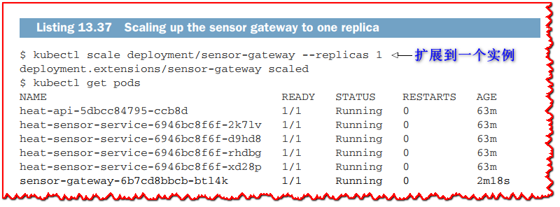

您现在可以再次成功发出 HTTP 请求。

>  **🏷注意:** 您在运行状况或准备情况检查中执行的操作取决于您的服务的功能。 作为一般规则，您应该执行对系统没有副作用的操作。 例如，如果您的服务需要在数据库连接断开时报告健康检查失败，那么安全的操作应该是执行一个小的 SQL 查询。 相比之下，执行数据插入 SQL 查询有副作用，这可能不是您想要检查数据库连接是否正常工作的方式。

### 13.3.2 指标

Vert.x 可以配置为报告各种项目的指标，如事件总线通信、网络通信等。 监控指标很重要，因为它们可用于检查服务的运行情况并触发警报。 例如，当给定 URL 端点的吞吐量或延迟高于阈值时，您可以发出警报，导致 Kubernetes 扩展服务。

我将向您展示如何从 Vert.x 公开指标，但其他主题，如可视化、警报和自动缩放非常复杂，超出了本书的范围。

Vert.x 公开了 JMX、Dropwizard、Jolokia 和 Micrometer 等流行技术的指标。

我们将使用 Micrometer 和 Prometheus。 Micrometer (https://micrometer.io/) 很有趣，因为它是对 InfluxDB 和 Prometheus 等指标报告后端的抽象。 Prometheus 是一个在 Kubernetes 生态系统中流行的指标和警报项目（https://prometheus.io/）。 它也可以在 *pull* 模式下工作：Prometheus 配置为定期从服务中收集指标，因此您的服务不会受到 Prometheus 不可用的影响。

我们将在传感器网关接收事件总线和 HTTP 流量时添加指标； 它是用例中最受请求的服务。 为此，我们首先必须添加两个依赖项，如下所示。


从 *main* 方法启动 Vert.x 时，传感器网关需要集群和指标。 我们需要按如下方式启用指标。

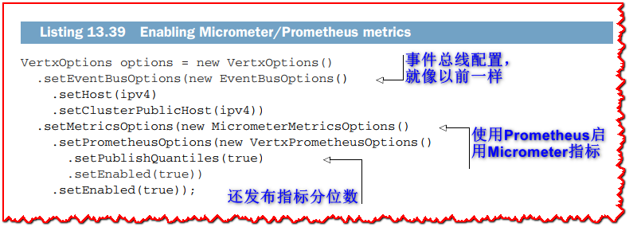

我们现在必须定义一个 HTTP 端点以使指标可用。 Vert.x Micrometer 模块提供了一个 Vert.x Web 处理程序来简化它，如下面的清单所示。


拦截度量请求并记录它们是一个好主意。 这在配置 Prometheus 以检查它是否正在收集任何指标时很有用。

您可以使用端口转发测试输出。


Prometheus 指标以简单的文本格式公开。 正如您在运行上述命令时所看到的，默认情况下会报告许多有趣的指标，例如响应时间、打开的连接等等。 您还可以使用 Vert.x Micrometer 模块 API 定义自己的指标，并像默认指标一样公开它们。

您将在本书 Git 存储库的 *chapter13/k8s-metrics* 文件夹中找到配置 Prometheus 操作符以使用来自传感器网关的指标的说明和 Kubernetes 描述符。 您还将找到一个指针，用于使用 Grafana 制作仪表板，如图 13.4 所示。

Grafana 是一种流行的仪表板工具，可以使用来自许多来源的数据，包括 Prometheus 数据库 (https://grafana.com/)。 您所需要的只是连接可视化和查询。 幸运的是，仪表板可以作为 JSON 文档共享。 如果要重现图 13.4 中的仪表板，请检查 Git 存储库中的指针。


## 13.4 结束的开始

所有美好的事情都结束了，本章结束了我们使用 Vert.x 实现响应式应用程序的旅程。我们从异步编程和 Vert.x 的基础知识开始这本书。异步编程是构建可扩展服务的关键，但它也带来了挑战，您看到了 Vert.x 如何帮助使这种编程风格变得简单而有趣。在本书的第二部分，我们使用了一个真实的应用场景来研究用于数据库、Web、安全、消息传递和事件流的关键 Vert.x 模块。这使我们能够构建一个由多个微服务组成的端到端反应式应用程序。在本书的最后，您看到了一种基于负载和混沌测试相结合的方法，以确保服务弹性和响应能力。这很重要，因为响应式不仅与可伸缩性有关，还与编写可以应对故障的服务有关。我们总结了在 Kubernetes 集群中部署 Vert.x 服务的说明，这是 Vert.x 非常适合的。

当然，我们并未涵盖 Vert.x 中的所有内容，但您可以通过该项目的网站和文档轻松找到自己的方式。 Vert.x 社区很受欢迎，您可以通过邮件列表和聊天取得联系。 最后但同样重要的是，您通过阅读本书学到的大部分技能都可以转化为 Vert.x 以外的技术。 Reactive 不是一种现成的技术。 像 Vert.x 这样的技术只能让你获得一半的响应式方法； 系统设计需要一种工艺和思维方式，以实现可靠的可扩展性、故障恢复能力和最终的响应能力。

就个人而言，我希望你喜欢读这本书，就像我喜欢写这本书一样。 我期待在在线讨论中收到您的来信，如果我们碰巧一起参加活动，我将非常高兴见到您本人！ 玩得开心，保重！

## 总结
  - Vert.x 应用程序可以轻松部署到 Kubernetes 集群，而无需 Kubernetes 特定的模块。
  - Vert.x 分布式事件总线通过配置集群管理器发现模式在 Kubernetes 中工作。
  - 使用 Minikube、Skaffold 和 Jib 等工具可以获得快速的本地 Kubernetes 开发体验。
  - 公开运行状况检查和指标是在集群中操作服务的好习惯。
