# 第四章: 异步数据和事件流

> 翻译: 白石(https://github.com/wjw465150/Vert.x-in-Action-ChineseVersion)

**本章涵盖了**

  - 为什么流是事件之上的有用抽象
  - 什么是背压，以及为什么它是异步生产者和消费者的基础
  - 如何从流中解析协议数据

到目前为止，我们一直在使用 **callbacks** 处理来自各种来源（例如 HTTP 或 TCP 服务器）的事件。回调函数允许我们一次推理一个事件。

处理来自TCP连接、文件或HTTP请求的传入数据缓冲区并没有太大的不同:您需要声明一个回调处理程序来响应每个事件并允许自定义处理。

也就是说，大多数事件需要作为一个系列而不是作为孤立事件来处理。处理HTTP请求正文就是一个很好的例子，因为需要组装几个不同大小的缓冲区来重新构建整个正文负载。由于响应式应用程序处理非阻塞I/O，高效和正确的流处理是关键。在本章中，我们将看看为什么流会带来挑战，以及Vert.x如何提供全面统一的流模型。

## 4.1 统一的流模型

Vert.x 提供跨多种类型资源的流的统一抽象，例如文件、网络套接字等。 *read stream* 是可以读取的事件源，而 *write stream* 是要发送到的事件的目的地。 例如，HTTP 请求是读取流，HTTP 响应是写入流。

Vert.x中的流跨越了广泛的源和接收范围，包括**表 4.1**中列出的那些。

**表 4.1 Vert.x 常用读写流**

| **流资源**  | **读取支持** | **写入支持** |
| --------------------------- | ---------------- | --------------------- |
| TCP sockets                 | Yes              | Yes                   |
| UDP datagrams               | Yes              | Yes                   |
| HTTP requests and responses | Yes              | Yes                   |
| WebSockets                  | Yes              | Yes                   |
| Files                       | Yes              | Yes                   |
| SQL results                 | Yes              | No                    |
| Kafka events                | Yes              | Yes                   |
| Periodic timers             | Yes              | No                    |

读写流是通过 *io.vertx.core.streams* 包的 *ReadStream* 和 *WriteStream* 接口定义的。 您将主要处理实现这两个接口的 API，而不是自己实现它们，尽管如果您想连接到某些第三方异步事件 API，您可能必须这样做。

这些接口可以看成是由两部分组成:
  - 读写数据的基本方法
  - 我们将在下一节介绍背压管理方法

**表 4.2** 列出了读流的基本方法。它们定义了三种事件通知的回调:读取了一些数据，出现了异常，流结束了。

**表4.2 ReadStream 基本方法**

| **方法**                             | **描述**                                                     |
| ------------------------------------ | ------------------------------------------------------------ |
| handler(Handler<T>)                  | 处理 T 类型的新读取值（例如 Buffer、byte[]、JsonObject 等）  |
| exceptionHandler(Handler<Throwable>) | 处理读取异常                                                 |
| endHandler(Handler<Void>)            | 当流结束时调用，原因可能是所有数据都已读取，也可能是引发了异常 |

类似地，**表 4.3** 中列出的写流的基本方法允许我们写数据，结束流，并在发生异常时得到通知。

**表4.3 WriteStream基本方法**

| **方法**                             | **描述**                                                     |
| ------------------------------------ | ------------------------------------------------------------ |
| write(T)                             | 写入一些类型为 T 的数据（例如 Buffer、byte[]、JsonObject 等） |
| exceptionHandler(Handler<Throwable>) | 处理写入异常                                                 |
| end()                                | 结束流                                                       |
| end(T)                               | 写入一些类型为 T 的数据，然后结束流                          |

在前面的章节中，我们已经在不知不觉中操纵了流，例如使用 TCP 和 HTTP 服务器。

*java.io* API 形成了一个经典的流 I/O 抽象，用于从 Java 中的各种来源读取和写入数据，尽管使用了阻塞 API。 将 JDK 流与 Vert.x 非阻塞流 API 进行比较也是很有趣的。

假设我们要读取文件的内容并将其内容输出到标准控制台输出。


```java
package chapter4.streamapis;

import java.io.File;
import java.io.FileInputStream;
import java.io.IOException;

public class JdkStreams {

  public static void main(String[] args) {
    File file = new File("build.gradle.kts");                 // <1>
    byte[] buffer = new byte[1024];
    try (FileInputStream in = new FileInputStream(file)) {
      int count = in.read(buffer);
      while (count != -1) {
        System.out.println(new String(buffer, 0, count));
        count = in.read(buffer);
      }
    } catch (IOException e) {
      e.printStackTrace();
    } finally {
      System.out.println("\n--- DONE");                       // <2>
    }
  }
}
```

> <1>: 使用try-with-resources可以确保无论正常执行还是异常执行，`reader.close()`都会被调用。
>
> <2>: 一旦读取完成，我们将插入两行到控制台。

**清单 4.1** 显示了一个使用 JDK I/O 流读取文件然后将其内容输出到控制台的经典示例，同时处理可能的错误。 我们将数据读取到缓冲区，然后立即将缓冲区内容写入标准控制台，然后再回收缓冲区以供下次读取。

以下清单显示了与**清单 4.1** 中相同的代码，但使用了 Vert.x 异步文件 API。

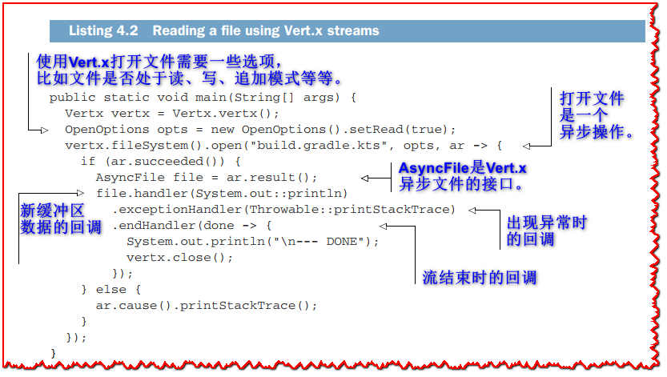

```java
package chapter4.streamapis;

import io.vertx.core.Vertx;
import io.vertx.core.file.AsyncFile;
import io.vertx.core.file.OpenOptions;

public class VertxStreams {

  public static void main(String[] args) {
    Vertx vertx = Vertx.vertx();
    OpenOptions opts = new OpenOptions().setRead(true);               // <1>
    vertx.fileSystem().open("build.gradle.kts", opts, ar -> {         // <2>
      if (ar.succeeded()) {  
        AsyncFile file = ar.result();                                 // <3>
        file.handler(System.out::println)                             // <4>                 
          .exceptionHandler(Throwable::printStackTrace)               // <5>  
          .endHandler(done -> {                                       // <6>
            System.out.println("\n--- DONE");
            vertx.close();
          });
      } else {
        ar.cause().printStackTrace();
      }
    });
  }
}
```

> <1>: 使用Vert.x打开文件需要一些选项，比如文件是否处于读、写、追加模式等等。
>
> <2>: 打开文件是一个异步操作。
>
> <3>: AsyncFile是Vertx异步文件的接口。
>
> <4>: 新缓冲区数据的回调。
>
> <5>: 出现异常时的回调。
>
> <6>: 流结束时的回调。

这里的方法是声明式的，因为我们在读取流时为不同类型的事件定义了处理程序。我们正在被 **push(推)** 数据，而在**清单 4.1** 中我们正在从流中 **pull(拉)** 数据。

乍一看，这种差异似乎是表面上的，在一个示例中提取数据，而在另一个示例中推送数据。 但是，区别很大，我们需要了解它才能掌握异步流，无论是使用 Vert.x 还是使用其他解决方案。

这让我们想到了**背压**的概念。

## 4.2 什么是背压?

背压是事件消费者向事件生产者发出信号的一种机制，因为发出事件的速度比消费者可以处理的速度更快。 在反应式系统中，背压用于暂停或减慢生产者的速度，以便消费者避免在无限的内存缓冲区中累积未处理的事件，从而可能耗尽资源。

为了理解为什么背压对异步流很重要，让我们以用于下载 Linux 分发映像的 HTTP 服务器为例，并考虑在没有任何背压管理策略的情况下实现。

Linux 分发映像通常以 `.iso` 文件的形式分发，并且很容易达到数GB。 实现可以分发此类文件的服务器将涉及执行以下操作：
  1. 打开 HTTP 服务器。
  2. 对于每个传入的 HTTP 请求，找到相应的文件。
  3. 对于从文件读取的每个缓冲区，将其写入HTTP响应体。

**图 4.1** 说明了这将如何与 Vert.x 一起工作，尽管这也适用于任何非阻塞 I/O API。 数据缓冲区从文件流中读取，然后传递给处理程序。 除了直接将每个缓冲区写入 HTTP 响应流之外，处理程序不太可能做任何事情。 每个缓冲区最终都会直接或作为较小的块写入底层 TCP 缓冲区。 由于 TCP 缓冲区可能已满（由于网络或客户端繁忙），因此有必要维护一个待写入的未决缓冲区缓冲区（**图 4.1** 中的写入队列）。 请记住，写操作是非阻塞的，因此需要缓冲。 这听起来像是一个非常简单的处理管道，那么可能会出现什么问题呢？

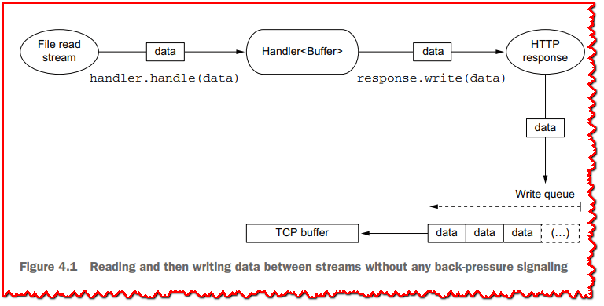

从文件系统中读取通常是快速且低延迟的，并且给定多个读取请求，操作系统可能会将一些页面缓存到 RAM 中。 相比之下，写入网络要慢得多，带宽取决于最弱的网络链接。 也会出现延迟。

由于读取比写入快得多，因此如**图 4.1** 所示的写入缓冲区可能会很快变得非常大。 如果我们有几千个并发连接来下载 ISO 映像，我们可能会在写入缓冲区队列中积累大量缓冲区。 实际上，我们在 JVM 进程内存中可能有几GB的 ISO 映像，等待通过网络写入！ 写入队列中的缓冲区越多，进程消耗的内存就越多。

这里的风险显然是耗尽的风险，要么是因为进程吃掉了所有可用的物理内存，要么是因为它运行在内存上限的环境中，例如容器。 这增加了消耗过多内存甚至崩溃的风险。

正如您可能猜到的那样，一个解决方案是**背压信号**，它使读流适应写流的吞吐量。在前面的示例中，当HTTP响应写队列增长得太大时，它应该能够通知文件读流速度太快。在实践中，暂停源流是管理背压的一种好方法，因为它给写入缓冲区中的项留出了时间，而不会积累新的项。

>  **💡提示:** 阻塞 I/O API 通过阻塞执行线程直到 I/O 操作完成具有隐式形式的背压。 当缓冲区已满时，写入操作会阻塞，这可以防止阻塞的线程在写入操作完成之前提取更多数据。

**表 4.4** 列出了 ReadStream 的背压管理方法。 默认情况下，读取流会尽可能快地读取数据，除非它被暂停。 处理器可以暂停然后恢复读取流以控制数据流。

**表 4.4 ReadStream 背压管理方式**

| **方法** |                                **描述**                                |
| -------- | --------------------------------------------------------------------- |
| pause()  | 暂停流，防止进一步的数据发送到处理程序。                                   |
| resume() | 再次开始读取数据并将其发送到处理程序。                                     |
| fetch(n) | 要求（最多）读取 n 个元素。 在调用 fetch(n) 之前必须暂停流(调用pause方法)。 |

当读取流暂停时，可以请求获取一定数量的元素，这是异步拉取的一种形式。这意味着处理器可以使用**fetch**请求元素，设置自己的速度。你将在本章的最后一节看到具体的例子。

在任何情况下，调用 **resume()** 会导致流再次开始以尽可能快的速度推送数据。

**表 4.5** 显示了 *Write-Stream* 对应的背压管理方法。

**表 4.5 WriteStream 背压管理方式**

|           **方法**           |                                                                  **描述**                                                                  |
| --------------------------- | ----------------------------------------------------------------------------------------------------------------------------------------- |
| setWriteQueueMaxSize(int)   | 定义在被视为已满之前，最大写入缓冲区队列大小应该是多少。 这是要写入的排队 Vert.x 缓冲区的大小，而不是实际字节的大小，因为排队的缓冲区可能具有不同的大小。 |
| boolean writeQueueFull()    | 指示写缓冲区队列大小何时已满。                                                                                                                |
| drainHandler(Handler<Void>) | 定义一个回调函数，当写缓冲区队列被清空时被调用(通常是当它返回到其最大大小的一半时)。                                                                |

写缓冲区队列有一个最大大小，超过这个大小就认为已满。写队列有默认的大小，您很少想要调整，但是如果您愿意，您可以这样做。注意，仍然可以进行写操作，数据将在队列中累积。写入器应该检查队列何时已满，但没有强制写入。当写入器知道写入队列已满时，可以通过**drain handler**通知当写队列清空时来调用此回调函数。通常，当写队列的一半被耗尽时，就会发生这种情况。

现在您已经了解了 *ReadStream* 和 *WriteStream* 中提供的背压操作，下面是我们通过 HTTP 提供 ISO 映像的示例中控制流程的方法：
  + 1. 对于每个读取缓冲区，将其写入 HTTP 响应流。
  + 2. 检查写入缓冲区队列是否已满。
  + 3. 如果满了
    - a. 暂停文件读取流。
    - b. 安装一个**drain handler**处理程序，当它被调用时恢复文件读取流。

请注意，这种背压管理策略并不总是您所需要的：
  - 在某些情况下，当写入队列已满时丢弃数据在功能上是正确的，甚至是可取的。
  - 有时事件源不像 Vert.x ReadStream 那样支持暂停，即使可能导致内存耗尽，您也需要在丢弃数据或缓冲之间做出选择。

处理**背压**的适当策略取决于您正在编写的代码的功能要求。 一般来说，您会更喜欢 Vert.x 流提供的流控制，但是当这不可能时，您将需要采用另一种策略。

现在让我们将我们看到的所有内容组装到一个应用程序中。

## 4.3 做一个音乐流媒体点唱机

我们将通过音乐流点唱机的例子来说明 Vert.x 流和背压管理（**见图 4.2**）。

这个想法是点唱机在本地存储了一些 MP3 文件，客户端可以通过 HTTP 连接以收听流。 单个文件也可以通过 HTTP 下载。 反过来，控制何时播放、暂停和安排歌曲是通过一个简单的基于文本的 TCP 协议进行的。 所有连接的播放器将同时收听相同的音频，除了由于播放器放置的缓冲导致的轻微延迟。

这个例子将让我们看到如何处理自定义流节奏和不同的背压管理策略，以及如何解析流。

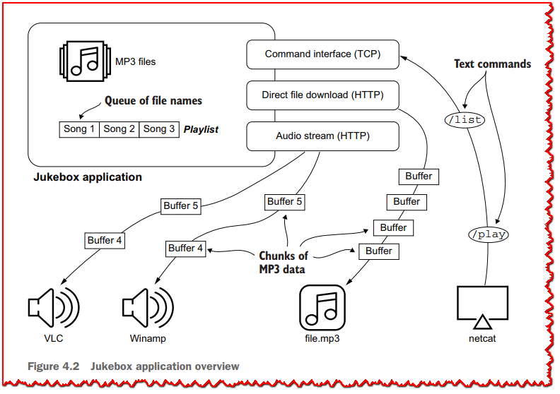

### 4.3.1 功能和使用

我们将构建的应用程序可以使用 Gradle 任务从本书 GitHub 存储库中的代码运行，如**清单 4.3** 的控制台输出所示。

>  **🏷注意:** 如果您希望点唱机播放音乐，您需要将一些 MP3 文件复制到项目目录中名为 `track/` 的文件夹中。


此应用程序中部署了两个 Verticle：
  - **Jukebox** 提供了主要的音乐流媒体逻辑和HTTP服务器接口，供音乐播放器连接。
 - **NetControl** 提供一个基于文本的TCP协议，用于远程控制点唱机应用程序。


要听音乐，用户可以连接VLC等播放器(**见图4.3**)，甚至可以直接在`http://localhost:8080/`上打开web浏览器。

另一方面，玩家可以通过**netcat**这样的工具来控制，使用纯文本命令来列出所有文件，安排播放的曲目，以及暂停或重新启动流。**清单4.4** 显示了使用**netcat**的交互式会话。

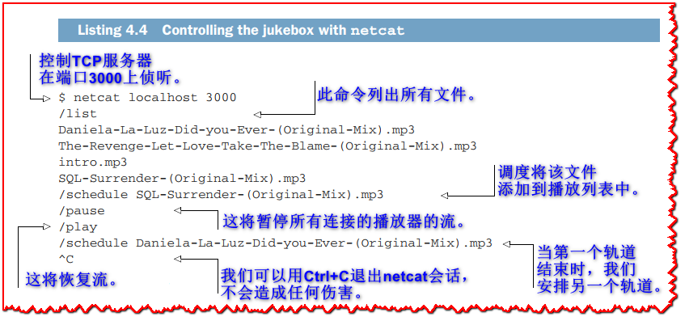

>  **💡提示:** *netcat* 可能在您的 Unix 环境中以 nc 的形式提供。 在 WSL 环境之外，我不知道有适用于 Windows 的友好且等效的工具。

最后，我们希望能够通过 HTTP 下载我们知道文件名的任何 MP3：

```bash
curl -o out.mp3 http://localhost:8080/download/intro.mp3
```

现在让我们剖析实现的各个部分。

### 4.3.2 HTTP处理: 总体情况

将有许多代码片段涉及到HTTP服务器处理，因此最好查看**图4.4**，以理解下一段代码如何组合在一起。

有两种类型的传入 HTTP 请求：客户端想要直接按名称下载文件，或者想要加入音频流。 处理策略非常不同。

在下载文件的情况下，目标是执行从文件读取流到 HTTP 响应写入流的直接复制。 这将通过**背压**管理来完成，以避免过度缓冲。

流式传输涉及更多，因为我们需要跟踪所有流式传输器的 HTTP 响应写入流。 计时器定期从当前 MP3 文件中读取数据，并为每个流媒体复制和写入数据。

让我们看看这些部分是如何实现的。

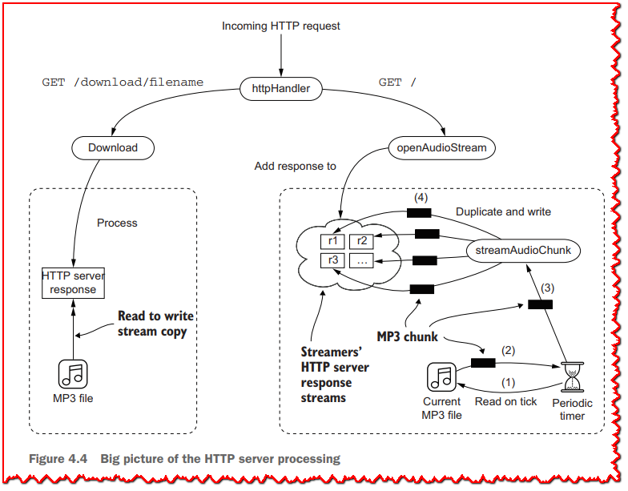


### 4.3.3 Jukebox Verticle 基础知识

下一个清单显示 Jukebox Verticle 类的状态由播放状态和播放列表定义。


枚举类型 *State* 定义了两种状态，而 *Queue* 保存了接下来要播放的所有预定曲目。 同样，Vert.x 线程模型确保单线程访问，因此不需要并发集合和临界区。

*Jukebox* verticle（清单 4.6）的 *start* 方法需要配置一些事件总线处理程序，这些处理程序对应于可以从 TCP 文本协议使用的命令和操作。 我们稍后会剖析的 *NetControl* verticle 处理 TCP 服务器的内部并将消息发送到事件总线。

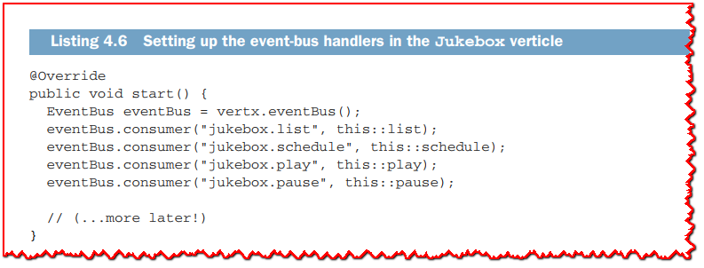

请注意，因为我们已经抽象了事件总线上的命令传输，所以我们可以轻松插入新的方式来命令点唱机，例如使用移动应用程序、Web 应用程序等。

以下清单提供了播放/暂停和调度处理程序。 这些方法直接操纵播放和播放列表状态。

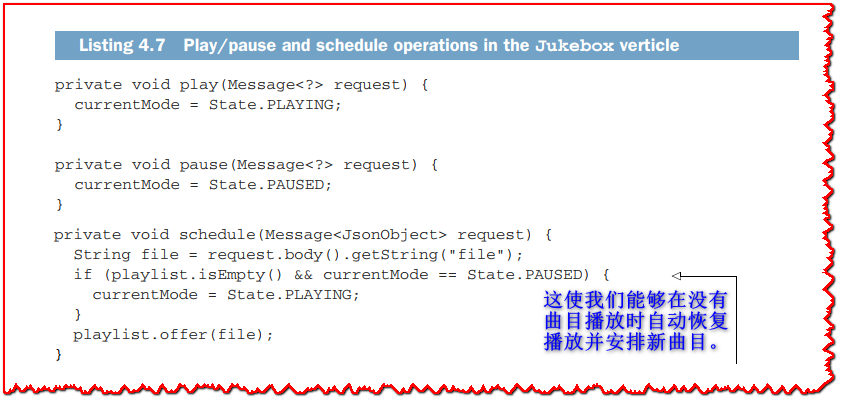

列出可用的文件有点复杂，如下面的清单所示。


### 4.3.4 传入的HTTP连接

有两种类型的传入HTTP客户端:他们要么想要音频流，要么想要下载文件。

HTTP服务器在verticle的`start`方法中启动(参见下一个清单)。


Vert.x HTTP服务器使用的请求处理程序如下面的清单所示。它将HTTP请求转发到*openAudioStream*和*download*实用程序方法，这些方法完成请求和进行处理。

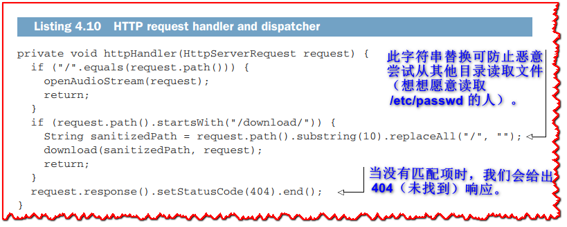

**openAudioStream**方法的实现如下所示。它将流准备为分块模式，设置适当的内容类型，并将响应对象留到以后使用。

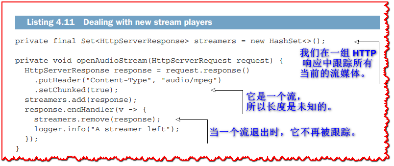

### 4.3.5 尽可能高效地下载

下载文件就是一个很好的例子，可以使用背压管理来协调源流（文件）和接收器流（HTTP 响应）。

以下清单显示了我们如何查找文件，当它存在时，我们将最终下载任务转发给 **downloadFile** 方法。


**downloadFile** 方法的实现如以下清单所示。


在两个流之间复制数据时，要注意背压。当策略是暂停源且不丢失任何数据时，通常会这样做，因此可以重写相同的代码，如以下清单所示。


在可暂停的 **ReadStream** 和 **WriteStream** 之间进行复制时，管道会处理背压。 它还管理源流的结束和两个流上的错误。 **清单 4.14** 的代码与 **清单 4.13** 中的代码完全相同，但没有使用样板文件。 **pipeTo** 还有其他变体用于指定自定义处理程序。

### 4.3.6 读取 MP3 文件，但不会太快

MP3 文件的标题包含元数据，例如艺术家姓名、流派、比特率等。 随后是几个包含压缩音频数据的帧，解码器可以将其转换为**脉冲编码调制**数据，最终可以转换为声音。

MP3 解码器对错误非常有弹性，因此如果它们在文件中间开始解码，它们仍然会设法计算出比特率，并且它们将与下一帧对齐以开始解码音频。 您甚至可以连接多个 MP3 文件并将它们发送到播放器。 只要所有文件都使用相同的比特率和立体声模式，音频就会被解码。

当我们设计一个音乐流点唱机时，这对我们来说很有趣：如果我们的文件以相同的方式编码，我们可以简单地一个接一个地推送播放列表中的每个文件，解码器就会很好地处理音频。

**为什么单靠背压是不够的**

将 MP3 数据提供给许多连接的播放器并不像看起来那么简单。 主要问题是确保所有当前和未来的玩家在大致相同的时间收听相同的音乐。 所有播放器都有不同的本地缓冲策略以确保流畅播放，即使网络出现延迟，但如果服务器只是尽可能快地推送文件，则并非所有客户端都会同步。 更糟糕的是，当一个新的播放器连接时，它可能不会收到任何可播放的内容，而当前播放器的缓冲区中还有几分钟的音乐。 为了提供合理的播放体验，我们需要控制读取文件的速度，为此我们将使用计时器。

这在**图 4.5** 中进行了说明，它显示了在流上 **没有** 和 **有** 速率控制所发生的情况。 在这两种情况下，假设玩家 A 在开始时加入了流，而玩家 B 在 10 秒后加入。 如果没有读取速率控制，我们会发现自己处于与下载 MP3 文件类似的情况。 在将 MP3 数据块复制到连接的客户端时，我们可能会设置背压以确保高效的资源使用，但流媒体体验会非常糟糕。

由于我们基本上以尽可能快的速度流式传输数据，播放器 A 发现其内部缓冲区充满了几乎所有当前文件数据。 虽然它可能在 0 分 15 秒的位置播放，但它已经接收到超过 3 分钟标记的数据。 当播放器 B 加入时，它开始从文件中更远的地方接收 MP3 数据块，因此它在 3 分 30 秒的位置开始播放。 如果我们将推理扩展到多个文件，则新播放器可以加入并且根本不接收数据，而之前连接的播放器可能在其内部缓冲区中播放多首歌曲。

相比之下，如果我们控制 MP3 文件的读取速率，从而控制 MP3 块被复制和写入连接的播放器的速率，我们可以确保它们或多或少都在相同的位置。

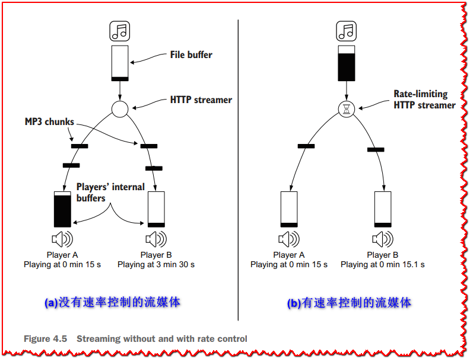

这里的速率控制就是确保所有播放器都足够快地接收数据，以便他们可以不间断地播放，但不能太快，以免缓冲太多数据。

**速率限制的流媒体实现**

让我们看看完整的 *Jukebox* verticle的 `start` 方法，因为它显示了非常需要的计时器。


除了连接事件总线处理程序和启动 HTTP 服务器之外，**start** 方法还定义了一个计时器，以便每 100 毫秒传输一次数据。

接下来，我们可以看看 **streamAudioChunk** 方法的实现。


**为什么是这些值？**

>  为什么我们每 100 毫秒读取一次数据？ 为什么要读取 4096 字节的缓冲区？
>  
>  我根据经验发现，这些值对于我的笔记本电脑上的320kbps恒定比特率的MP3文件很好用。它们确保测试中不会出现下降，同时防止玩家缓冲过多数据，从而在音频流中间隔数秒结束。
>  
>  在运行示例时，您可以随意修改这些值。
>  

**streamAudioChunk** 的代码读取最多 4096 字节的块。 由于该方法将始终每秒调用 10 次，因此还需要检查是否正在播放任何内容。 **processReadBuffer** 方法流式传输数据，如下面的清单所示。


对于播放器的每个 HTTP 响应流，该方法都会复制读取的数据。 请注意，这里还有一种背压管理的情况：当客户端的写入队列已满时，我们只是简单地丢弃数据。 在播放器端，这会导致音频掉线，但由于服务器上的队列已满，这意味着播放器无论如何都会有延迟或掉线。 丢弃数据很好，因为 MP3 解码器知道如何恢复，并且它确保播放将与其他播放器保持紧密的时间。

>  **☢警告:** Vert.x 缓冲区一旦被写入就不能重复使用，因为它们被放置在写入队列中。 重用缓冲区总是会导致错误，所以不要在这里寻找不必要的优化。

最后，以下清单中的辅助方法可以打开和关闭文件。


## 4.4 解析简单的流

到目前为止，我们对自动点唱机示例的剖析主要集中在用于下载和流式传输 MP3 数据的 *Jukebox* verticle。 现在是剖析 *NetControl* verticle 的时候了，它在端口 3000 上公开了一个 TCP 服务器，用于接收文本命令来控制点唱机播放的内容。 从异步数据流中提取数据是一种常见的需求，Vert.x 提供了有效的工具来做到这一点。

我们的文本协议中的命令具有以下形式：

```
/action [argument]
```

这些是动作：
  - /list - 列出可播放的文件
  - /play - 播放流
  - /pause - 暂停流
  - /schedule file - 在播放列表的末尾追加文件

每个文本行只能有一个命令，因此该协议被称为*换行分隔*。

我们需要一个解析器，因为缓冲区以块的形式到达，每个块很少对应一行。 例如，第一个读取缓冲区可能包含以下内容：

```
ettes.mp3
/play
/pa
```

下一个可能看起来像这样：

```
use
/schedule right-here-righ
```

后面可能会这样：

```
t-now.mp3
```

我们真正想要的是对 **行** 进行推理，因此解决方案是在缓冲区到达时将它们连接起来，然后在换行符上再次拆分它们，这样每个缓冲区就有一行。 Vert.x 没有手动组装中间缓冲区，而是通过 *RecordParser* 类提供了一个方便的解析助手。 解析器通过查找分隔符或使用固定大小的块来摄取缓冲区并发出带有解析数据的新缓冲区。

在我们的例子中，我们需要在流中寻找换行符。 以下清单显示了如何在 *NetControl* verticle 中使用 **RecordParser**。


解析器既是读取流又是写入流，因为它充当两个流之间的适配器。 它摄取来自 TCP 套接字的中间缓冲区，并将解析的数据作为新缓冲区发出。 这是相当透明的并且简化了verticle实现的其余部分。

在下一个清单中，每个缓冲区都被称为一行，因此我们可以直接处理命令。


简单命令位于 case 子句中，其他命令位于单独的方法中，如下表所示。

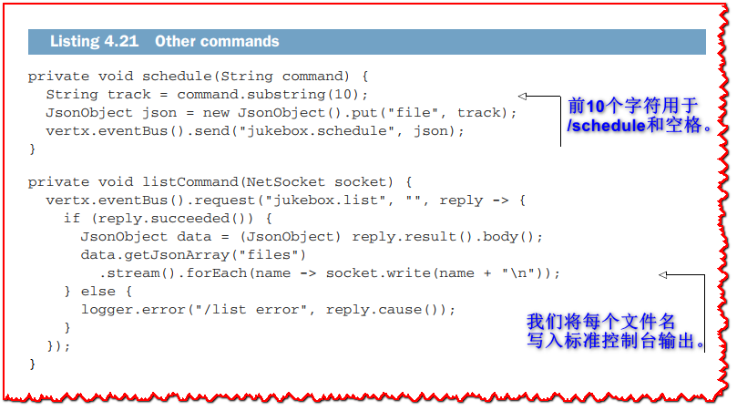

## 4.5 解析复杂的流

流可以比文本行更复杂，*RecordParser* 也可以简化我们的工作。 让我们以键/值数据库存储为例，其中每个键和值都是一个字符串。

在这样的数据库中，我们可以有诸如 `1 -> {foo}` 和 `2 -> {bar, baz}` 之类的条目，其中 1 和 2 是键。 为这种类型的数据结构定义序列化方案有无数种方法，所以想象一下我们必须使用**表 4.6** 中的流格式。

**表 4.6 数据库流格式**

| **数据** | **描述**                                       |
| -------- | ---------------------------------------------- |
| 幻数头   | 用于标识文件类型的字节 1、2、3 和 4 序列       |
| 版本     | 带有数据库流格式版本的整数                     |
| 名称     | 以字符串形式显示的数据库名称，以**换行符**结束 |
| 键长度   | 整数，键的字符数                               |
| 键名称   | 键名的字符序列                                 |
| 值长度   | 整数，值的字符数                               |
| 值       | 值的字符序列                                   |
| (…)      | 剩下的{key, value}序列                         |

这种格式混合了二进制和文本记录，因为流以一个幻数、一个版本号、一个名称开始，然后是一系列键和值条目。虽然格式本身在某些方面存在问题，但它是一个演示更复杂解析的好例子。

首先，让我们编写一个程序，将一个数据库写入一个文件，其中包含两个键/值条目。下面的清单展示了如何使用Vertx文件系统api打开文件，将数据追加到缓冲区，然后写入它。


在这个例子中，我们只有很少的数据，所以我们使用了一个在将数据写入文件之前完全准备好的缓冲区，但我们也可以同样地使用一个缓冲区用于头文件，并为每个键/值条目使用新缓冲区。

写很容易，但是读回来呢？ **RecordParser** 类的有趣特性是它的解析模式可以动态切换。 我们可以开始解析固定大小为 5 的缓冲区，然后切换到基于制表符的解析，然后是 12 字节的块，依此类推。

解析逻辑通过拆分成方法更好地表达，每个方法对应一个解析状态：解析数据库名称的方法，解析值条目的方法，等等。

下面的清单打开了我们之前编写的文件，并将*RecordParser*对象置于固定模式，因为我们正在寻找一个代表魔法头的四个字节的序列。当读取幻数时，将调用我们安装的处理程序。


下一个清单提供了更多方法的实现。


*readMagicNumber* 方法从缓冲区中提取幻数的四个字节。 我们知道缓冲区正好是四个字节，因为解析器处于固定大小模式。

下一个条目是数据库版本，它是一个整数，所以我们不必更改解析器模式，因为整数是四个字节。 读取版本后，*readVersion* 方法切换到分隔模式以提取数据库名称。 然后我们开始寻找键长度，因此我们需要在 *readName* 中使用固定大小的模式。

下面的清单读取键名、值长度和正确的值，*finishEntry* 设置解析器查找整数并委托给 *readKey*。


下一个清单显示了使用**清单 4.23** 到 **4.25** 的解析方法读取数据库文件时的一些示例输出。


这些动态解析器模式和处理程序的更改形成了一种非常简单而有效的解析复杂流的方法。

>  **💡提示:** 您可能想知道如何动态更改解析模式，而解析器已经可以从读取流中获得更多数据。 请记住，我们处于事件循环中，因此解析器处理程序一次处理一个解析器记录。 当我们从分隔符模式切换到固定大小模式时，下一条记录是通过根据字节数处理剩余的流数据而不是查找字符串来发出的。 当从固定大小模式切换到定界符模式时，同样的道理也适用。

## 4.6 关于流获取模式的快速说明

在结束本章之前，让我们回到我故意搁置一旁的 *ReadStream* 接口的细节。

在Vert.x 3.6中引入了我在本章前面提到的**fetch**模式，它允许流消费者请求许多数据项，而不是流将数据项推给消费者。它的工作原理是暂停流，然后在需要数据时请求随后获取不同数量的项。

我们可以使用 **fetch** 模式重写点唱机文件流代码，但我们仍然需要一个计时器来指示速度。 在这种情况下，手动读取 4096 字节的缓冲区或请求获取 4096 并没有什么不同。

相反，让我们回到数据库读取示例。 **清单 4.23** 到 **清单4.25** 中的读取流推送事件。 切换到获取模式并拉取数据不需要很多更改。 以下清单显示了流初始化代码。


请记住，**RecordParser** 修饰文件流。 它被暂停，然后 **fetch** 方法请求一个元素。 由于解析器发出解析数据的缓冲区，因此在本例中请求一个元素意味着请求一个 4 字节的缓冲区（幻数）。 最终，解析器处理程序将被调用来处理请求的缓冲区，并且在再次调用 **fetch** 方法之前不会发生任何其他事情。

下面的清单显示了两个解析处理程序方法及其对获取模式的适应。


两种模式的唯一区别是我们需要通过调用 **fetch** 来请求元素。 在编写 Vert.x 应用程序时，您可能不需要使用 **fetch** 模式，但如果您需要手动控制读取流，它是一个有用的工具。

在许多情况下，您只需要推送数据，请求者可以通过在需要暂停时发出信号来管理背压。 如果您遇到请求者更容易让源知道它可以处理多少项目的情况，那么提取数据是管理背压的更好选择。 Vert.x 流在这里非常灵活。

下一章将重点介绍 Vert.x 异步编程回调函数以外的其他模型。

## 总结
  - Vert.x 流模型异步事件和数据流，它们可以用于 push  和 pull/fetch 模式。
  - 背压管理对于确保异步系统之间的协调事件交换至关重要，我们通过跨多个设备的 MP3 音频流和直接下载来说明这一点。
  - 流可以被解析为简单和复杂的数据，这里通过音频流服务的网络控制接口来说明。

