# 第四章: 异步数据和事件流

**This chapter covers**
  - Why streams are a useful abstraction on top of eventing
  - What back-pressure is, and why it is fundamental for asynchronous producers and consumers
  - How to parse protocol data from streams

So far we have been processing events using *callbacks*, and from various sources such as HTTP or TCP servers. Callbacks allow us to reason about events one at a time.

Processing an incoming data buffer from a TCP connection, from a file, or from an HTTP request is not very different: you need to declare a callback handler that reacts to each event and allows custom processing.

That being said, most events need to be processed as a series rather than as isolated events. Processing the body of an HTTP request is a good example, as several buffers of different sizes need to be assembled to reconstitute the full body payload. Since reactive applications deal with non-blocking I/O, efficient and correct stream processing is key. In this chapter we’ll look at why streams pose challenges

and how Vert.x offers a comprehensive unified stream model.

## 4.1 Unified stream model

Vert.x offers a unified abstraction of streams across several types of resources, such as files, network sockets, and more. A *read stream* is a source of events that can be read, whereas a *write stream* is a destination for events to be sent to. For example, an HTTP request is a read stream, and an HTTP response is a write stream.

Streams in Vert.x span a wide range of sources and sinks, including those listed in table 4.1.

**Table 4.1 Vert.x common read and write streams**

| **Stream** **resource**     | **Read support** | **Write** **support** |
| --------------------------- | ---------------- | --------------------- |
| TCP sockets                 | Yes              | Yes                   |
| UDP datagrams               | Yes              | Yes                   |
| HTTP requests and responses | Yes              | Yes                   |
| WebSockets                  | Yes              | Yes                   |
| Files                       | Yes              | Yes                   |
| SQL results                 | Yes              | No                    |
| Kafka events                | Yes              | Yes                   |
| Periodic timers             | Yes              | No                    |

Read and write stream are defined through the *ReadStream* and *WriteStream* interfaces of the *io.vertx.core.streams* package. You will mostly deal with APIs that implement these two interfaces rather than implement them yourself, although you may have to do so if you want to connect to some third-party asynchronous event API.

These interfaces can be seen as each having two parts:
  - Essential methods for reading or writing data
  - Back-pressure management methods that we will cover in the next section

Table 4.2 lists the essential methods of read streams. They define callbacks for being notified of three types of events: some data has been read, an exception has arisen, and the stream has ended.

**Table 4.2** **ReadStream** **essential methods**

| **Method**                           | **Description**                                              |
| ------------------------------------ | ------------------------------------------------------------ |
| handler(Handler<T>)                  | Handles a new read value of type T (e.g.,  Buffer, byte[], JsonObject, etc.) |
| exceptionHandler(Handler<Throwable>) | Handles a read exception                                     |
| endHandler(Handler<Void>)            | Called when the  stream has ended,  either because all data has been read or because  an exception has been raised |

Similarly, the essential methods of write streams listed in table 4.3 allow us to write data, end a stream, and be notified when an exception arises.

**Table 4.3** **WriteStream** **essential methods**

| **Method**                           | **Description**                                              |
| ------------------------------------ | ------------------------------------------------------------ |
| write(T)                             | Writes some  data of type,  T (e.g., Buffer,    byte[], JsonObject, etc.) |
| exceptionHandler(Handler<Throwable>) | Handles a write exception                                    |
| end()                                | Ends the stream                                              |
| end(T)                               | Writes some  data of type,  T, and then  ends   the stream   |

We already manipulated streams in the previous chapters without knowing it, such as with TCP and HTTP servers.

The *java.io* APIs form a classic stream I/O abstraction for reading and writing data from various sources in Java, albeit using blocking APIs. It is interesting to compare the JDK streams with the Vert.x non-blocking stream APIs.

Suppose we want to read the content of a file and output its content to the standard console output.


```java
package chapter4.streamapis;

import java.io.File;
import java.io.FileInputStream;
import java.io.IOException;

public class JdkStreams {

  public static void main(String[] args) {
    File file = new File("build.gradle.kts");                 // <1>
    byte[] buffer = new byte[1024];
    try (FileInputStream in = new FileInputStream(file)) {
      int count = in.read(buffer);
      while (count != -1) {
        System.out.println(new String(buffer, 0, count));
        count = in.read(buffer);
      }
    } catch (IOException e) {
      e.printStackTrace();
    } finally {
      System.out.println("\n--- DONE");                       // <2>
    }
  }
}
```

> <1>: Using try-with-resources we ensure that reader.close() is always going to be called, whether the execution completes normally or exceptionally.
>
> <2>: We insert two lines to the console once reading has finished.

Listing 4.1 shows a classic example of using JDK I/O streams to read a file and then output its content to the console, while taking care of possible errors. We read data to a buffer and then immediately write the buffer content to the standard console before recycling the buffer for the next read.

The following listing shows the same code as in listing 4.1, but using the Vert.x asynchronous file APIs.


```java
package chapter4.streamapis;

import io.vertx.core.Vertx;
import io.vertx.core.file.AsyncFile;
import io.vertx.core.file.OpenOptions;

public class VertxStreams {

  public static void main(String[] args) {
    Vertx vertx = Vertx.vertx();
    OpenOptions opts = new OpenOptions().setRead(true);               // <1>
    vertx.fileSystem().open("build.gradle.kts", opts, ar -> {         // <2>
      if (ar.succeeded()) {  
        AsyncFile file = ar.result();                                 // <3>
        file.handler(System.out::println)                             // <4>                 
          .exceptionHandler(Throwable::printStackTrace)               // <5>  
          .endHandler(done -> {                                       // <6>
            System.out.println("\n--- DONE");
            vertx.close();
          });
      } else {
        ar.cause().printStackTrace();
      }
    });
  }
}
```

> <1>: Opening a file with Vert.x requires options, such as whether the file is in read, write, append mode, and more.
>
> <2>: Opening a file is an asynchronous operation.
>
> <3>: AsyncFile is the interface for Vert.x asynchronous files.
>
> <4>: The callback for new buffer data.
>
> <5>: The callback when an exception arises.
>
> <6>: The callback when the stream ends.

The approach is declarative here, as we define handlers for the different types of events when reading the stream. We are being *pushed* data, whereas in listing 4.1 we were *pulling* data from the stream.

This difference may seem cosmetic at first sight, with data being pulled in one example, while being pushed in the other. However, the difference is major, and we need to understand it to master asynchronous streams, whether with Vert.x or with other solutions.

This brings us to the notion of *back-pressure*.

## 4.2 What is back-pressure?

Back-pressure is a mechanism for a consumer of events to signal an event’s producer that it is emitting events at a faster rate than the consumer can handle them. In reactive systems, back-pressure is used to pause or slow down a producer so that consumers avoid accumulating unprocessed events in unbounded memory buffers, possibly exhausting resources.

To understand why back-pressure matters with asynchronous streams, let’s take the example of an HTTP server used for downloading Linux distribution images, and consider the implementation without any back-pressure management strategy in place.

Linux distribution images are often distributed as .iso files and can easily weigh several gigabytes. Implementing a server that could distribute such files would involve doing the following:
  1. Open an HTTP server.
  2. For each incoming HTTP request, find the corresponding file.
  3. For each buffer read from the file, write it to the HTTP response body.

Figure 4.1 provides an illustration of how this would work with Vert.x, although this also applies to any non-blocking I/O API. Data buffers are read from the file stream, and then passed to a handler. The handler is unlikely to do anything but directly write each buffer to the HTTP response stream. Each buffer is eventually written to the underlying TCP buffer, either directly or as smaller chunks. Since the TCP buffer may be full (either because of the network or because the client is busy), it is necessary to maintain a buffer of pending buffers to be written (the write queue in figure 4.1). Remember, a write operation is non-blocking, so buffering is needed. This sounds like a very simple processing pipeline, so what could possibly go wrong?


Reading from a filesystem is generally fast and low-latency, and given several read requests, an operating system is likely to cache some pages into RAM. By contrast, writing to the network is much slower, and bandwidth depends on the weakest network link. Delays also occur.

As the reads are much faster than writes, a write buffer, as shown in figure 4.1, may quickly grow very large. If we have several thousand concurrent connections to download ISO images, we may have lots of buffers accumulated in write buffer queues. We may actually have several gigabytes worth of ISO images in a JVM process memory, waiting to be written over the network! The more buffers there are in write queues, the more memory the process consumes.

The risk here is clearly that of exhaustion, either because the process eats all available physical memory, or because it runs in a memory-capped environment such as a container. This raises the risk of consuming too much memory and even crashing.

As you can probably guess, one solution is *back-pressure signaling*, which enables the read stream to adapt to the throughput of the write stream. In the previous example,when the HTTP response write queue grows too big, it should be able to notify the file read stream that it is going too fast. In practice, pausing the source stream is a good way to manage back-pressure, because it gives time to write the items in the write buffer while not accumulating new ones.

>  **💡提示:** Blocking I/O APIs have an implicit form of back-pressure by blocking execution threads until I/O operations complete. Write operations block when buffers are full, which prevents blocked threads from pulling more data until write operations have completed.

Table 4.4 lists the back-pressure management methods of ReadStream. By default, a read stream reads data as fast as it can, unless it is being paused. A processor can pause and then resume a read stream to control the data flow.

**Table 4.4 ReadStream back-pressure management methods**

| **Method** | **Description**                                              |
| ---------- | ------------------------------------------------------------ |
| pause()    | Pauses the stream, preventing further data from being sent to the handler. |
| resume()   | Starts reading data again and  sending it to the handler.    |
| fetch(n)   | Demands a number, n, of elements to  be read (at most). The stream must be paused before calling fetch(n). |

When a read stream has been paused, it is possible to ask for a certain number of elements to be fetched, which is a form of asynchronous pulling. This means that a processor can ask for elements using *fetch*, setting its own pace. You will see concrete examples of that in the last section of this chapter.

In any case, calling *resume()* causes the stream to start pushing data again as fast as it can.

Table 4.5 shows the corresponding back-pressure management methods for *Write-Stream*.

**Table 4.5  WriteStream back-pressure management methods**

| **Method**                  | **Description**                                              |
| --------------------------- | ------------------------------------------------------------ |
| setWriteQueueMaxSize(int)   | Defines what the maximum write buffer queue size should be before being considered full. This is a size in terms of queued Vert.x buffers to be written, not a size in terms of actual bytes, because the queued buffers may be of different sizes. |
| boolean writeQueueFull()    | Indicates when the write buffer queue size is full.          |
| drainHandler(Handler<Void>) | Defines a callback indicating when the write buffer queue has been drained (typically when it is back to half of its maximum size). |

The write buffer queue has a maximum size after which it is considered to be full. Write queues have default sizes that you will rarely want to tweak, but you can do so if you want to. Note that writes can still be made, and data will accumulate in the queue. A writer is supposed to check when the queue is full, but there is no enforcement on writes. When the writer knows that the write queue is full, it can be notified through a *drain handler* when data can be written again. In general this happens when half the write queue has been drained.

Now that you have seen the back-pressure operations provided in *ReadStream* and *WriteStream*, here is the recipe for controlling the flow in our example of providing ISO images via HTTP:

  **1** For each read buffer, write it to the HTTP response stream.

  **2** Check if the write buffer queue is full.

  **3** If it is full

​    **a** Pause the file read stream.

​    **b** Install a drain handler that resumes the file read stream when it is called.

Note that this back-pressure management strategy is not always what you need:
   - There may be cases where dropping data when a write queue is full is functionally correct and even desirable.
  - Sometimes the source of events does not support pausing like a Vert.x ReadStream does, and you will need to choose between dropping data or buffering even if it may cause memory exhaustion.

The appropriate strategy for dealing with *back-pressure* depends on the functional requirements of the code you are writing. In general, you will prefer flow control like Vert.x streams offer, but when that’s not possible, you will need to adopt another strategy.

Let’s now assemble all that we’ve seen into an application.

## 4.3 Making a music-streaming jukebox

We are going to illustrate Vert.x streams and back-pressure management through the example of a music-streaming jukebox (see figure 4.2).

The idea is that the jukebox has a few MP3 files stored locally, and clients can connect over HTTP to listen to the stream. Individual files can also be downloaded over HTTP. In turn, controlling when to play, pause, and schedule a song happens over a simple, text-based TCP protocol. All connected players will be listening to the same audio at the same time, apart from minor delays due to the buffering put in place by the players.

This example will allow us to see how we can deal with custom flow pacing and different back-pressure management strategies, and also how to parse streams.


### 4.3.1 Features and usage

The application that we will build can be run from the code in the book’s GitHub repository using a Gradle task, as shown in the console output of listing 4.3.

>  **🏷注意:** You will need to copy some of your MP3 files to a folder named tracks/ in the project directory if you want the jukebox to have music to play.


There are two verticles being deployed in this application:
  - *Jukebox* provides the main music-streaming logic and HTTP server interface for music players to connect to.
 - *NetControl* provides a text-based TCP protocol for remotely controlling the jukebox application.

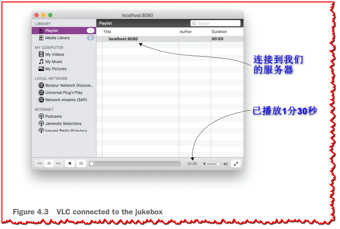

To listen to music, the user can connect a player such as VLC (see figure 4.3) or even open a web browser directly at http://localhost:8080/.

On the other hand, the player can be controlled via a tool like *netcat*, with plain text commands to list all files, schedule a track to be played, and pause or restart the stream. Listing 4.4 shows an interactive session using *netcat*.


>  **💡提示:** *netcat* may be available as nc on your Unix environment. I am not aware of a friendly and equivalent tool for Windows, outside of a WSL environment.

Finally, we want to be able to download any MP3 for which we know the filename over HTTP:

```bash
curl -o out.mp3 http://localhost:8080/download/intro.mp3
```

Let’s now dissect the various parts of the implementation.

### 4.3.2 HTTP processing: The big picture

There will be many code snippets referring to HTTP server processing, so it is good to look at figure 4.4 to understand how the next pieces of code will fit together.

There are two types of incoming HTTP requests: either a client wants to directly download a file by name, or it wants to join the audio stream. The processing strategies are very different.

In the case of downloading a file, the goal is to perform a direct copy from the file read stream to the HTTP response write stream. This will be done with *back-pressure* management to avoid excessive buffering.

Streaming is a bit more involved, as we need to keep track of all the streamers’ HTTP response write streams. A timer periodically reads data from the current MP3 file, and the data is duplicated and written for each streamer.

Let’s look at how these parts are implemented.


### 4.3.3 Jukebox verticle basics

The next listing shows that the state of the Jukebox verticle class is defined by a play status and a playlist.


An enumerated type, *State*, defines two states, while a *Queue* holds all scheduled tracks to be played next. Again, the Vert.x threading model ensures single-threaded access, so there is no need for concurrent collections and critical sections.

The *start* method of the *Jukebox* verticle (listing 4.6) needs to configure a few event-bus handlers that correspond to the commands and actions that can be used from the TCP text protocol. The *NetControl* verticle, which we will dissect later, deals with the inners of the TCP server and sends messages to the event bus.


Note that because we’ve abstracted the transfer of commands over the event-bus, we can easily plug in new ways to command the jukebox, such as using mobile applications, web applications, and so on.

The following listing provides the play/pause and schedule handlers. These methods directly manipulate the play and playlist state.


Listing the available files is a bit more involved, as the next listing shows.  

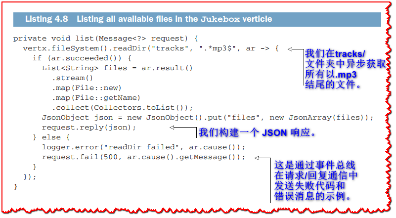

### 4.3.4 Incoming HTTP connections

There are two types of incoming HTTP clients: either they want the audio stream or they want to download a file.

The HTTP server is started in the start method of the verticle (see the next listing).

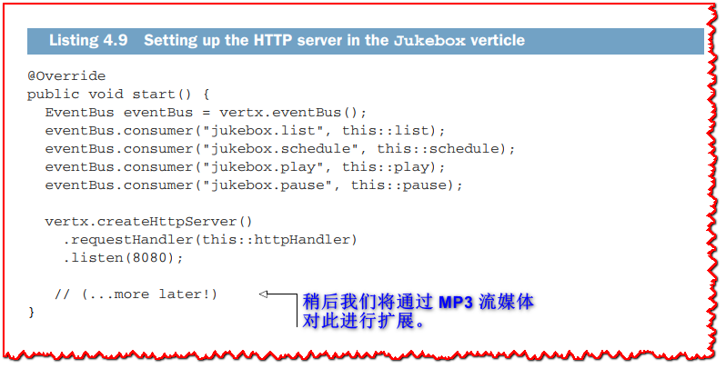

The request handler used by the Vert.x HTTP server is shown in the following listing. It forwards HTTP requests to the *openAudioStream* and *download* utility methods, which complete the requests and proceed.


The implementation of the openAudioStream method is shown in the following listing. It prepares the stream to be in chunking mode, sets the proper content type, and sets the response object aside for later.


### 4.3.5 Downloading as efficiently as possible

Downloading a file is a perfect example where back-pressure management can be used to coordinate a source stream (the file) and a sink stream (the HTTP response).

The following listing shows how we look for the file, and when it exists, we forward the final download duty to the *downloadFile* method.

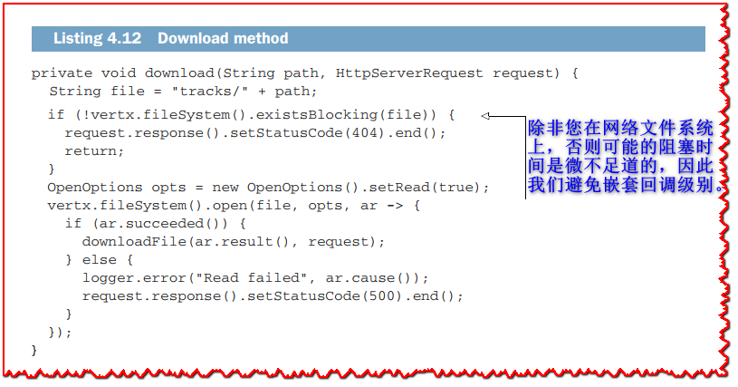

The implementation of the downloadFile method is shown in the following listing.

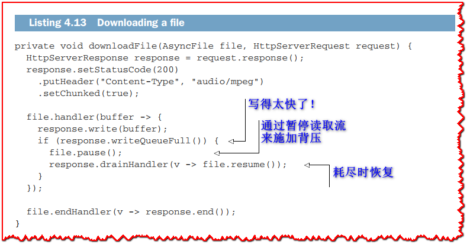

Back-pressure is taken care of while copying data between the two streams. This is so commonly done when the strategy is to pause the source and not lose any data that the same code can be rewritten as in the following listing.


A pipe deals with back-pressure when copying between a pausable *ReadStream* and a *WriteStream*. It also manages the end of the source stream and errors on both streams. The code of listing 4.14 does exactly what’s shown in listing 4.13, but without the boilerplate. There are other variants of *pipeTo* for specifying custom handlers.

### 4.3.6 Reading MP3 files, but not too fast

MP3 files have a header containing metadata such as the artist name, genre, bit rate, and so on. Several frames containing compressed audio data follow, which decoders can turn into *pulse-code modulation* data, which can eventually be turned into sound.

MP3 decoders are very resilient to errors, so if they start decoding in the middle of a file, they will still manage to figure out the bit rate, and they will align with the next frame to start decoding the audio. You can even concatenate multiple MP3 files and send them to a player. The audio will be decoded as long as all files are using the same bit rate and stereo mode.

This is interesting for us as we design a music-streaming jukebox: if our files have been encoded in the same way, we can simply push each file of a playlist one after the other, and the decoders will handle the audio just fine.

**WHY BACK-PRESSURE ALONE IS NOT ENOUGH**

Feeding MP3 data to many connected players is not as simple as it may seem. The main issue is ensuring that all current and future players are listening to the same music at roughly the same time. All players have different local buffering strategies to ensure smooth playback, even when the network suffers delays, but if the server simply pushes files as fast as it can, not all clients will be synchronized. Worse, when a new player connects, it may receive nothing to play while the current players have several minutes of music remaining in their buffers. To provide a sensible playback experience, we need to control the pace at which files are read, and for that we will use a timer.

This is illustrated in figure 4.5, which shows what happens *without* and *with* rate control on the streams. In both cases, suppose that Player A joined the stream at the beginning, while Player B joined, say, 10 seconds later. Without read-rate control, we find ourselves in a similar case to that of downloading an MP3 file. We may have backpressure in place to ensure efficient resource usage while copying MP3 data chunks to the connected clients, but the streaming experience will be very bad.

Since we are basically streaming data as fast as we can, Player A finds its internal buffers filled with almost all the current file data. While it may be playing at position 0 minutes 15 seconds, it has already received data beyond the 3-minute mark. When Player B joins, it starts receiving MP3 data chunks from much farther on in the file, so it starts playing at position 3 minutes and 30 seconds. If we extend our reasoning to multiple files, a new player can join and receive no data at all, while the previously connected players may have multiple songs to play in their internal buffers.

By contrast, if we control the read rate of the MP3 file, and hence the rate at which MP3 chunks are being copied and written to the connected players, we can ensure that they are all, more or less, at the same position.


Rate control here is all about ensuring that all players receive data fast enough so that they can play without interruption, but not too quickly so they do not buffer too much data.

**RATE-LIMITED STREAMING IMPLEMENTATION**

Let’s look at the complete *Jukebox* verticle start method, as it shows that much needed timer.

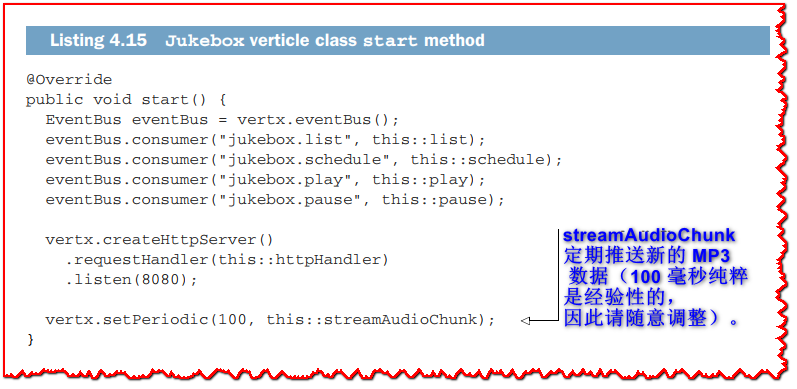

Beyond connecting the event-bus handlers and starting an HTTP server, the *start* method also defines a timer so that data is streamed every 100 milliseconds.

Next, we can look at the implementation of the *streamAudioChunk* method.

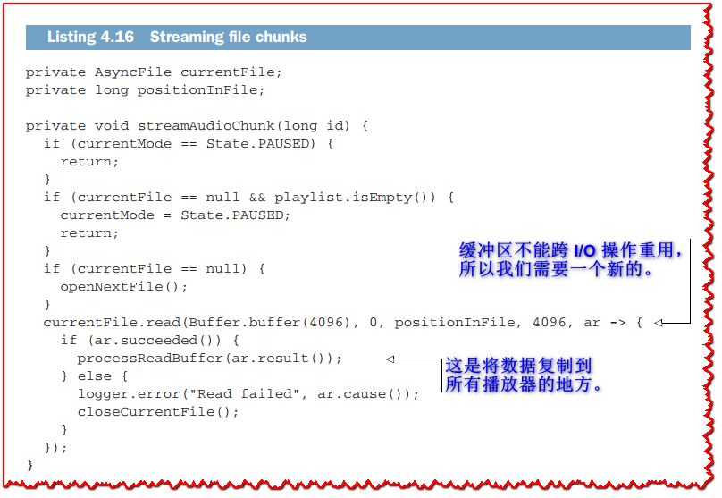

**Why these values?**

>  Why do we read data every 100 milliseconds? And why read buffers of 4096 bytes?
>  
>  I have empirically found these values work well for 320 KBps constant bit rate MP3 files on my laptop. They ensured no drops in tests while preventing players from buffering too much data, and thus ending several seconds apart in the audio stream.
>  
>  Feel free to tinker with these values as you run the examples.
>  

The code of *streamAudioChunk* reads blocks of, at most, 4096 bytes. Since the method will always be called 10 times per second, it also needs to check whether anything is being played at all. The *processReadBuffer* method streams data, as shown in the following listing.

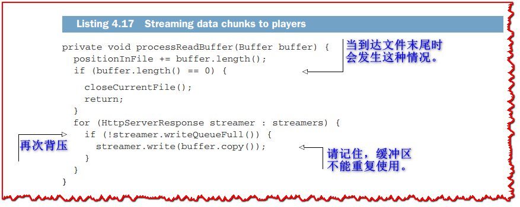

For every HTTP response stream to a player, the method copies the read data. Note that we have another case of back-pressure management here: when the write queue of a client is full, we simply discard data. On the player’s end, this will result in audio drops, but since the queue is full on the server, it means that the player will have delays or drops anyway. Discarding data is fine, as MP3 decoders know how to recover, and it ensures that playback will remain closely on time with the other players.

>  **☢警告:** Vert.x buffers cannot be reused once they have been written, as they are placed in a write queue. Reusing buffers will always result in bugs, so don’t look for unnecessary optimizations here.

Finally, the helper methods in the following listing enable the opening and closing of files.


## 4.4 Parsing simple streams

So far our dissection of the jukebox example has focused on the *Jukebox* verticle used to download and stream MP3 data. Now it’s time to dissect the *NetControl* verticle, which exposes a TCP server on port 3000 for receiving text commands to control what the jukebox plays. Extracting data from asynchronous data streams is a common requirement, and Vert.x provides effective tools for doing that.

The commands in our text protocol are of the following form:

```
/action [argument]
```

These are the actions:
  - /list—Lists the files available for playback
  - /play—Ensures the stream plays
  - /pause—Pauses the stream
  - /schedule file—Appends file at the end of the playlist

Each text line can have exactly one command, so the protocol is said to be *newline-separated*.

We need a parser for this, as buffers arrive in chunks that rarely correspond to one line each. For example, a first read buffer could contain the following:

```
ettes.mp3
/play
/pa
```

The next one may look like this:

```
use
/schedule right-here-righ
```

And it may be followed by this:

```
t-now.mp3
```

What we actually want is reasoning about *lines*, so the solution is to concatenate buffers as they arrive, and split them again on newlines so we have one line per buffer. Instead of manually assembling intermediary buffers, Vert.x offers a handy parsing helper with the *RecordParser* class. The parser ingests buffers and emits new buffers with parsed data, either by looking for delimiters or by working with chunks of fixed size.

In our case, we need to look for newline delimiters in the stream. The following listing shows how to use *RecordParser* in the *NetControl* verticle.

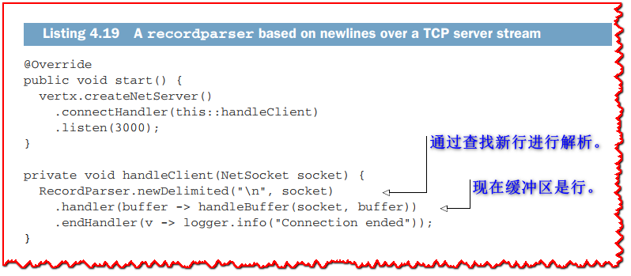

The parser is both a read and a write stream, as it functions as an adapter between two streams. It ingests intermediate buffers coming from the TCP socket, and it emits parsed data as new buffers. This is fairly transparent and simplifies the rest of the verticle implementation.

In the next listing, each buffer is known to be a line, so we can go directly to processing commands.

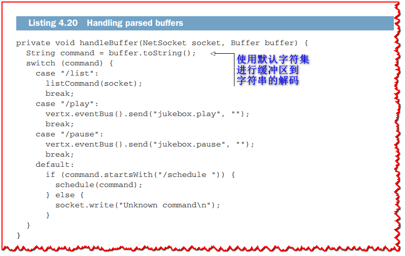

The simple commands are in the case clauses, and the other commands are in separate methods shown in the following listing.


## 4.5 Parsing complex streams

Streams can be more complex than just lines of text, and *RecordParser* can also simplify our work with these. Let’s take the example of key/value database storage, where each key and value is a string.

In such a database, we could have entries such as `1 -> {foo}` and `2 -> {bar, baz}`, with 1 and 2 being keys. There are countless ways to define a serialization scheme for this type of data structure, so imagine that we must use the stream format in table 4.6.

**Table 4.6 Database stream format**

| **Data**     | **Description**                                              |
| ------------ | ------------------------------------------------------------ |
| Magic header | A sequence of bytes 1, 2, 3, and 4 to identify the file type |
| Version      | An integer with the database stream format version           |
| Name         | Name of the database as a string,  ending with a newline  character |
| Key length   | Integer with the number of characters for the next  key      |
| Key name     | A sequence of characters for the key name                    |
| Value length | Integer with the number of characters for the next  value    |
| Value        | A sequence of characters for the value                       |
| (…)          | Remaining {key, value} sequences                             |

The format mixes binary and text records, as the stream starts with a magic number, a version number, a name, and then a sequence of key and value entries. While the format in itself is questionable on some points, it is a good example to illustrate more complex parsing.

First of all, let’s have a program that writes a database to a file with two key/value entries. The following listing shows how to use the Vert.x filesystem APIs to open a file, append data to a buffer, and then write it.


In this example we had little data, so we used a single buffer that we prepared wholly before writing it to the file, but we could equally use a buffer for the header and new buffers for each key/value entry.

Writing is easy, but what about reading it back? The interesting property of *RecordParser* is that its parsing mode can be switched on the fly. We can start parsing buffers of fixed size 5, then switch to parsing based on tab characters, then chunks of 12 bytes, and so on.

The parsing logic is better expressed by splitting it into methods where each method corresponds to a parsing state: a method for parsing the database name, a method for parsing a value entry, and so on.

The following listing opens the file that we previously wrote and puts the *RecordParser* object into fixed mode, as we are looking for a sequence of four bytes that represents the magic header. The handler that we install is called when a magic number is read.


The next listing provides the implementation of further methods.

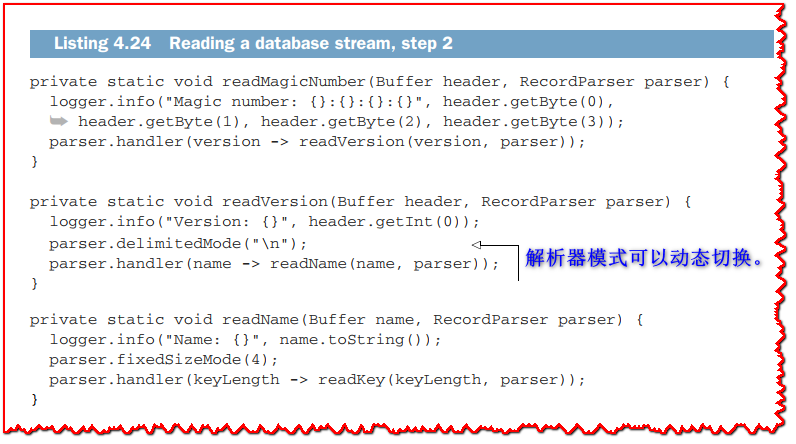

The *readMagicNumber* method extracts the four bytes of the magic number from a buffer. We know that the buffer is exactly four bytes since the parser was in fixed-sized mode.

The next entry is the database version, and it is an integer, so we don’t have to change the parser mode because an integer is four bytes. Once the version has been read, the *readVersion* method switches to delimited mode to extract the database name. We then start looking for a key length, so we need a fixed-sized mode in *readName*.

The following listing reads the key name, the value length, and the proper value, and *finishEntry* sets the parser to look for an integer and delegates to *readKey*.

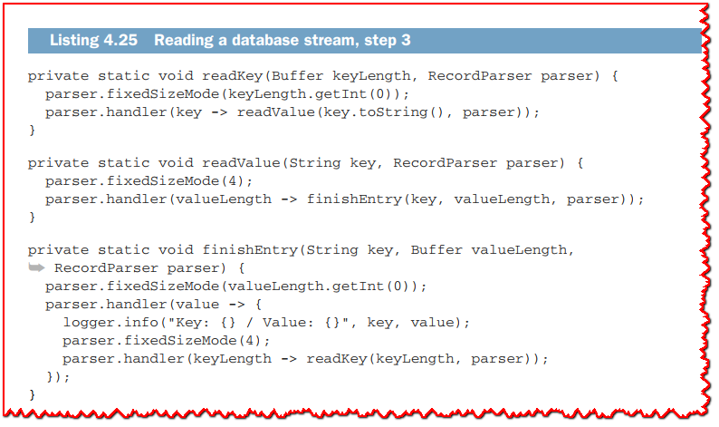

The next listing shows some sample output when reading the database file with the parsing methods of listings 4.23 through 4.25.


These on-the-fly parser mode and handler changes form a very simple yet effective way to parse complex streams.

>  **💡提示:** You may wonder how the parsing mode can be changed on the fly, while some further data is already available to the parser from the read stream. Remember that we are on an event loop, so parser handlers are processing parser records one at a time. When we switch from, say, delimiter mode to fixed-size mode, the next record is emitted by processing the remaining stream data based on a number of bytes rather than looking for a string. The same rea- soning applies when switching from fixed-sized mode to delimiter mode.

## 4.6 A quick note on the stream fetch mode

Before we wrap up this chapter, let’s go back to a detail of the *ReadStream* interface that I deliberately left aside.

Introduced in Vert.x 3.6, the fetch mode that I mentioned earlier in this chapter allows a stream consumer to request a number of data items, rather than the stream pushing data items to the consumer. This works by pausing the stream and then ask- ing for a varying number of items to be fetched later on, as data is needed.

We could rewrite the jukebox file-streaming code with the fetch mode, but we would still need a timer to dictate the pace. In this case, manually reading a buffer of 4096 bytes or requesting 4096 to be fetched is not that different.

Instead, let’s go back to the database reading example. The read stream pushed events in listings 4.23 through 4.25. Switching to fetch mode and pulling data does not require many changes. The following listing shows the stream initialization code.


Remember that the *RecordParser* decorates the file stream. It is paused, and then the *fetch* method asks for one element. Since the parser emits buffers of parsed data, ask- ing for one element in this example means asking for a buffer of four bytes (the magic number). Eventually, the parser handler will be called to process the requested buffer, and nothing else will happen until another call to the *fetch* method is made.

The following listing shows two of the parsing handler methods and their adapta- tion to the fetch mode.


The only difference between the two modes is that we need to request elements by calling *fetch*. You will not likely need to play with fetch mode while writing Vert.x applications, but if you ever need to manually control a read stream, it is a useful tool to have.

In many circumstances, having data being pushed is all you need, and the requester can manage the back-pressure by signaling when pausing is needed. If you have a case where it is easier for the requester to let the source know how many items it can handle, then pulling data is a better option for managing the back-pressure. Vert.x streams are quite flexible here.

The next chapter focuses on other models besides callbacks for asynchronous pro- gramming with Vert.x.

## Summary
  - Vert.x streams model asynchronous event and data flows, and they can be used in both push and pull/fetch modes.
  - Back-pressure management is essential for ensuring the coordinated exchange of events between asynchronous systems, and we illustrated this through MP3 audio streaming across multiple devices and direct downloads.
  - Streams can be parsed for simple and complex data, illustrated here by a net- worked control interface for an audio streaming service.

