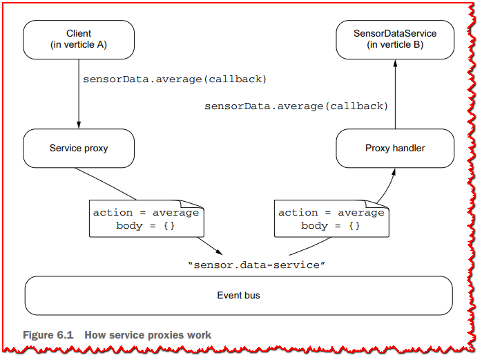
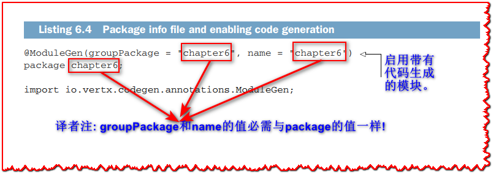
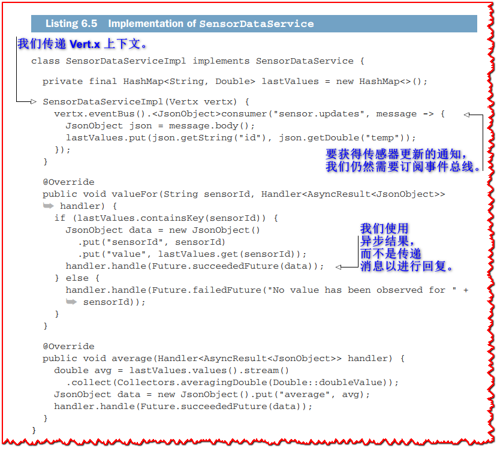
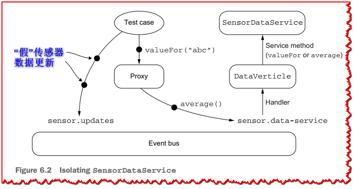
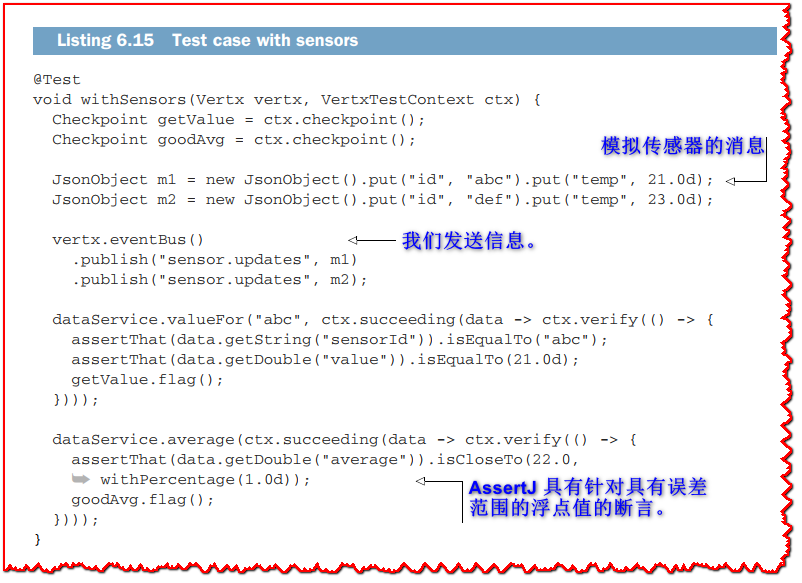
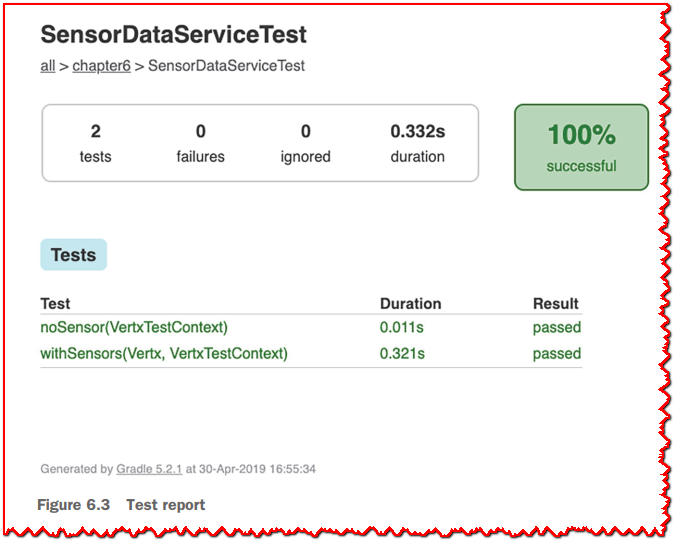

# 第六章: 超越事件总线

**本章涵盖了**

  - 如何在事件总线上公开服务
  - Verticle 和事件总线服务的异步测试

事件总线是在 Vert.x 中表达事件处理的基本工具，但它还有更多功能！ 事件总线服务对于公开类型化接口而不是简单的消息传递很有用，尤其是在事件总线目标处需要多种消息类型时。 测试也是一个重要的概念，我们将看看测试异步 Vert.x 代码与传统测试有什么不同。

在本章中，我们将重温前面的示例，将其重构为事件总线服务，并对其进行测试。

## 6.1   使用服务 API 重新审视热传感器

在第 3 章中，我们以热传感器为例。 我们有一个 *SensorData* verticle，它保存每个传感器的最后观察值，并使用事件总线上的**请求/应答**通信计算它们的平均值。 下面的清单显示了我们用来计算温度平均值的代码。

此代码与 Vert.x 事件总线 API 紧密耦合，因为它需要接收消息并回复它。 任何愿意调用 *average* 的软件组件都必须通过事件总线发送消息并期待响应。

但是，如果我们可以拥有一个带有调用方法的常规 Java 接口，而不必通过事件总线发送和接收消息呢？ 下一个清单中提出的接口将与事件总线完全无关。

提议的接口具有带有尾随回调参数的方法，因此调用者将被异步通知响应和错误。 *`Handler<AsyncResult<T>>`* 类型通常用于 Vert.x API 中的回调，其中 `T` 可以是任何东西，但通常是 JSON 类型。

**清单 6.2** 的接口是我们使用事件总线服务的目标。 让我们修改热传感器示例，将事件总线交互替换为 *SensorDataService* 类型的 Java 接口。

## 6.2 返回 RPC（远程过程调用）

您可能已经熟悉 **远程过程调用**，这是分布式计算中的一种流行抽象。 当您调用在另一台机器（服务器）上运行的函数时，引入了 RPC 来隐藏网络通信。 这个想法是本地函数充当代理，通过网络向服务器发送带有调用参数的消息，然后服务器调用 **真实** 函数。 然后将响应发送回代理，客户端会产生调用常规本地函数的错觉。

Vert.x 事件总线服务是一种*异步 RPC*：
  - 服务封装了一组操作，如**清单 6.2** 中的 *SensorDataService*。
  - 服务由带有公开操作方法的常规 Java API 描述。
  - 请求者和实现者都不需要直接处理事件总线消息。

图 6.1 说明了在调用 *SensorDataService* 接口的 *average* 方法时所涉及的各种组件。 客户端代码调用服务代理上的 *average* 方法。 这是一个实现 *SensorDataService* 接口的对象，然后在事件总线上将消息发送到 *sensor.data-service* 目的地（可以配置）。 消息体包含方法调用参数值，所以因为*average*只接受回调，所以消息体为空。 该消息还有一个 **action** 标头，指示正在调用哪个方法。

**代理处理程序(proxy handler)**侦听 *sensor.data-service* 目标并根据消息的操作标头和正文分派方法调用。 这里使用了实际的 *SensorDataService* 实现，并调用了 *average* 方法。 然后，**代理处理程序(proxy handler)**使用通过 *average* 方法回调传递的值回复事件总线消息。 反过来，客户端通过**服务代理(service proxy  )**接收回复，**服务代理(service proxy)**将回复传递给来自客户端调用的回调。

这种模型可以简化对事件总线的处理，尤其是在需要公开许多操作时。 因此，将 Java 接口定义为 API 而不是手动处理消息是有意义的。

## 6.3 定义服务接口

清单 6.2 有我们想要的 *SensorDataService* 接口，但还需要添加一些代码。 要开发事件总线服务，您需要
  - 编写一个尊重一些约定的 Java 接口
  - 编写一个实现类

Vert.x 不依赖于通过字节码工程或运行时反射的魔法，因此需要编写和编译*服务代理* 和 *处理程序*。 幸运的是，Vert.x 带有代码生成器，因此您将在编译时生成服务代理和处理程序，而不是自己编写它们。

完整的 *SensorDataService* 接口在以下列表中详细说明。

`@ProxyGen` 注解用于标记事件总线服务接口，以生成代理代码。

您还需要定义一个 `package-info.java` 文件并使用 `@ModuleGen` 注解包定义以启用注解处理器，如下面的清单所示。

服务接口中的方法需要遵守一些约定，特别是将回调作为最后一个参数。 你会很想使用返回值而不是回调，但请记住，我们正在处理异步操作，所以我们需要回调！ 服务接口具有服务实现 (*create*) 和代理 (*createProxy*) 的工厂方法是**惯用**的。 这些方法极大地简化了获取代理或发布服务的代码。

*SensorDataServiceVertxEBProxy* 类由 Vert.x 代码生成器生成，如果您查看它，您将看到事件总线操作。 还生成了一个 *SensorDataServiceVertxProxyHandler* 类，但只有 Vert.x 会使用它，而不是您的代码。

现在让我们看看 *SensorDataServiceImpl* 类中的实际服务实现。

## 6.4 服务实现

以下服务实现是对第 3 章代码的直接改编。

与第 3 章的代码相比，我们大部分都将事件总线代码替换为通过已完成的future对象传递异步结果。 此代码也没有对生成的**服务代理处理程序(proxy handler)**代码的引用。

>  **💡提示:** 清单 6.5 中的代码没有异步操作。 在更详细的服务中，您会很快发现向其他组件（如数据库、HTTP 服务、消息代理，甚至是事件总线上的其他服务）发出异步调用的情况。 准备好响应后，您会将结果或错误传递给回调方法，就像我们在 *SensorDataServiceImpl* 中所做的那样。

## 6.5 启用代理代码生成

服务代理生成是在编译时使用 *java* 和 *apt* 注解处理完成的。 需要两个 Vert.x 模块：*vertx-service-proxy* 和 *vertx-codegen*。

要使 Vert.x 代码生成与 Gradle 中的注解处理一起使用，您将需要类似于以下内容的配置。

现在，每当编译 Java 类时，都会生成代理类。 您可以在项目的 `src/main/generated` 文件夹中查看文件。

如果您查看 *SensorDataServiceVertxProxyHandler* 的代码，您会在 *handle* 方法中看到 *switch* 块，其中 `action` 标头用于将方法调用分派给服务实现方法。 同样，在 *SensorDataServiceVertxEBProxy* 的 *average* 方法中，您将看到通过事件总线发送消息以调用该方法的代码。如果您必须实现自己的事件总线服务系统，*SensorDataServiceVertxProxyHandler* 和 *SensorDataServiceVertxEBProxy* 的代码实际上就是您要编写的代码。

## 6.6 部署事件总线服务

事件总线服务需要部署到 Verticle，并且需要定义事件总线地址。 以下清单显示了如何部署服务。

> 译者注:  `register()`方法里创建**服务代理处理程序(proxy handler)**对象并对**服务代理(service proxy)**发送的事件进行事件消费

部署就像绑定到地址并传递服务实现一样简单。 我们可以使用 *SensorDataService* 接口中的工厂 *create* 方法来执行此操作。

您可以在一个 Verticle 上部署多个服务。 部署功能相关的事件总线服务是有意义的，因此 Verticle 仍然是一个连贯的事件处理单元。

通过调用相应的工厂方法并传递正确的事件总线地址来获得用于发出方法调用的服务代理，如下面的清单所示。

服务接口遵循回调模型，因为这是（异步）服务接口的规范定义。

## 6.7 超越回调的服务代理

我们在前一章探讨了回调以外的异步编程模型，但我们设计了带有回调的事件总线服务。 好消息是，您可以利用代码生成来为您的服务代理获取 RxJava 或 Kotlin 协程变体。 更好的是，您不需要太多额外的工作！

要实现此功能，需要将`@VertxGen`注解添加到服务接口，如下所示。

当此注解存在时，Vert.x Java 注解处理器的代码生成将在构建时启用所有合适的代码生成器。

要生成 RxJava 绑定，我们需要在以下清单中添加依赖项。

当我们编译项目时，会生成一个 *chapter6.reactivex.SensorDataService* 类。 这是一个将原始回调 API 连接到 RxJava 的小垫片。 该类具有原始 *SensorDataService* API 中的所有方法（包括 *create* 工厂方法），以及带有 rx 前缀的方法。

给定接受回调的 *average* 方法，RxJava 代码生成器创建一个不带参数的 *rxAverage* 方法，该方法返回 *Single* 对象。 类似地，*valueFor* 被转换为 *rxValueFor*，这是一个接受 *String* 参数（传感器标识符）并返回 *Single* 对象的方法。

下一个清单显示了使用生成的 RxJava API 的示例。

此处创建的 RxJava 管道每三秒进行一次新订阅，并将平均值提取到一个字符串中，然后显示在标准输出中。

>  **🏷注意:** 您必须始终使用接口和实现的回调 API 来开发事件总线服务。 然后代码生成器将其转换为其他模型。

现在您知道如何开发事件总线服务，让我们切换到测试 Verticle 和服务的主题。

## 6.8 测试和 Vert.x

自动化测试在软件设计中至关重要，Vert.x 应用程序也需要进行测试。 测试 Vert.x 代码的主要困难是操作的异步特性。 除此之外，测试是经典的：它们有一个设置阶段和一个测试执行和验证阶段，然后是一个拆卸阶段。

多亏了事件总线，verticle 与系统的其余部分相对隔离得很好。 这在测试环境中非常有用：
  - 事件总线允许您将事件发送到一个verticle，以使其处于所需的状态，并观察它产生了什么事件。
  - 部署时传递给 Verticle 的配置允许您为以测试为中心的环境调整一些参数（例如，使用内存数据库）。
  - 可以部署具有受控行为的模拟 Verticle 来替代具有大量依赖项的 Verticle（例如，数据库、连接到其他 Verticle 等）。

因此，与单元测试相比，测试 Verticle 更像是集成测试，无论被测试的 Verticle 是部署在同一个 JVM 中还是以集群模式部署。 我们需要将 Verticle 视为不透明的盒子，我们通过事件总线进行通信，并且可能通过连接到 Verticle 公开的网络协议。 例如，当一个 Verticle 暴露一个 HTTP 服务时，我们可能会在测试中发出 HTTP 请求来检查它的行为。

在本书中，我们将只关注 Vert.x 特定的测试方面。 如果您对更广泛的测试主题缺乏经验，我建议您阅读 Lasse Koskela（Manning，2013 年）的 *Effective Unit Testing* 之类的书。

### 6.8.1 将 JUnit 5 与 Vert.x 一起使用

Vert.x 支持经典的 JUnit 4 测试框架以及最新的 JUnit 5 测试框架。Vert.x 提供了一个名为 *vertx-junit5* 的模块，支持 JUnit 框架的第 5 版 (https://junit. org/junit5/）。 要在 Vert.x 项目中使用它，您需要添加 *io.vertx:vertx-junit5* 依赖项，可能还有一些 JUnit 5 库。

在 Gradle 项目中，需要更新 *dependencies* 部分，如下所示。

*vertx-junit5* 库已经依赖于 *junit-jupiter-api*，但在构建中修复版本是一个好习惯。 *junit-jupiter-engine* 模块需要存在于 Gradle 的 *testRuntime* 范围内。 最后，JUnit 5 可以与任何断言 API 一起使用，包括它的内置 API，而 AssertJ 是一种流行的 API。

### 6.8.2测试 DataVerticle

我们需要两个测试用例来检查 *DataVerticle* 的行为，以及 *SensorDataService* 的扩展：
  - 当不存在传感器时，平均值应为 0，并且请求任何传感器标识符的值都必须引发错误。
  - 当有传感器时，我们需要检查平均值和单个传感器值。

**图 6.2** 显示了测试环境的交互。 测试用例有一个代理引用来调用*SensorDataService*。 实际的 *DataVerticle* verticle 部署在 *sensor.data-service* 目的地。 它可以从测试中发出 *valueFor* 和 *average* 方法调用。 由于 *DataVerticle* 从事件总线上的传感器接收消息，我们可以发送任意消息，而不是部署我们无法控制的实际 *HeatSensor* verticles。 模拟一个 Verticle 通常就像发送它要发送的消息类型一样简单。

以下清单显示了测试类序言。

JUnit 5 支持扩展以提供附加功能。 特别是，扩展可以将参数注入测试方法，它们可以拦截生命周期事件，例如调用测试方法之前和之后。 *VertxExtension* 类通过执行以下操作来简化编写测试用例：
  - 使用默认配置注入 *Vertx* 的现成实例
  - 注入 *VertxTestContext* 对象来处理 Vert.x 代码的异步特性
  - 确保等待 *VertxTestContext* 成功或失败

*prepare* 方法在每个测试用例之前执行，以准备测试环境。 我们在这里使用它来部署 *DataVerticle* verticle，然后获取服务代理并将其存储在 *dataService* 字段中。 由于部署 Verticle 是一个异步操作，所以 *prepare* 方法会被注入 *Vertx* 上下文和 *VertxTestContext* 对象以通知它何时完成。

>  **💡提示:** 版本 5 之前的 JUnit 用户可能会惊讶于类和测试方法是包私有的； 这是 JUnit 5 的惯用方法。

您可以在以下清单中看到第一个测试用例，当没有部署传感器时。

此测试用例假设没有部署传感器，因此尝试获取任何传感器值肯定会失败。 我们通过查找不存在的传感器 *abc* 的温度值来检查此行为。 然后我们检查平均值是否为 0。

检查点被标记以标记测试执行到达某些行。

当所有声明的检查点都被标记之后，测试就成功完成了。当断言失败、抛出意外异常或发生(可配置)延迟且未标记所有检查点时，测试失败。

**为什么异步测试不同**

测试异步操作与您可能熟悉的常规测试略有不同。 测试执行中的默认约定是测试运行线程调用测试方法，并且在抛出异常时它们会失败。 断言方法抛出异常以报告错误。

因为像 *deployVerticle* 和 *send* 这样的操作是异步的，所以测试运行线程在它们有机会完成之前就退出了方法。 *VertxExtension* 类通过等待 *VertxTestContext* 报告成功或失败来处理这个问题。 为了避免让测试永远等待，有一个超时（默认为 30 秒）。

最后，当有传感器时，我们有一个测试用例。

该测试通过在事件总线上发送虚假传感器数据更新来模拟具有标识符 *abc* 和 *def* 的两个传感器，就像传感器所做的那样。 然后，我们的断言具有确定性，我们可以检查 *valueFor* 和 *average* 方法的行为。

### 6.8.3 运行测试

可以从您的 IDE 运行测试。 您也可以使用 Gradle 运行它们：*gradlew test*。

Gradle 在 *build/reports/tests/test/index.html* 中生成人类可读的测试报告。 当您在网络浏览器中打开该文件时，您可以检查所有测试是否通过，如**图 6.3** 所示。

请注意，Gradle *test* 任务是 *build* 的依赖项，因此测试总是在项目完全构建时执行。

## 总结

  - 事件总线服务和代理通过提供异步服务接口从事件总线通信中抽象出来。
  - 可以为事件总线服务生成除回调之外的绑定：RxJava、Kotlin 协程等。
  - 测试异步代码和服务比传统的命令式案例更具挑战性，Vert.x 提供了对 JUnit 5 的专门支持。

